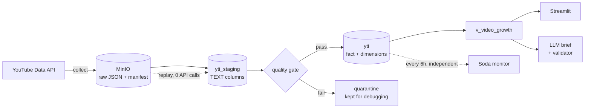
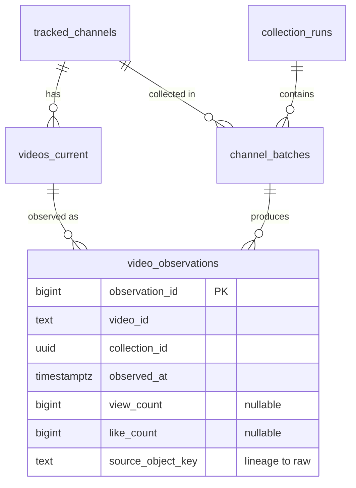

# YouTube Content Intelligence

An ELT pipeline that tracks view growth across a fixed set of YouTube channels, with
immutable raw storage, idempotent loads, a pre-publish quality gate, and an LLM-written
daily brief that cannot invent numbers.

**Stack:** Airflow · PostgreSQL · MinIO (S3-compatible) · Docker Compose · Soda · Streamlit · OpenAI

| | |
|---|---|
| Channels tracked | 4 (2 groups: `books_learning`, `kids_animation`) |
| Videos / observations | 203 / 650 across 4 collection runs |
| Quota per run | 12 units of YouTube's 10,000/day |
| Tests | 122 (113 unit, 5 DAG, 4 integration) |
| LLM prompt eval | v1 13/20 → v2 17/20 → **v3 20/20** on 20 synthetic cases |

---

## Architecture



Three Airflow DAGs, all thin wrappers around a CLI:

- **`yt_collect`** — daily at 21:00 (Asia/Ho_Chi_Minh), one task per channel in parallel.
- **`yt_report`** — runs when `yt_collect` publishes new observations (Airflow Dataset),
  not on a clock, so it never reads half-finished data.
- **`yt_quality`** — every 6 hours, **on its own schedule** so it still fires if collection stops.

---

## Design decisions

**Raw first, database second.** YouTube does not return historical statistics — a missed
day is gone for good. Raw responses are written to object storage before anything else,
with a manifest written last as a commit marker. Any bug in parsing can be fixed and
replayed from raw with zero API calls: `youtube-intel replay --collection-id <id>`.

**Grain is "one video per collection run", not "one video per day".** Keying on date
breaks as soon as collection runs twice a day. Each run gets a deterministic UUIDv5
derived from Airflow's logical date, so parallel tasks agree on it without coordination
and retries land on the same rows (`ON CONFLICT` upsert → idempotent).

**Block before publish, monitor after.** A Python quality gate checks each batch *before*
it reaches published tables; failing batches are quarantined, not deleted. Soda then
watches the published tables on an independent schedule — including a freshness check,
the one failure mode a per-batch gate structurally cannot see (no batch → no gate run).

**Unknown is not zero.** Hidden like counts stay `NULL`; the growth view labels videos it
cannot rank (`insufficient_history`, `window_too_short`, …) instead of scoring them 0.
Shorts are never inferred from duration alone — a 77-second video might not be a Short.

**The LLM writes prose; code writes facts.** Every number in the brief, and the scope
statement listing which channels it covers, is rendered by code. The validator rejects any
digit or URL in LLM prose, any `video_id` or observation id not in the evidence bundle, and
any reuse of a reference channel's character names in content suggestions. It falls back to
a deterministic template after one repair attempt, so the brief is never lost because an
external API failed.

**Prompts are versioned and evaluated, not eyeballed.** A deterministic eval harness runs
each prompt version over 20 fixed synthetic cases, each built to trigger one failure mode
(overstating weak videos, claiming to have watched a video, wrong scope, prompt injection
in titles, reusing character names). Results are stored with the full LLM output so the
scorers can be fixed and re-run without new API calls.

| Check | v1 | v2 | v3 |
|---|---|---|---|
| No claims about unwatched content | 16/20 | 20/20 | 20/20 |
| No hype on weak videos | 1/3 | 3/3 | 3/3 |
| Scope accurate | 19/20 | 20/20 | 20/20 |
| No reuse of reference names | 8/9 | **6/9** | 9/9 |
| **Cases passed** | 13/20 | 17/20 | **20/20** |

v2 fixed its three target issues but regressed on character names — caught only because the
harness scores every check, not just the ones being fixed. v3 is in production.

**Classified failures.** API errors are split into quota exhausted / misconfiguration /
transient. Only transient errors are retried; the CLI exit code (`0`/`1`/`2`/`3`) tells
the orchestrator whether a retry can help.

### What I deliberately did not use

| Tool | Why not |
|---|---|
| CeleryExecutor | 12 quota units and ~4 seconds per run. LocalExecutor avoids Redis + a worker container (~2 GB RAM) for distribution I'd never use. Config kept commented for when it's needed. |
| dbt | The transform layer is one view and a thin normalization step already orchestrated by Airflow. dbt would add a tool without solving a problem I have. |
| Kafka / Spark | Batch volume is ~200 rows/day. |

---

## Quick start

Requires Docker and a [YouTube Data API v3](https://console.cloud.google.com/apis/library/youtube.googleapis.com) key.

```bash
cp .env.example .env                      # then fill in API_KEY and passwords

docker build --build-arg GIT_SHA=$(git rev-parse --short HEAD) \
             -t <namespace>/yt_api_elt:latest .   # must match DOCKERHUB_* in .env
docker compose up -d --wait

# apply migrations
set -a; . ./.env; set +a
for f in sql/migrations/*.sql; do
  docker exec -i postgres psql -U "$ELT_DATABASE_USERNAME" -d "$ELT_DATABASE_NAME" \
    -v ON_ERROR_STOP=1 < "$f"
done

# first collection (~12 quota units)
docker exec airflow-scheduler youtube-intel collect
```

| URL | What |
|---|---|
| http://localhost:8080 | Airflow |
| http://localhost:8501 | Dashboard |
| http://localhost:9001 | MinIO console |

## CLI

The CLI is the only entry point; Airflow just schedules it.

```
youtube-intel collect [--channel ID] [--dry-run]   # call the API (costs quota)
youtube-intel replay --collection-id ID            # rebuild from raw, 0 API calls
youtube-intel status                               # recent runs, coverage
youtube-intel report [--no-llm] [--show]           # daily brief per group
youtube-intel eval --prompt-version v3 [--baseline FILE]   # score a prompt, 20 cases
youtube-intel retention [--apply]                  # dry-run by default
youtube-intel verify-channels                      # check channel IDs
```

## Data model



`video_observations` is the fact table, unique on `(video_id, collection_id)`.
`tracked_channels` and `videos_current` are SCD type 1 dimensions.

## Tests

```bash
pip install -e ".[dev,llm]"
pytest -m "not integration"          # 113 unit tests, no Docker, < 1 s

docker exec airflow-scheduler bash -lc "cd /opt/airflow && pytest tests/"   # all 122
```

CI runs unit tests, then brings up the full stack with migrations from an empty database,
and only pushes the image to Docker Hub if both pass. CI never calls the YouTube API.

## Project layout

```
src/youtube_intel/   business logic — no Airflow imports
  youtube.py         API client, error classification, quota meter
  storage.py         raw objects + manifest (S3-compatible)
  normalize.py       the only place that casts types
  quality.py         pre-publish gate
  repository.py      all SQL
  pipeline.py        collect / replay orchestration
  reporting.py       evidence → LLM → validator → fallback, versioned prompts
  evals.py           prompt eval: 20 synthetic cases, 7 deterministic checks
  retention.py       plan/apply cleanup
  cli.py
dags/                thin Airflow wrappers
sql/migrations/      forward-only, numbered
evals/results/       one JSON per eval run, including raw LLM output
include/soda/        post-publish monitoring
dashboard/           Streamlit (reads SQL, computes nothing)
docs/                data contract, policy notes
```

## Limitations

- **Four channels, 50 most recent videos each.** Rankings describe this set only, not YouTube.
  Kids channels dominate growth partly because they are larger — not normalized by channel size.
- **Runs on a personal machine.** When it's off, nothing is collected, and those days cannot be
  recovered. `catchup=False` is intentional: backfilling would fetch today's numbers and label
  them with past dates.
- **Retention of raw data is disabled** until YouTube's developer policy has been read and
  recorded — see [`docs/policy_notes.md`](docs/policy_notes.md).
- **Metadata only.** Topic inference comes from titles; videos are never watched or transcribed.
- **LLM evaluation has limits.** 20/20 is on synthetic cases, one run per prompt version, with
  keyword-based scorers — a paraphrase that avoids the banned words is not caught. Suggested
  content angles still need human review before use.
- **Verification status:** collection, replay, quality gate, dashboard, and LLM reports
  (`gpt-4o-mini`, prompt v3) are verified on live data. CI workflow syntax is validated but has
  not yet run on GitHub.
