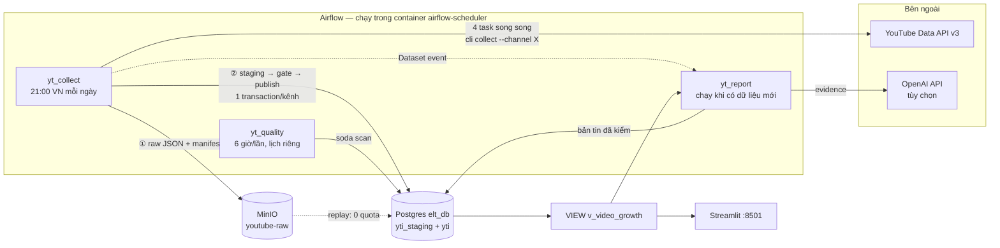
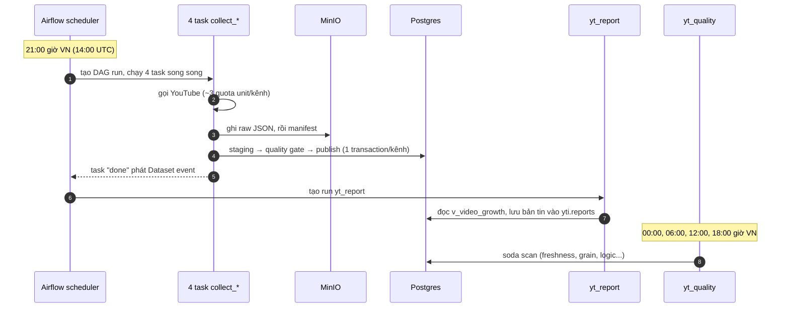
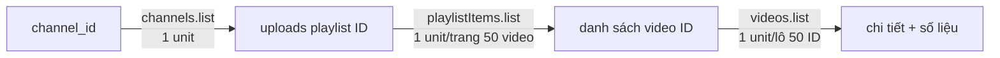
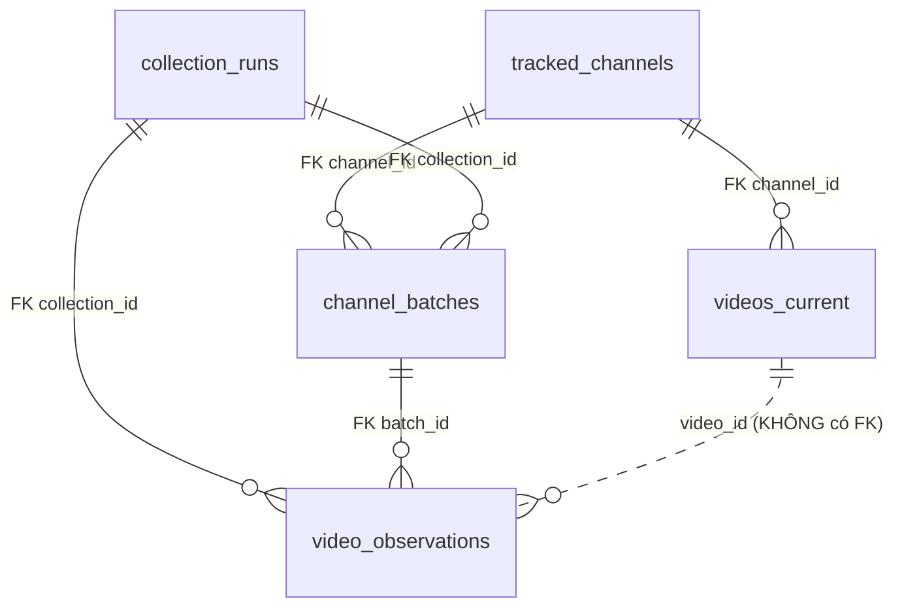
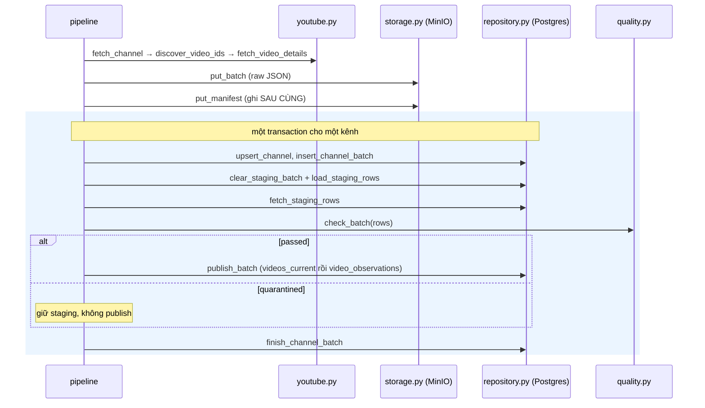
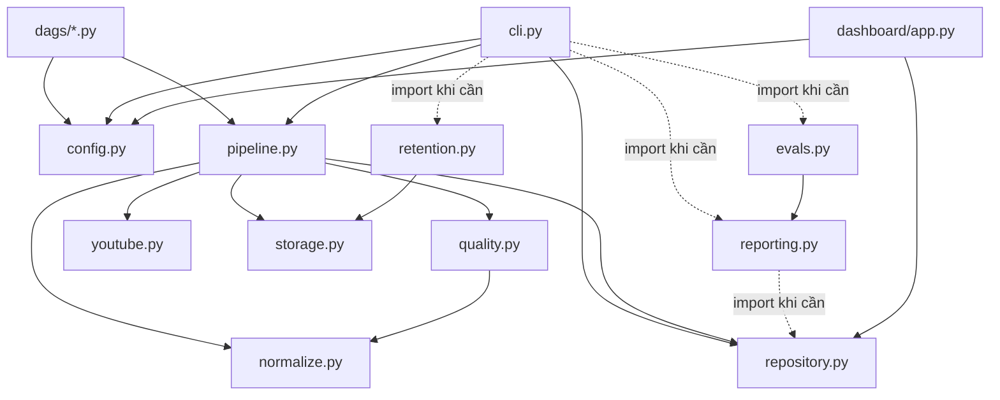

# learning.md — Học lại YT_ELT từ chính code của nó

> **Đây không phải README.** README giới thiệu project cho người ngoài. File này là
> một người mentor ngồi cạnh bạn, mở repository ra và dẫn bạn đi từ file này sang
> file khác, dừng lại học khái niệm đúng lúc code cần đến nó.
>
> **Ảnh chụp trạng thái:** viết dựa trên code ở commit `3dd4133` (24–25/09/2026).
> Lúc viết, database có 205 video, 850 observation, 5 lần thu; bộ test có 125 test
> (116 unit + 5 DAG + 4 integration).
>
> **Quy tắc vàng khi đọc file này:** CODE là nguồn sự thật. Nếu file này lệch với
> code (vì code đã được sửa sau này), hãy tin code và sửa lại file này.

---

## Cách dùng file này

**Lần đọc đầu tiên:** đọc tuần tự từ trên xuống, mở file code tương ứng song song ở
cửa sổ bên cạnh. Mỗi "chặng" là một file (hoặc một cụm file liên quan). Đừng đọc
lướt qua phần "Chạy & kiểm chứng": gõ lệnh thật, nhìn kết quả thật. Hiểu bằng mắt
và hiểu bằng tay là hai mức khác nhau.

**Những lần sau:** dùng làm tài liệu tra cứu. Mục lục ở dưới, phần cuối có
Cheat Sheet để đọc nhanh trước phỏng vấn.

**Ký hiệu dùng xuyên suốt:**

| Ký hiệu | Nghĩa |
|---|---|
| 🧩 **Trong project hiện tại** | Code THỰC SỰ đang làm gì. Chỉ mô tả thứ có trong repo. |
| 📘 **Kiến thức cần hiểu** | Khái niệm đứng phía sau đoạn code. |
| 🏭 **Nếu ở production** | Cách làm ở quy mô công ty. **KHÔNG phải thứ project đã làm.** |
| > **Engineering Note** | Hạn chế có thật trong code hiện tại, vì sao chấp nhận được lúc này, và production sẽ làm khác thế nào. File này **không sửa code**, chỉ ghi lại. |
| 🔎 **Chạy & kiểm chứng** | Lệnh để tự nhìn thấy phần vừa học chạy thật. |
| 🧯 **Khi nó hỏng** | Kịch bản lỗi gắn với đúng đoạn code gây ra nó. |
| 🧠 **Tư duy tạo file** | Từ requirement nào mà engineer nghĩ ra file/module này. |
| ➡️ **Vì sao tiếp theo mở file X?** | Mối nối sang chặng sau. |

**Quy ước lệnh:** hầu hết lệnh chạy TRONG container, vì code nghiệp vụ chạy trong
container `airflow-scheduler`. Stack phải đang chạy (`docker compose up -d`). Ba mẫu
lệnh bạn sẽ gặp liên tục:

```bash
# 1. Chạy CLI của project (điểm vào duy nhất của nghiệp vụ)
docker exec airflow-scheduler youtube-intel status

# 2. Mở psql vào database dữ liệu (elt_db)
docker exec -it postgres bash -c 'psql -U "$POSTGRES_USER" -d elt_db'

# 3. Chạy test đơn vị ngay trên máy (không cần Docker)
venv/bin/python -m pytest -m "not integration" -q
```

---

## Mục lục

- [Phần 0 — Bức tranh lớn](#phần-0--bức-tranh-lớn)
- [Chặng 1 — `config/channels.yaml`: hệ thống theo dõi cái gì, khi nào](#chặng-1--configchannelsyaml-hệ-thống-theo-dõi-cái-gì-khi-nào)
- [Chặng 2 — `config.py`: cổng vào duy nhất của cấu hình](#chặng-2--srcyoutube_intelconfigpy-cổng-vào-duy-nhất-của-cấu-hình)
- [Chặng 3 — `cli.py`: điểm vào của mọi thao tác](#chặng-3--srcyoutube_intelclipy-điểm-vào-của-mọi-thao-tác)
- [Chặng 4 — `pipeline.py` (phần 1): bức tranh một lần thu](#chặng-4--srcyoutube_intelpipelinepy-phần-1-bức-tranh-một-lần-thu)
- [Chặng 5 — `youtube.py`: nói chuyện với YouTube](#chặng-5--srcyoutube_intelyoutubepy-nói-chuyện-với-youtube)
- [Chặng 6 — `normalize.py`: biên giới ép kiểu](#chặng-6--srcyoutube_intelnormalizepy-biên-giới-ép-kiểu)
- [Chặng 7 — `storage.py`: raw trước tiên (+ học Docker qua MinIO)](#chặng-7--srcyoutube_intelstoragepy-raw-trước-tiên)
- [Chặng 8 — `001_init.sql` + `002`: hình dạng database (+ Postgres container)](#chặng-8--sqlmigrations001_initsql--002-hình-dạng-database)
- [Chặng 9 — `repository.py`: transaction, idempotency, upsert](#chặng-9--srcyoutube_intelrepositorypy-transaction-idempotency-upsert)
- [Chặng 10 — `quality.py`: khóa cửa trước khi công bố](#chặng-10--srcyoutube_intelqualitypy-khóa-cửa-trước-khi-công-bố)
- [Chặng 11 — `pipeline.py` (phần 2): lắp ráp một kênh, rồi replay](#chặng-11--pipelinepy-phần-2-lắp-ráp-một-kênh-rồi-replay)
- [Chặng 12 — `dags/yt_collect.py`: ai bấm nút lúc 21:00 (+ Airflow trong Docker)](#chặng-12--dagsyt_collectpy-ai-bấm-nút-lúc-2100)
- [Chặng 13 — `003_growth_view.sql`: từ ảnh chụp thành tốc độ tăng](#chặng-13--sqlmigrations003_growth_viewsql-từ-ảnh-chụp-thành-tốc-độ-tăng)
- [Chặng 14 — `dashboard/app.py`: đọc và vẽ, không tính](#chặng-14--dashboardapppy-đọc-và-vẽ-không-tính)
- [Chặng 15 — `yt_report.py` → `reporting.py`: LLM có kiểm chứng](#chặng-15--dagsyt_reportpy--cli-report--reportingpy-llm-có-kiểm-chứng)
- [Chặng 16 — `evals.py`: đo prompt thay vì đoán](#chặng-16--srcyoutube_intelevalspy-đo-prompt-thay-vì-đoán)
- [Chặng 17 — `yt_quality.py` + Soda: camera giám sát](#chặng-17--dagsyt_qualitypy--includesoda-camera-giám-sát)
- [Chặng 18 — `retention.py`: vòng đời dữ liệu](#chặng-18--srcyoutube_intelretentionpy-vòng-đời-dữ-liệu)
- [Chặng 19 — `tests/`: cái gì đang được bảo vệ](#chặng-19--tests-cái-gì-đang-được-bảo-vệ)
- [Chặng 20 — Đóng gói và giao hàng: Dockerfile, env, CI](#chặng-20--đóng-gói-và-giao-hàng)
- [Chặng 21 — `docs/`, README, brief: hiện hành và di sản](#chặng-21--docs-readme-brief-hiện-hành-và-di-sản)
- [Nhìn lại toàn bộ project](#nhìn-lại-toàn-bộ-project)
- [Nếu phải tự xây lại project từ đầu](#nếu-phải-tự-xây-lại-project-từ-đầu)
- [Tổng hợp Engineering Notes](#tổng-hợp-engineering-notes)
- [Phỏng vấn](#phỏng-vấn)
- [Kiến thức cần ôn thêm](#kiến-thức-cần-ôn-thêm)
- [Project Cheat Sheet](#project-cheat-sheet)

---

# Phần 0 — Bức tranh lớn

## 0.1 Project này sinh ra để giải quyết vấn đề gì?

Bạn là người làm nội dung. Bạn chọn vài kênh YouTube làm "nguồn tham khảo" và muốn
trả lời một câu hỏi đơn giản:

> *"Trong các kênh tôi đang theo dõi, video nào đang tăng lượt xem nhanh nhất lúc
> này — và từ đó tôi có thể làm nội dung NGUYÊN BẢN theo hướng nào?"*

Nghe dễ, nhưng có một cái bẫy nằm ngay ở nguồn dữ liệu:

**YouTube Data API chỉ trả số liệu HIỆN TẠI.** Hỏi video X có bao nhiêu view, nó trả
"1.250.000", tức tổng tích lũy tới giây này. Nó **không** trả "hôm qua có bao nhiêu".
Muốn biết "tăng bao nhiêu trong 24 giờ", bạn phải **tự chụp số liệu định kỳ và tự
lưu lại**, rồi lấy ảnh chụp sau trừ ảnh chụp trước.

Hệ quả của cái bẫy này chi phối **mọi** quyết định thiết kế:

1. **Lỡ một lần chụp là mất vĩnh viễn.** Máy tắt hôm thứ Ba thì không có cách nào lấy
   lại số liệu thứ Ba. → Dữ liệu thô (raw) phải được lưu **trước tiên** và **nguyên văn**.
2. **Không được bịa dữ liệu.** Chạy bù cho thứ Ba vào thứ Tư sẽ lấy số của thứ Tư rồi
   dán nhãn thứ Ba. → Airflow tắt `catchup`, và "không biết" luôn là `NULL`, không bao giờ là `0`.
3. **Pipeline sẽ được chạy lại** (retry, replay). → Mọi thao tác ghi phải **idempotent**:
   chạy lại N lần cho kết quả như chạy 1 lần.

Ghi nhớ ba ý này, vì bạn sẽ gặp lại chúng ở gần như mọi file.

## 0.2 Input, output, người dùng cuối nhận được gì?

| | Cụ thể trong project |
|---|---|
| **Input 1 — lựa chọn** | [config/channels.yaml](config/channels.yaml): 4 kênh, chia 2 nhóm (`books_learning`, `kids_animation`), lịch chụp (21:00 giờ VN mỗi ngày), cấu hình LLM, retention. |
| **Input 2 — nguồn** | YouTube Data API v3: `channels.list`, `playlistItems.list`, `videos.list`. |
| **Input 3 — bí mật** | File `.env`: API key YouTube, mật khẩu Postgres/MinIO, key OpenAI (tùy chọn). |
| **Output 1 — raw** | JSON nguyên văn + `_manifest.json` trên MinIO, bucket `youtube-raw`. |
| **Output 2 — dữ liệu công bố** | Postgres database `elt_db`, schema `yti`: video, lần quan sát, lần thu, bản tin. |
| **Output 3 — chỉ số** | VIEW `yti.v_video_growth`: view/giờ giữa hai lần chụp cách nhau ~24h. |
| **Người dùng nhận** | Dashboard Streamlit (http://localhost:8501), bản tin mỗi nhóm trong bảng `yti.reports` (LLM viết văn, code viết số), cảnh báo Soda trong log Airflow. |

## 0.3 Kiến trúc thực tế

Sơ đồ dưới chỉ vẽ những gì **thực sự tồn tại** trong code:



**Đọc sơ đồ bằng lời:** mỗi tối 21:00, Airflow gọi lệnh `collect` cho từng kênh. Lệnh
đó hỏi YouTube, **ghi nguyên văn câu trả lời lên MinIO trước**, rồi mới nạp vào
Postgres qua ba bước: vào vùng nháp (staging), qua trạm kiểm tra (quality gate), rồi
mới sang vùng công bố. Khi xong, Airflow phát tín hiệu "dữ liệu mới" và DAG báo cáo tự
chạy: đọc VIEW tăng trưởng, nhờ LLM viết văn, kiểm tra văn đó, lưu lại. Dashboard đọc
cùng VIEW đó. Song song, cứ 6 giờ một lần, Soda quét vùng công bố xem có gì bất
thường, kể cả trường hợp "pipeline đã ngừng chạy".

## 0.4 Vì sao project cần ĐÚNG những thành phần này?

Đừng học kiểu "project có A, B, C". Hãy học kiểu "có vấn đề X nên mới có A".
Mỗi dòng dưới đây là một vấn đề thật, dẫn tới một thành phần thật:

| Vấn đề | Thành phần giải quyết | Ở đâu |
|---|---|---|
| Phải chụp số liệu mỗi ngày, kể cả khi bạn không ngồi máy | Bộ lập lịch: Airflow | `dags/yt_collect.py` |
| Logic chụp phải chạy được cả khi KHÔNG có Airflow (debug tay, test, CI) | Package Python riêng + CLI; Airflow chỉ gọi CLI | `src/youtube_intel/`, `cli.py` |
| YouTube không trả quá khứ; code parse có thể sai | Lưu nguyên văn trước (raw) lên object storage, có manifest, replay được | MinIO + `storage.py` |
| Cần truy vấn, nối bảng, tính tăng trưởng | Database quan hệ với fact/dimension | Postgres + `sql/migrations/` |
| Dữ liệu bẩn không được lọt vào nơi dashboard đọc | Staging → quality gate → published; batch hỏng bị cách ly | `quality.py`, schema `yti_staging` |
| Pipeline có thể chết IM LẶNG (không chạy thì không ai báo) | Monitor chạy lịch riêng, check độ tươi | `yt_quality.py` + Soda |
| Người đọc muốn văn bản, không muốn bảng số | LLM viết bản tin | `reporting.py` |
| LLM bịa số, bịa video, nghe lời tiêu đề độc hại | Evidence + validator + template dự phòng | `reporting.py` |
| "Prompt mới có tốt hơn không?" không thể trả lời bằng cảm giác | Bộ đánh giá tất định, 20 ca cố định | `evals.py` |
| Dữ liệu phình ra theo thời gian | Retention kiểu plan/apply, mặc định chỉ xem | `retention.py` |
| Phải chạy được trên máy khác, trong CI | Docker Compose, Dockerfile, `.env.example`, GitHub Actions | gốc repo, `.github/` |

**Những thứ project KHÔNG dùng** (và bạn không cần học để hiểu repo này): Kafka,
Spark, dbt, Kubernetes, AWS thật, FastAPI. Redis + CeleryExecutor từng có nhưng đã bị
tắt (chỉ còn dạng comment trong `docker-compose.yaml`). Ở phần phỏng vấn sẽ có câu
"vì sao không dùng X" — trả lời được câu đó có giá trị ngang biết dùng X.

## 0.5 Một ngày của hệ thống



Điều kiện ngầm của cả sơ đồ này: **máy bạn đang bật và Docker đang chạy.** Máy tắt,
hoặc Docker Desktop chưa được mở sau khi khởi động lại, thì không có gì chạy cả, và vì
`catchup=False`, ngày đó mất luôn (Chặng 12 giải thích vì sao đó là thiết kế đúng).

## 0.6 Bản đồ repository

| Đường dẫn | Vai trò | Trạng thái |
|---|---|---|
| `config/channels.yaml` | Mọi LỰA CHỌN: kênh, lịch, LLM, retention | hiện hành |
| `src/youtube_intel/` | Toàn bộ nghiệp vụ. **Không import airflow ở đâu cả** | hiện hành |
| `dags/` | 3 DAG, wrapper mỏng gọi CLI | hiện hành |
| `sql/migrations/` | Schema database, đánh số tăng dần | hiện hành |
| `include/soda/` | Kết nối + check của Soda | hiện hành |
| `dashboard/app.py` | Streamlit 3 màn hình | hiện hành |
| `tests/` | unit / DAG / integration | hiện hành |
| `evals/results/` | Kết quả chấm prompt v1, v2, v3 (JSON, có cả đầu ra LLM) | hiện hành |
| `docker-compose.yaml`, `Dockerfile`, `docker/postgres/` | Hạ tầng local | hiện hành, có comment cũ |
| `.github/workflows/ci-cd_yt-elt.yaml` | CI/CD 3 job | hiện hành |
| `docs/data_contract.md` | Hợp đồng dữ liệu viết ở giai đoạn đầu | **phần lớn là di sản** (mô tả schema cũ) |
| `docs/policy_notes.md` | Việc còn mở: đọc chính sách YouTube | khung, CHƯA XÁC MINH |
| `YOUTUBE_PROJECT_AGENT_BRIEF.md` | Tài liệu thiết kế/bàn giao | thiết kế, không phải mô tả code |
| `README.md` | Giới thiệu cho người ngoài | vài con số đã cũ (xem Chặng 21) |

## 0.7 Lộ trình học — và vì sao thứ tự lại như vậy

Lộ trình này **đi theo đường chạy của một con số view**, từ lúc nó còn là một dòng
trong file cấu hình cho tới lúc hiện lên dashboard và bản tin:

```
channels.yaml ──► config.py ──► cli.py ──► pipeline.py
   (chọn gì)      (đọc, kiểm)   (điểm vào)   (điều phối một lần thu)
                                                  │
        ┌─────────────────┬───────────────────────┼──────────────────┐
        ▼                 ▼                       ▼                  ▼
   youtube.py        normalize.py            storage.py        repository.py ◄── 001/002.sql
   (gọi API)         (ép kiểu)               (raw + MinIO)     (Postgres)
                                                                     │
                                  quality.py ◄───────────────────────┘
                                  (gate)
                                     │
      quay lại pipeline.py (lắp ráp + replay) ──► dags/yt_collect.py (lịch)
                                                        │
                            003_growth_view.sql ◄───────┘ (dữ liệu đã có → tính chỉ số)
                               │            │
                     dashboard/app.py    yt_report.py → reporting.py → evals.py
                                                        │
                    yt_quality.py + Soda ── retention.py ── tests/ ── Docker/CI ── docs
```

Vì sao **không** bắt đầu từ Docker hay Airflow? Vì bạn chưa biết chúng phục vụ cái
gì. Ta sẽ gặp Docker lần đầu đúng lúc code cần MinIO (Chặng 7), gặp lại lúc code cần
Postgres (Chặng 8) và Airflow (Chặng 12). Gặp Airflow đúng lúc hỏi "ai gọi CLI mỗi
tối?". Gặp transaction đúng lúc code mở transaction. Mọi khái niệm đều trả lời một câu
hỏi mà code vừa đặt ra.

---

# Chặng 1 — `config/channels.yaml`: hệ thống theo dõi cái gì, khi nào

Mở [config/channels.yaml](config/channels.yaml). Đây là file nhỏ nhất nhưng là nơi
tốt nhất để bắt đầu. Nó là **requirement đã được viết thành dữ liệu**: theo dõi kênh
nào, chia nhóm ra sao, chụp lúc mấy giờ, dùng LLM nào, giữ dữ liệu bao lâu.

### File này sinh ra để làm gì?

Trước khi có file này, câu hỏi là: *"Muốn đổi kênh theo dõi hoặc đổi giờ chạy thì
phải sửa ở đâu?"* Nếu câu trả lời là "sửa code Python", thì mỗi thay đổi nhỏ đều là
một lần sửa code, test lại, deploy lại. Và tệ hơn: giờ chạy sẽ bị viết ở hai nơi
(trong DAG và trong code tính "ô lịch"), sớm muộn sẽ lệch nhau mà không báo lỗi.

### Nếu không có file này thì sao?

Danh sách kênh và lịch sẽ nằm rải rác: một ít trong DAG, một ít trong `pipeline.py`,
một ít trong biến môi trường. Code cũ của repo từng làm đúng như vậy: biến
`CHANNEL_HANDLE=MrBeast` trong môi trường. Comment trong `docker-compose.yaml` còn
ghi lại chuyện này: biến đó thành "config chết" và làm người đọc tưởng hệ thống đang
theo dõi MrBeast.

### 📘 Kiến thức cần hiểu: CODE — CONFIG — SECRET

Đây là cách phân loại nền tảng của mọi hệ thống nghiêm túc, và file này mở đầu bằng
chính nó:

| Loại | Là gì | Ở đâu trong project | Vào git? |
|---|---|---|---|
| CODE | Logic: *làm thế nào* | `src/`, `dags/` | Có |
| CONFIG | Lựa chọn: *làm với cái gì, khi nào* | `config/channels.yaml` | Có |
| SECRET | Mật khẩu, key: *được phép làm không* | `.env` (mẫu ở `.env.example`) | **Không bao giờ** |

Phép thử đơn giản: *"Nếu public thứ này lên GitHub thì có ai lợi dụng được không?"*
Có → SECRET. *"Đổi thứ này có cần sửa logic không?"* Không → CONFIG.

### 🧩 Trong project hiện tại: từng khóa được dùng ở đâu

Học config bằng cách đọc giá trị thì vô ích. Hãy học bằng cách biết **giá trị đó chảy
tới đâu**:

| Khóa | Được dùng bởi | Ảnh hưởng |
|---|---|---|
| `report_timezone: Asia/Ho_Chi_Minh` | `pipeline.current_slot()`, `tz` của cả 3 DAG | Cắt "ngày" theo giờ VN. Database vẫn lưu UTC. |
| `snapshot_hours: 24` + `snapshot_anchor_hour: 21` | `Settings.cron_expression()` → `schedule` của `yt_collect` | Sinh ra cron `0 21 * * *`. **Lịch chỉ khai ở đây.** |
| `initial_video_limit_per_channel: 50` | `youtube.discover_video_ids(limit=...)` | Tối đa 50 video mới nhất/kênh. |
| `discovery_page_limit_per_channel: 2` | `discover_video_ids(page_limit=...)` | Trần số trang, chặn vòng lặp phân trang vô hạn. |
| `request_timeout_seconds`, `max_attempts` | `YouTubeClient(timeout=, max_attempts=)` | Timeout từng request, số lần thử lại. |
| `derived_metrics_enabled: false` | **Không nơi nào đọc** | Xem Engineering Note bên dưới. |
| `llm_enabled`, `llm_model`, `llm_max_output_tokens` | `reporting.generate_payload()`, `call_llm()` | Bật/tắt LLM, chọn model. |
| `prompt_version: v3` | `reporting.get_prompt()`, cột `yti.reports.prompt_version` | Chọn phiên bản prompt. |
| `report_top_n: 3` | `reporting.build_evidence(top_n=)` | Mỗi nhóm tối đa 3 video trong bản tin. |
| `staging_retention_days`, `orphan_retention_hours`, `raw_retention_days` | `cli.cmd_retention()` → `retention.py` | Dọn gì, sau bao lâu. `null` = không bao giờ xóa raw. |
| `channels[].id` | toàn bộ pipeline; tên đường dẫn raw; khóa `tracked_channels` | Khóa tự nhiên của kênh. |
| `channels[].group` | `tracked_channels.group_code`, bản tin theo nhóm | Hai nhóm tách báo cáo. |
| `channels[].title` | tên task Airflow (`collect_FightMediocrity`...), log | Tiêu đề **thật** trong DB lấy từ API, không lấy từ đây. |
| `channels[].enabled` | `Config.enabled_channels()` | Tắt kênh không cần xóa dòng. |
| `channels[].reference_names` | `reporting.run_reports()` → `forbidden_names` | Tên nhân vật/thương hiệu mà gợi ý nội dung **không được** dùng lại. |
| `channels[].verified_at`, `source_url` | `verified_at` **không được đọc**; `source_url` lưu vào `tracked_channels` | Ghi chú cho người. |
| `groups` | `config._parse_channels()` | Danh sách nhóm hợp lệ, gõ sai tên nhóm bị bắt ngay. |

> **Engineering Note — cờ `derived_metrics_enabled` không điều khiển gì cả.**
> *Hiện tại:* `config.py` đọc và kiểm kiểu cờ này, nhưng không module nào dùng nó. VIEW
> `v_video_growth` và bản tin chạy bất kể giá trị của cờ.
> *Hạn chế:* người đọc config (và `docs/policy_notes.md`) sẽ tưởng chỉ số dẫn xuất đang bị
> tắt chờ xác minh chính sách, trong khi thực tế đang chạy.
> *Vì sao chấp nhận được lúc này:* đây là project học, dữ liệu không public ra ngoài.
> *Production:* hoặc nối cờ vào chỗ tính/hiển thị chỉ số (dashboard màn 3, `run_reports`),
> hoặc xóa cờ đi. Cờ không nối vào đâu là loại config nguy hiểm nhất: nó nói dối.

> **Engineering Note — danh sách nhóm được khai ở HAI nơi.**
> *Hiện tại:* `groups:` trong YAML **và** ràng buộc `CHECK (group_code IN ('books_learning',
> 'kids_animation'))` trong `001_init.sql` (bảng `tracked_channels` và `reports`).
> *Hạn chế:* thêm kênh vào nhóm có sẵn thì chỉ cần sửa YAML (đúng như comment đầu file
> hứa). Nhưng thêm **nhóm mới** thì config pass mà database từ chối lúc INSERT.
> *Production:* bảng tra cứu `groups` + khóa ngoại, hoặc chấp nhận và ghi rõ "thêm nhóm
> = thêm migration".

### 🔎 Chạy & kiểm chứng

```bash
# Config có đọc được không, cron suy ra là gì? (chạy trên máy, không cần Docker)
venv/bin/python -c "from youtube_intel.config import load_config; \
c = load_config(require=()); print(c.settings.cron_expression()); \
print([ch.title for ch in c.enabled_channels()])"
# Kết quả mong đợi: 0 21 * * *   và 4 tên kênh
```

Thử phá: đổi `snapshot_hours: 24` thành `5`, chạy lại lệnh trên. Bạn sẽ thấy
`ConfigError: ... phải là ước của 24`. Đó là *fail fast*, sẽ học ở chặng sau. Nhớ đổi
lại.

### 🧠 Tư duy tạo file

> Requirement: *"Theo dõi 4 kênh, 2 nhóm; sau này thêm kênh mà không sửa code; giờ
> chạy đổi được."*
> Engineer nghĩ: *"Đây là LỰA CHỌN, không phải LOGIC. Lựa chọn phải nằm ngoài code,
> trong một file người đọc được, đi vào git để có lịch sử thay đổi. Và lịch chạy là
> một khái niệm, nên chỉ được định nghĩa ở một chỗ."*
> → tạo `config/channels.yaml`.

### 📌 Chốt chặng

- **Vừa học:** phân biệt code/config/secret; mỗi khóa config chảy tới đâu.
- **Vị trí trong kiến trúc:** đầu vào của mọi thứ, được đọc bởi `config.py`.
- **Nhớ khi phỏng vấn:** "Lịch chạy chỉ khai một nơi. DAG *suy ra* cron từ config,
  nên không thể lệch với code tính ô lịch."

### ➡️ Vì sao tiếp theo mở `config.py`?

YAML chỉ là văn bản. Phải có ai đó đọc nó, kiểm tra nó hợp lệ, gộp với secret từ biến
môi trường, rồi đưa cho phần còn lại của hệ thống một object dùng được. Người đó là
`src/youtube_intel/config.py`.

---

# Chặng 2 — `src/youtube_intel/config.py`: cổng vào duy nhất của cấu hình

Mở [src/youtube_intel/config.py](src/youtube_intel/config.py). Đọc docstring đầu file
trước: bốn triết lý của file nằm ở đó.

### File này sinh ra để làm gì?

Giải ba vấn đề cùng lúc:

1. **Ai được đọc `os.environ`?** Nếu mọi module tự `os.environ.get(...)` thì không ai
   biết biến nào được dùng ở đâu, và test phải vá biến môi trường toàn cục.
2. **Sai cấu hình thì phát hiện lúc nào?** Tốt nhất là lúc khởi động, không phải sau
   20 phút chạy.
3. **Phần còn lại của code nhận config dưới dạng gì?** Một object có kiểu, không sửa
   được. Không dùng dict lồng dict.

### Vị trí trong flow

```
config/channels.yaml ─┐
                      ├─► config.load_config(require=...) ─► Config (bất biến)
biến môi trường ──────┘                                          │
                     ┌──────────────┬─────────────┬──────────────┼──────────────┐
                     ▼              ▼             ▼              ▼              ▼
                  cli.py        dags/*.py    dashboard/app.py  tests/     (pipeline,
                                                                          reporting...
                                                                          nhận qua tham số)
```

- **Ai gọi file này:** mọi hàm `cmd_*` trong `cli.py`, cả 3 DAG (lúc Airflow parse
  file), `dashboard/app.py`, và test.
- **File này gọi ai:** chỉ `yaml.safe_load` và `os.environ`. Không mạng, không DB.
- **Input:** đường dẫn YAML (mặc định tính từ vị trí file `.py`) + biến môi trường.
- **Output:** `Config(settings, channels, secrets)`, hoặc ném `ConfigError`.
- **Side effect:** không có (chỉ đọc).

### Các class và hàm quan trọng

**`ChannelConfig`, `Settings`, `Secrets`, `Config`**: bốn `@dataclass(frozen=True)`.

- `frozen=True` nghĩa là **không gán lại được sau khi tạo**. Config bị sửa giữa chừng
  là loại bug không để lại dấu vết. Khi thật sự cần một bản khác (ví dụ lệnh
  `report --no-llm`), code dùng `dataclasses.replace()` để tạo **bản sao mới**
  (xem `cli.cmd_report`).
- `Settings.slot_hours()` và `Settings.cron_expression()`: đây là chỗ "lịch chỉ khai
  một nơi" thành hiện thực. `range(21, 24, 24)` cho `(21,)`, nên cron là `0 21 * * *`.
- `Secrets.__repr__` trả `"Secrets(<đã ẩn>)"`: nếu ai lỡ `print(cfg)` hay một thư viện
  log object này, mật khẩu không bị in ra.

**`SECRET_GROUPS` + tham số `require`**: đây là ý hay nhất của file.

```python
SECRET_GROUPS = {
    "youtube": ("youtube_api_key",),
    "minio":   ("minio_endpoint", "minio_access_key", "minio_secret_key"),
    "db":      ("db_host", "db_port", "db_name", "db_user", "db_password"),
    "llm":     ("openai_api_key",),
}
```

Mỗi lệnh chỉ đòi nhóm secret nó **thực sự dùng**:

| Lệnh | `require=` | Vì sao |
|---|---|---|
| `collect` | `("youtube","minio","db")` | gọi API, ghi MinIO, ghi DB |
| `replay` | `("minio","db")` | **không gọi YouTube**, nên không đòi API key |
| `status`, `report` | `("db",)` | chỉ đọc/ghi DB; LLM là tùy chọn |
| `eval` | `("llm",)` | chỉ gọi OpenAI, không cần DB |
| DAG lúc parse, unit test | `()` | chỉ cần biết có kênh nào, lịch ra sao |

**Pseudo-code `load_config()`:**

```
1. xác định nhóm secret cần (require); nhóm lạ -> ConfigError
2. đọc YAML bằng safe_load; không phải mapping -> ConfigError
3. _parse_settings: từng khóa bắt buộc có mặt + đúng kiểu + đúng MIỀN GIÁ TRỊ
      (snapshot_hours phải là ước của 24, anchor < snapshot_hours, ...)
4. _parse_channels: id khớp regex ^UC + 22 ký tự, không trùng id, group hợp lệ
5. _load_secrets: đọc MỌI biến, nhưng chỉ KIỂM các nhóm được yêu cầu;
      gom TẤT CẢ biến thiếu rồi báo MỘT lần
6. trả về Config bất biến
```

### 📘 Kiến thức cần hiểu

**1. Biến môi trường, và đường đi của một secret.** Đây là thứ người mới hay mơ hồ
nhất. Theo dõi `API_KEY` từ file tới code:

```
.env (máy bạn, không vào git)
   │   docker compose tự đọc .env để thay các ${...} trong docker-compose.yaml
   ▼
docker-compose.yaml:   API_KEY: ${API_KEY}      (khối environment của x-airflow-common)
   │   compose đặt biến này vào môi trường của container
   ▼
container airflow-scheduler:  os.environ["API_KEY"]
   │   config._load_secrets() — nơi DUY NHẤT đọc os.environ
   ▼
Secrets.youtube_api_key ──► pipeline ──► YouTubeClient(api_key)
```

Hệ quả thực tế: sửa `.env` xong **phải** `docker compose up -d` để tạo lại container.
Container đang chạy không tự thấy biến mới.

**2. Fail fast.** Phát hiện lỗi càng sớm thì càng rẻ. `snapshot_hours: 0` đúng kiểu
`int` nhưng vô nghĩa. Bắt ở đây rẻ hơn nhiều so với để nó làm hỏng một phép chia ở
giữa pipeline. Cùng tinh thần: thiếu 3 biến thì báo **cả 3 trong một lần**, không bắt
người vận hành sửa, chạy, rồi lại thiếu biến khác.

**3. Dependency injection.** Hàm không tự đi lấy thứ nó cần, mà được **đưa** cho.
`pipeline.run_collection(cfg)` nhận `Config`, không tự đọc env. Nhờ vậy test chỉ cần
tạo `Config` khác, không phải vá môi trường toàn cục.

**4. Least privilege áp dụng cho config.** Đòi thứ không dùng là chặn một thao tác hợp
lệ. Nếu `replay` đòi API key, người vận hành sẽ đặt một key giả chỉ để chạy được, và
thói quen đó làm hỏng kỷ luật bảo mật.

**5. `yaml.safe_load` thay vì `yaml.load`.** `yaml.load` với loader không an toàn có
thể dựng object Python tùy ý từ file YAML, tức là file cấu hình có thể chạy code.
`safe_load` chỉ dựng kiểu dữ liệu cơ bản (dict, list, str, int...).

### 🧯 Khi nó hỏng

| Tình huống | Điều xảy ra | Nhìn ở đâu |
|---|---|---|
| Thiếu `API_KEY` khi chạy `collect` | `ConfigError: Thiếu biến môi trường: API_KEY (cần cho: db, minio, youtube)` → CLI thoát mã **2** | stderr / log task Airflow |
| Channel ID gõ thiếu 1 ký tự | `ConfigError` ngay lúc **Airflow parse DAG** → UI hiện "Broken DAG" | Airflow UI, trang chủ |
| Group gõ sai `book_learning` | `ConfigError` lúc parse | như trên |
| Sửa `.env` nhưng quên tạo lại container | Code vẫn thấy giá trị CŨ | lệnh kiểm tra bên dưới |

### 🔎 Chạy & kiểm chứng

```bash
venv/bin/python -m pytest tests/unit/test_config.py -v
# Đọc tên từng test: mỗi test canh một hành vi (fail-fast, secret ẩn, cron suy ra...)

# Secret có vào container không? (chỉ báo có/trống, KHÔNG in giá trị)
docker exec airflow-scheduler bash -c 'for v in API_KEY MINIO_SECRET_KEY OPENAI_API_KEY; do \
  [ -n "${!v}" ] && echo "$v: có" || echo "$v: TRỐNG"; done'
```

### 🏭 Nếu ở production

Secret không nằm trong file `.env` trên máy, mà trong **secret manager** (HashiCorp
Vault, AWS Secrets Manager, GCP Secret Manager), có xoay vòng (rotation) và nhật ký truy
cập. Phần parse/validate thường dùng thư viện như `pydantic-settings` thay vì viết tay.
Nhưng **nguyên tắc** của file này vẫn giữ nguyên: một cổng vào, fail fast, bất biến,
đòi đúng thứ cần.

### 🧠 Tư duy tạo file

> Requirement: *"Code chạy ở 4 nơi: CLI, Airflow, Streamlit, pytest. Mỗi nơi cần
> một phần cấu hình khác nhau. Sai cấu hình phải phát hiện ngay."*
> Engineer nghĩ: *"Nếu mỗi nơi tự đọc YAML và env, sẽ có 4 cách hiểu khác nhau. Phải có
> MỘT hàm đọc + kiểm, trả về object có kiểu. Và secret phải chia nhóm, vì CLI `replay`
> không cần API key."*
> → tạo `config.py` với `load_config(require=...)`.

### 📌 Chốt chặng

- **Kiến thức quan trọng nhất:** đường đi `.env` → compose → container env →
  `os.environ` → `Secrets` → code; fail fast; least privilege cho config.
- **Nhớ khi phỏng vấn:** "Chỉ một file được đọc `os.environ`. Mỗi lệnh khai nhóm secret
  nó cần, nên `replay` chạy được mà không cần API key."

### ➡️ Vì sao tiếp theo mở `cli.py`?

`load_config(require=...)` được gọi với tham số khác nhau tùy lệnh. Ai quyết định
lệnh nào cần gì? Chính là `cli.py`, điểm vào mà cả con người lẫn Airflow đều gọi.

---

# Chặng 3 — `src/youtube_intel/cli.py`: điểm vào của mọi thao tác

Mở [src/youtube_intel/cli.py](src/youtube_intel/cli.py).

### File này sinh ra để làm gì?

Vấn đề: logic nghiệp vụ phải chạy được bởi **con người** (debug lúc 2 giờ sáng),
bởi **Airflow** (theo lịch), bởi **CI** (smoke test). Nếu logic nằm trong DAG, chỉ
Airflow chạy được nó. CLI biến nghiệp vụ thành **một chương trình dòng lệnh** mà ai
cũng gọi được, và Airflow chỉ là **một trong những người gọi**.

### Nếu không có file này?

Mỗi DAG sẽ tự import và gọi hàm nghiệp vụ bằng `PythonOperator`. Muốn chạy tay thì
phải bật UI, trigger DAG, chờ scheduler, đọc log qua trình duyệt. CI muốn smoke test
thì phải dựng cả Airflow.

### Vị trí trong flow

```
người gõ lệnh ──┐
Airflow Bash ───┼──► cli.main() ──► cmd_collect / cmd_replay / cmd_status / cmd_report
CI smoke test ──┘                   cmd_eval / cmd_retention / cmd_verify_channels
                                         │
                                         ▼
                        config · pipeline · repository · reporting · evals · retention
```

### Bảng lệnh

| Lệnh | Secret đòi | Gọi vào | Side effect | Chi phí |
|---|---|---|---|---|
| `collect [--channel ID] [--collection-id] [--scheduled-for] [--dry-run]` | youtube, minio, db | `pipeline.run_collection` | Gọi API, ghi MinIO, ghi DB | ~3 quota/kênh |
| `replay --collection-id ID` | minio, db | `pipeline.replay_collection` | Đọc MinIO, ghi DB | 0 quota |
| `status [--limit]` | db | SQL trực tiếp trong hàm | chỉ đọc | 0 |
| `report [--group] [--no-llm] [--show]` | db | `reporting.run_reports` | ghi `yti.reports` | OpenAI nếu bật |
| `eval --prompt-version vN` | llm | `evals.run_eval` | ghi file JSON | OpenAI, ~0,01 USD |
| `retention [--apply]` | minio, db | `retention.*` | chỉ xem; `--apply` mới xóa | 0 |
| `verify-channels` | youtube | `YouTubeClient.fetch_channel` | chỉ đọc API | ~1 quota/kênh |

### 📘 Kiến thức cần hiểu

**1. `python -m youtube_intel.cli` tìm thấy package bằng cách nào?**
Đây là lúc gặp [pyproject.toml](pyproject.toml) lần đầu. File này khai báo package
`youtube-intel`, code nằm trong `src/` (*src layout*), và:

```toml
[project.scripts]
youtube-intel = "youtube_intel.cli:main"
```

Sau `pip install -e .` (trên máy) hoặc `pip install` trong Dockerfile (trong image),
Python biết `youtube_intel` ở đâu, và lệnh `youtube-intel` trở thành một chương trình
gọi thẳng `cli.main()`. Airflow dùng `python -m youtube_intel.cli`, còn bạn gõ tay có
thể dùng `youtube-intel`. Hai cách gọi cùng một hàm.

*Vì sao src layout?* Chạy pytest ở gốc repo thì Python **không** tự thấy `src/`, nên
test buộc phải import qua package **đã cài**, đúng như người dùng thật. Code để ở gốc
thì test có thể xanh dù bạn quên khai một dependency.

**2. `argparse` với subcommand.** `build_parser()` tạo một lệnh cha và nhiều lệnh con.
Mỗi lệnh con gắn hàm xử lý bằng `set_defaults(func=cmd_collect)`, rồi `main()` chỉ
cần gọi `args.func(args)`. Thêm lệnh mới = thêm một `add_parser` + một hàm `cmd_*`.

**3. Mã thoát (exit code) là một phần của giao diện.** Đây là cách chương trình nói
chuyện với thế giới bên ngoài:

| Mã | Nghĩa | Sinh ra ở đâu |
|---|---|---|
| 0 | thành công | `CollectionResult.exit_code()` khi `succeeded` |
| 1 | có vấn đề (`partial`/`failed`) | `exit_code()`; `report` khi có nhóm `failed` |
| 2 | lỗi cấu hình | `main()` bắt `ConfigError` |
| 3 | lỗi hạ tầng (MinIO/Postgres/Docker) | `main()` bắt `Exception` còn lại |
| 130 | người dùng Ctrl+C | quy ước Unix 128 + SIGINT(2) |

Airflow `BashOperator` đọc mã này: 0 là task xanh, khác 0 là task đỏ và được retry.
CI đọc mã này: khác 0 là step đỏ.

**4. Log và output đi hai đường khác nhau.** `setup_logging()` cho log ra **stderr**.
Bản tóm tắt kết quả (`result.summary()`) được `print` ra **stdout**. Cờ `--json-logs`
bật *structured logging* (mỗi dòng log là một JSON), dành cho máy đọc. Thư viện ồn ào
(`botocore`, `urllib3`) bị hạ xuống WARNING.

**5. `_diagnose()`: runbook nhúng trong code.** Khi hạ tầng sập, thay vì 30 dòng
traceback của botocore, CLI in một dòng lỗi + **gợi ý hành động** ("Không kết nối được
MinIO. Kiểm tra: docker compose ps..."). Traceback đầy đủ vẫn còn khi chạy với `-v`.

> **Engineering Note — Airflow không phân biệt mã 1, 2, 3.**
> *Hiện tại:* docstring của CLI nói mã 2 nghĩa là "retry vô ích, cần con người sửa". Nhưng
> `BashOperator` coi **mọi** mã khác 0 là thất bại và retry theo `retries: 2` của DAG. Lỗi
> hết quota (mã 1) và lỗi cấu hình (mã 2) đều bị thử lại 2 lần nữa.
> *Vì sao chấp nhận được:* mỗi lần retry vô ích chỉ tốn ~1 quota unit và vài phút.
> *Production:* dùng `skip_on_exit_code` của BashOperator, hoặc tách loại lỗi thành
> exception mà Airflow hiểu (`AirflowFailException` để dừng không retry) trong một
> operator riêng.

### 🔎 Chạy & kiểm chứng

```bash
docker exec airflow-scheduler youtube-intel --help
docker exec airflow-scheduler youtube-intel status        # lệnh đầu tiên khi có sự cố
docker exec airflow-scheduler youtube-intel status; echo "exit code = $?"   # 0

# Thử mã 2: chạy TRÊN MÁY, nơi shell không có biến DB nào
venv/bin/youtube-intel status; echo "exit code = $?"
# LỖI CẤU HÌNH: Thiếu biến môi trường: ELT_DATABASE_NAME, ... (cần cho: db)
# exit code = 2        <- báo MỌI biến thiếu trong MỘT lần, và không có traceback
```

### 🧠 Tư duy tạo file

> Requirement: *"Nghiệp vụ phải chạy được bởi người, bởi Airflow và bởi CI. Khi hỏng,
> người vận hành phải biết làm gì tiếp."*
> Engineer nghĩ: *"Airflow chỉ nên là bộ hẹn giờ. Nghiệp vụ cần một điểm vào độc lập,
> có mã thoát rõ nghĩa để orchestrator và CI hiểu được. Thông báo lỗi phải nói bước
> tiếp theo."*
> → tạo `cli.py`, và khai `[project.scripts]` trong `pyproject.toml`.

### 📌 Chốt chặng

- **Vừa học:** CLI là điểm vào; exit code là giao diện; src layout và entry point.
- **Nhớ khi phỏng vấn:** "DAG chỉ gọi CLI bằng BashOperator. Đổi sang cron, Dagster hay
  Prefect thì chỉ sửa wrapper; lệnh in trong log là lệnh gõ tay để tái hiện được."

### ➡️ Vì sao tiếp theo mở `pipeline.py`?

`cmd_collect` gần như không làm gì: nó gọi `load_config(...)` rồi giao toàn bộ việc
cho `pipeline.run_collection(...)`, in `summary()` và trả `exit_code()`. Muốn biết một
lần thu thực sự diễn ra thế nào, phải mở `pipeline.py`.

---

# Chặng 4 — `src/youtube_intel/pipeline.py` (phần 1): bức tranh một lần thu

Mở [src/youtube_intel/pipeline.py](src/youtube_intel/pipeline.py). File này dài
(~550 dòng) và gọi gần như mọi module khác. Ta **không** đọc hết một lượt. Ở chặng
này chỉ đọc `run_collection()` để thấy **bộ khung**; từng bước bên trong sẽ dẫn ta sang
các file khác, rồi Chặng 11 quay lại lắp ráp toàn bộ.

### File này sinh ra để làm gì?

Mỗi module khác chỉ biết một việc: `youtube.py` biết gọi API, `storage.py` biết ghi
MinIO, `repository.py` biết SQL, `quality.py` biết chấm điểm. Cần **một nơi** quyết
định **thứ tự** và **ranh giới lỗi**: gọi gì trước, ghi gì trước, lỗi loại nào thì
dừng cả lần thu, lỗi loại nào chỉ bỏ qua một kênh. Đó là `pipeline.py`, người điều
phối (orchestration ở mức code, khác với orchestration ở mức lịch của Airflow).

### Pseudo-code `run_collection()`

```
1. chọn kênh: mọi kênh enabled (lọc theo --channel nếu có); không có kênh -> ValueError
2. collection_id = tham số truyền vào, HOẶC uuid4() mới
   scheduled_for = tham số truyền vào, HOẶC current_slot(settings)
   started_at    = bây giờ (UTC)
3. tạo RawStore và Database (mới là object, CHƯA kết nối)
4. nếu không phải dry-run:
      store.ensure_bucket()
      mở transaction ngắn -> insert_collection_run(status='running')   <- "mở sổ" NGAY
5. mở YouTubeClient (một phiên HTTP dùng chung cho mọi kênh)
6. với từng kênh:
      try:   _run_one_channel(...)            -> kênh 'succeeded'
      except QuotaExceededError:              -> kênh 'failed', DỪNG vòng lặp
      except ConfigurationError:              -> kênh 'failed', DỪNG vòng lặp
      except mọi lỗi khác:                    -> kênh 'failed', kênh SAU vẫn chạy
      finally: ghi số quota kênh này đã tiêu
7. trạng thái cả lần thu: tất cả OK -> succeeded; không kênh nào OK -> failed; còn lại -> partial
8. nếu không phải dry-run: transaction ngắn -> finish_collection_run(status, ended_at)
9. trả CollectionResult (CLI dùng để in summary và tính exit code)
```

Để ý bước 4: **sổ ghi lần chạy được mở trước khi gọi API**. Nếu tiến trình chết giữa
chừng, database vẫn còn dấu vết "đã có một lần chạy bắt đầu lúc X và không kết thúc".
Chỉ ghi khi thành công thì mọi lần thất bại đều biến mất không dấu vết.

### 📘 Kiến thức cần hiểu

**1. "Lần thu" là một thực thể có ID.** Câu hỏi "lần chạy hôm qua" rất mơ hồ. Trong
project này, mỗi lần thu là một dòng trong `yti.collection_runs` có `collection_id`
kiểu UUID, và **mọi** dữ liệu khác trỏ về nó: file raw (nằm trong đường dẫn), batch,
observation. Vì ID nằm trong đường dẫn file raw, nó phải có **trước** khi chạm MinIO
hay DB. Đó là lý do chọn UUID sinh trong Python thay vì số tự tăng của database.

**2. UUID v4 và v5, xem bằng dữ liệu thật của bạn.**
- `uuid4()`: ngẫu nhiên. Dùng khi chạy tay `collect` không truyền `--collection-id`.
- `uuid5(namespace, chuỗi)`: **băm** chuỗi, nên cùng chuỗi luôn ra cùng UUID. Airflow
  dùng nó để 4 task song song tự tính ra **cùng** một `collection_id` (Chặng 12).
- Chữ số version nằm ở ký tự thứ 15 của UUID. Chạy thử:

```sql
SELECT collection_id,
       substr(collection_id::text, 15, 1) AS uuid_version,   -- 4 = chạy tay, 5 = Airflow
       scheduled_for, started_at
  FROM yti.collection_runs ORDER BY started_at;
```

Lúc viết tài liệu này, `835089ee-f657-5971-...` là v5 (Airflow, ô lịch 2026-09-23 14:00 UTC)
và `657a6b69-a120-4a1f-...` là v4 (chạy tay). Hai dòng này có **cùng** `scheduled_for`
nhưng khác `collection_id`: chạy tay và chạy theo lịch cho cùng một ô lịch là **hai
lần thu khác nhau**. Grain của project cho phép điều đó (Chặng 8).

**3. Ba (thật ra là năm) mốc thời gian, đừng gộp:**

| Cột | Nghĩa | Sinh ở đâu |
|---|---|---|
| `scheduled_for` | Ô lịch mà lần thu **đại diện** | `current_slot()` hoặc logical date của Airflow |
| `started_at` | Lúc tiến trình **thật sự** bắt đầu | `utc_now()` trong `run_collection` |
| `observed_at` | Lúc **đọc con số** từ YouTube | `utc_now()` ngay trước `videos.list` trong `_run_one_channel` |
| `loaded_at` | Lúc dòng vào staging | `DEFAULT now()` của Postgres |
| `inserted_at` | Lúc dòng vào bảng fact | `DEFAULT now()` của Postgres |

`started_at − scheduled_for` là **độ trễ của scheduler** (dashboard màn 1 có cột
"trễ (phút)"). Mọi phép tính tăng trưởng dùng `observed_at`, vì "view tăng bao nhiêu"
phải đo theo lúc con số được đọc, không phải lúc nó được lưu. Trong lý thuyết dữ liệu,
đây là phân biệt **event time** và **processing time**.

**4. `current_slot()` và múi giờ.** Hàm làm tròn *xuống* về mốc lịch gần nhất **theo
giờ VN**, rồi trả về UTC để lưu. Vì sao không dùng thẳng `now()`? Vì chạy lại 5 phút
sau sẽ ra giá trị khác, thành hai ô lịch cho cùng một lần thu. Vì sao theo giờ VN mà
không theo UTC? Vì DAG dùng `tz=Asia/Ho_Chi_Minh`. Tính khác múi giờ thì chạy tay và
chạy theo lịch sẽ ra hai mốc khác nhau.

Hai quy tắc thời gian xuyên suốt project:
- **Luôn dùng datetime "aware"** (có `tzinfo`). `storage.utc_now()` trả
  `datetime.now(timezone.utc)`, **không** dùng `datetime.utcnow()` (trả datetime "naive",
  không biết thuộc múi giờ nào, và đã bị deprecate từ Python 3.12).
- **Lưu UTC, đổi múi giờ chỉ lúc hiển thị hoặc lúc cắt ngày.**

**5. Bulkhead: vách ngăn chống lan lỗi.** Tàu thủy chia khoang để thủng một khoang
không chìm cả tàu. Ở đây mỗi kênh có `try/except` riêng. Kênh 3 lỗi mạng thì kênh 4
vẫn chạy. Nhưng có hai loại lỗi **cố ý** phá vách ngăn: hết quota (kênh nào cũng sẽ
hết) và sai cấu hình (key sai thì kênh nào cũng sai). Chạy tiếp chỉ phí thời gian và
làm rối log.

**6. Trạng thái `partial` và sự trung thực.** 3/4 kênh thành công: gọi là `succeeded`
là nói dối, gọi là `failed` là phí dữ liệu đã lấy. `partial` trả exit code 1 vì nó
**cần người xem**.

> **Engineering Note — trong chế độ Airflow, trạng thái lần thu là "ai ghi sau cùng thắng".**
> *Hiện tại:* DAG chạy **4 tiến trình riêng**, mỗi tiến trình `collect --channel X` với
> cùng `collection_id`. Mỗi tiến trình tự tính `status` chỉ dựa trên **một** kênh của nó
> rồi gọi `finish_collection_run()`, ghi đè lẫn nhau. Kênh 1 lỗi, kênh 4 thành công và
> xong sau cùng thì `collection_runs.status = 'succeeded'`. Trạng thái `partial` chỉ xuất
> hiện khi chạy tay `collect` cho nhiều kênh trong một tiến trình.
> *Vì sao chấp nhận được:* từng kênh vẫn hiện rõ đỏ/xanh trong Airflow UI, và bảng
> `channel_batches` cho biết kênh nào đã publish.
> *Production:* tính trạng thái lần thu từ `channel_batches` (một task tổng kết cuối DAG,
> hoặc một VIEW) thay vì để từng tiến trình tự ghi.

> **Engineering Note — số quota trong manifest là số CỘNG DỒN khi chạy nhiều kênh.**
> *Hiện tại:* `BatchManifest.request_count/estimated_units` và `finish_channel_batch(request_count=...)`
> lấy từ `yt.meter`, là bộ đếm dùng chung cho cả tiến trình. Chạy tay 4 kênh một lượt thì
> manifest kênh thứ 4 ghi tổng quota của cả 4 kênh. Trong chế độ Airflow (1 kênh/tiến trình)
> thì số này đúng.
> *Production:* lấy hiệu số trước/sau như `outcome.quota_units` đã làm.

### 🔎 Chạy & kiểm chứng

```bash
# Dry-run: GỌI API THẬT (~3 quota unit) nhưng KHÔNG ghi MinIO/DB. In ra kết quả.
docker exec airflow-scheduler youtube-intel collect \
  --channel UCXLesGEfmyhxqOjoAqhRwhA --dry-run

# Tự tính lại collection_id mà Airflow đã dùng cho ô lịch 2026-09-23 14:00 UTC:
python3 -c "import uuid; print(uuid.uuid5(uuid.NAMESPACE_URL, 'yt-collection/2026-09-23T14:00:00+00:00'))"
# -> 835089ee-f657-5971-a1ee-e7c9851ea8eb   (so với bảng collection_runs: khớp)
```

### 🧠 Tư duy tạo file

> Requirement: *"Một lần thu gồm nhiều kênh; một kênh hỏng không được làm mất dữ liệu kênh
> khác; hết quota thì dừng; phải biết lần thu nào thành công tới đâu."*
> Engineer nghĩ: *"Các module chuyên môn không được biết nhau. Cần một tầng điều phối nắm
> thứ tự và ranh giới lỗi. Ranh giới transaction là MỘT kênh, không phải cả lần thu."*
> → tạo `pipeline.py` với `run_collection` (vòng ngoài) và `_run_one_channel` (vòng trong).

### ➡️ Vì sao tiếp theo mở `youtube.py`?

Trong vòng lặp, dòng đầu tiên của `_run_one_channel()` là
`info = yt.fetch_channel(channel_id=...)`. Dữ liệu bắt đầu từ YouTube, nên ta đi theo
nó sang [src/youtube_intel/youtube.py](src/youtube_intel/youtube.py).

---

# Chặng 5 — `src/youtube_intel/youtube.py`: nói chuyện với YouTube

### File này sinh ra để làm gì?

Gọi API bên ngoài là nơi **mọi thứ có thể hỏng**: mạng chập chờn, hết quota, key sai,
kênh bị xóa, API trả thiếu dữ liệu mà vẫn báo thành công. File này gom toàn bộ sự hỗn
loạn đó vào một chỗ và trả về cho pipeline những object sạch, **kèm thông tin về độ tin
cậy của chính dữ liệu đó**.

**Quy tắc số một của file:** chỉ import `requests` và `tenacity`. Không airflow, không
boto3, không psycopg2. Nhờ vậy test chạy trong mili giây và debug được trong terminal
khi hạ tầng chưa lên.

### Vị trí trong flow

```
pipeline._run_one_channel ─► YouTubeClient.fetch_channel ─────► ChannelInfo
                           ─► YouTubeClient.discover_video_ids ─► DiscoveryResult
                           ─► YouTubeClient.fetch_video_details ► VideoDetailsResult
cli.cmd_verify_channels   ─► YouTubeClient.fetch_channel
```

- **Input:** API key, channel ID, danh sách video ID.
- **Output:** dataclass bất biến, mỗi cái mang cả **dữ liệu** lẫn **siêu dữ liệu chất
  lượng**: `truncated`, `total_reported`, `expected_count`, `received_count`, `missing_ids`.
- **Side effect:** gọi HTTP (tốn quota), ghi log.

### 📘 Kiến thức cần hiểu: đường đi bắt buộc của YouTube Data API

API **không** cho "lấy mọi video của kênh X" bằng một lệnh. Đường đi là:



**Quota** là ngân sách 10.000 unit/ngày, **không mua thêm được bằng tiền**. Bảng giá
nằm ở `QUOTA_COST`: `channels`, `playlistItems`, `videos` giá 1; `search` giá **100**,
nên project tránh hẳn `search`. Với 50 video/kênh: 1 + 1 + 1 = **3 unit/kênh**, tức
**12 unit/lần thu** (log thật của task ghi `quota : 3 units`). Không batch 50 ID/lần
thì 1000 video tốn 1000 unit thay vì 20. Batching ở đây không phải để nhanh, mà để
**sống được trong hạn mức**.

### Các phần quan trọng

**`_get()`: một request có retry.** Pseudo-code:

```
lặp tối đa max_attempts (=4) lần:
    tính quota cho lần gọi này       <- lần thử lại CŨNG bị tính (request hỏng vẫn có thể tốn quota)
    GET url?params&key=...
    timeout / mất kết nối     -> ném RetryableError
    HTTP 200                  -> trả JSON
    mã khác                   -> _classify_error() quyết định loại lỗi
nếu là RetryableError: ngủ (khoảng 2s, 2s, 4s... tối đa 30s) rồi thử lại, CÓ GHI LOG WARNING
nếu là lỗi khác: ném thẳng lên, KHÔNG thử lại
```

📘 **Retry với exponential backoff.** Lỗi tạm thời (mạng, server quá tải) thường tự hết
sau vài giây. Thử lại **ngay** thì dễ đập vào đúng lúc server còn quá tải; chờ tăng
dần thì nhẹ cho server và có cơ hội thành công cao hơn. Thư viện `tenacity` làm việc
này bằng decorator `@retry(stop=..., wait=wait_exponential(...), retry=retry_if_exception_type(RetryableError))`.
Điểm mấu chốt là `retry_if_exception_type(RetryableError)`: **chỉ** lỗi tạm thời mới
được thử lại. `before_sleep_log` ghi log mỗi lần retry. Không có nó, retry diễn ra im
lặng: bạn chỉ thấy quota tiêu nhiều hơn dự kiến mà không hiểu vì sao.

**Cây ngoại lệ + `_classify_error()`: hàm quan trọng nhất file.**

```
YouTubeError
 ├── RetryableError        5xx, 429, timeout, mất mạng, 403 rateLimitExceeded/backendError
 ├── QuotaExceededError    403 quotaExceeded / dailyLimitExceeded   -> dừng cả lần thu
 ├── ConfigurationError    403 khác (key hỏng, API chưa bật), 400 keyInvalid -> dừng cả lần thu
 └── NotFoundError         404; hoặc 200 nhưng items rỗng
```

Vì sao phải đọc `error.errors[0].reason` thay vì chỉ đọc mã HTTP? Vì **cùng mã 403**
có ba nghĩa trái ngược: hết quota (dừng hẳn), gọi quá nhanh (chờ rồi thử lại), key sai
(người phải sửa). Nếu mọi lỗi cùng một kiểu exception, nơi gọi phải đọc chuỗi thông
báo để đoán, và đó là cách làm mong manh nhất có thể.

**`discover_video_ids()`: phân trang có trần.** Hai cái trần khác nhau: `limit` (quyết
định nghiệp vụ: 50 video) và `page_limit` (chặn vòng lặp vô hạn). Chạm trần nào cũng
đặt `truncated=True`. Peppa có 1.274 video mà ta lấy 50, nên **bắt buộc** phải ghi
"đã cắt", để về sau không ai khẳng định "đã phân tích toàn bộ kênh".

**`fetch_video_details()` + `_reconcile()`: đối soát.** Gửi 50 ID có thể chỉ nhận 48
(video vừa bị xóa hoặc chuyển private). API vẫn trả HTTP 200, không báo gì. Đây là
**silent data loss**, loại lỗi nguy hiểm nhất vì pipeline vẫn xanh. `_reconcile()` so
số nhận với số gửi: thiếu ≤ 5% thì cảnh báo, thiếu > 5% thì ném lỗi. Vì sao có ngưỡng
thay vì so bằng tuyệt đối? Nguồn thật luôn lệch nhẹ; so tuyệt đối thì pipeline đỏ mỗi
ngày, người ta tắt cảnh báo, và cảnh báo mất tác dụng.

**Giữ nguyên dạng mà API trả về.** `viewCount` là **chuỗi** `"1234"`, và code để nguyên
chuỗi. `statistics.likeCount` có thể **vắng mặt hoàn toàn** (không phải `null`), nên
dùng `.get()` để ra `None`. Ép kiểu là việc của `normalize.py` (chặng sau).

**`requests.Session` và context manager.** Session giữ kết nối TCP/TLS để tái sử dụng
(HTTP keep-alive). `with YouTubeClient(...) as yt:` đảm bảo session đóng kể cả khi có
exception.

### 🧯 Khi nó hỏng

| Tình huống | Code phản ứng | Hậu quả cho lần thu |
|---|---|---|
| API key sai / bị thu hồi | 400/403 → `ConfigurationError` | Kênh đó `failed`, **dừng cả lần thu**, exit 1 |
| Hết quota ngày | 403 `quotaExceeded` → `QuotaExceededError` | Dừng cả lần thu; quota reset lúc 00:00 giờ Thái Bình Dương |
| Mạng chập chờn | `RetryableError`, thử tối đa 4 lần, có log WARNING | Hết 4 lần vẫn lỗi → kênh `failed`, kênh sau vẫn chạy |
| Kênh bị xóa / ID sai | 200 nhưng `items` rỗng → `NotFoundError` | Kênh `failed` |
| Thiếu > 5% chi tiết video | `_reconcile` ném `YouTubeError` | Kênh `failed` |
| Thiếu ≤ 5% | log WARNING, `missing_ids` ghi vào manifest | Vẫn chạy tiếp |
| Video ẩn like | `likeCount` = `None` | Bình thường, thành NULL trong DB |

> **Engineering Note — API key có thể lọt vào log khi mất mạng.** *(đã kiểm chứng)*
> *Hiện tại:* key được gửi dưới dạng query param `?key=...`. Khi `requests` gặp lỗi kết nối,
> thông báo của `ConnectionError` **chứa cả URL lẫn query string**. Đã thử bằng một host không
> tồn tại: thông báo có dạng `...Max retries exceeded with url: /youtube/v3/videos?part=...&key=<KEY>`.
> Code bọc nguyên thông báo đó vào `RetryableError(f"Lỗi mạng khi gọi {endpoint}: {e}")`, rồi
> `before_sleep_log` và `logger.error("Kênh %s thất bại: %s", ...)` ghi nó ra log task Airflow.
> *Mức độ hiện tại:* ngày 24/09 đã quét thư mục `logs/`, **chưa** có file nào chứa key.
> Chỉ xảy ra khi có lỗi mạng loại "không kết nối được".
> *Production:* gửi key qua header `X-Goog-Api-Key` thay vì query string, hoặc lọc thông báo
> lỗi trước khi log (redaction), và bật bộ lọc secret ở tầng thu thập log.

> **Engineering Note — chú thích cũ.** Docstring đầu file còn nhắc `dags/api/youtube_client.py`
> "vẫn giữ nguyên". File đó đã bị xóa khi chuyển sang kiến trúc mới. Đây là **di sản**, không
> phải mô tả hiện tại.

> **Engineering Note — không khử trùng video ID khi discovery.**
> Brief yêu cầu "dedup ID" trước `videos.list`, nhưng `discover_video_ids()` không làm việc đó.
> Nếu playlist trả trùng ID, lỗi được **bắt ở quality gate** (`duplicate_video_id`, Chặng 10)
> và batch bị cách ly. An toàn, nhưng là cách ly một lỗi có thể tránh từ sớm.

### 🔎 Chạy & kiểm chứng

```bash
# Xác minh 4 kênh (~4 quota unit): so tiêu đề API với tiêu đề trong config
docker exec airflow-scheduler youtube-intel verify-channels

# Test phân loại lỗi — KHÔNG gọi mạng (dùng response giả)
venv/bin/python -m pytest tests/unit/test_youtube.py -v

# Xem trong log một lần thu thật: đối soát và quota (log nằm ngay trong repo, thư mục logs/)
grep -h "Đối soát\|units" logs/dag_id=yt_collect/run_id=scheduled__*/task_id=collect_Sprouts/attempt=*.log | tail
# ... Đối soát chi tiết video: 50/50 - đủ.
# ...   quota      : 3 units
```

### 🏭 Nếu ở production

Thêm **jitter** (ngẫu nhiên hóa thời gian chờ) để nhiều worker không retry cùng lúc,
**circuit breaker** (lỗi liên tục thì ngừng gọi một lúc), và **ngân sách quota tập trung**
(một bộ đếm dùng chung cho mọi job, cảnh báo ở 80%). Client cũng thường có **contract
test** với response mẫu đã ghi lại (fixture) để phát hiện khi API đổi định dạng.

### 🧠 Tư duy tạo file

> Requirement: *"Gọi YouTube API ổn định, không phí quota, không nuốt lỗi."*
> Engineer nghĩ: *"Không gọi API rải rác nhiều nơi. Cần một client duy nhất: retry CÓ
> CHỌN LỌC theo loại lỗi, đếm quota, và trả về dữ liệu kèm độ tin cậy của nó. Client
> không được biết về database hay MinIO để test được một mình."*
> → tạo `youtube.py` (class `YouTubeClient` vì có trạng thái dùng chung thật sự: key, session, meter).

### 📌 Chốt chặng

- **Kiến thức quan trọng nhất:** phân loại lỗi quyết định retry; quota là tài nguyên phải
  đo; đối soát expected/received chống silent data loss.
- **Nhớ khi phỏng vấn:** "Cùng mã 403 có ba cách xử lý trái ngược, nên tôi phân loại theo
  `reason`, và chỉ retry lỗi tạm thời."

### ➡️ Vì sao tiếp theo mở `normalize.py`?

Quay lại `_run_one_channel()`. Sau khi có `det.videos` (list dict, số liệu còn là chuỗi,
trường có thể `None`), dòng tiếp theo là `videos = [normalize_video(v) for v in det.videos]`.
Dữ liệu thô phải được ép thành kiểu có nghĩa, và việc đó chỉ được làm ở **một** nơi.

---

# Chặng 6 — `src/youtube_intel/normalize.py`: biên giới ép kiểu

Mở [src/youtube_intel/normalize.py](src/youtube_intel/normalize.py).

### File này sinh ra để làm gì?

Dữ liệu từ API toàn chuỗi: `"1234"`, `"PT12M38S"`, `"2026-09-21T15:31:49Z"`. Database
cần `BIGINT`, số giây, `TIMESTAMPTZ`. Phải có một **biên giới** nơi chuỗi được đổi
thành kiểu, và biên giới đó phải **duy nhất**. Nếu hai nơi tự parse duration theo hai
cách khác nhau, replay từ raw sẽ ra kết quả khác replay từ staging, và đó là loại bug
cực khó truy.

**Toàn bộ file là hàm thuần (pure function):** vào gì ra nấy, không mạng, không DB,
không đọc env. Đây là nơi **đáng viết test nhất** cả project, và thực tế nó có nhiều
test nhất (41 test).

### Vị trí trong flow: hai đường vào, một logic parse

```
raw JSON (khóa "viewCount")  ─► normalize_video()   ─┐
                                                      ├─► dùng CHUNG to_bigint, parse_iso8601_duration,
dòng staging ("raw_view_count") ─► from_staging_row() ┘   parse_timestamp, to_bool_or_none, classify_format
                                                          ─► NormalizedVideo
quality.py cũng import 3 hàm parse để kiểm tra
```

- `normalize_video()` dùng khi **nạp vào staging** (từ API hoặc từ raw lúc replay).
- `from_staging_row()` dùng khi **publish**: đọc lại dòng staging rồi ép kiểu.

Để ý chi tiết này trong pipeline: publish **không** dùng object `videos` đang có sẵn
trong bộ nhớ, mà đọc **ngược lại từ staging** (`fetch_staging_rows`) rồi mới
`from_staging_row`. Nhờ vậy staging là **nguồn duy nhất** cho bước publish, dù dữ liệu
đến từ API hay từ replay.

### 📘 Kiến thức cần hiểu

**1. NULL không phải 0. Đây là nguyên tắc xuyên suốt project.**
Thử nghĩ: 2 video, một có 50 like, một bị chủ kênh ẩn like.

| Cách lưu | `AVG(like_count)` | Đúng/sai |
|---|---|---|
| video ẩn like → `NULL` | 50 (SQL tự bỏ qua NULL) | đúng |
| video ẩn like → `0` | 25 | **sai một nửa** |

`0` nghĩa là "có đúng 0 lượt thích". `NULL` nghĩa là "không biết". Hai sự thật khác
nhau về thế giới. Vì thế `to_bigint()` trả `None` cho mọi thứ không parse được,
**tuyệt đối không trả 0**.

**2. Bẫy nhỏ: `bool` là lớp con của `int` trong Python.** `int(True) == 1`. Nếu không
chặn riêng, `True` sẽ lặng lẽ thành `1`. `to_bigint()` có nhánh `isinstance(value, bool)`
trả `None` trước.

**3. ISO-8601 duration phải cộng cả phần NGÀY.** `P1DT2H3M4S` là 1 ngày 2 giờ 3 phút 4
giây, bằng 93.784 giây. Repo cũ dùng kiểu `TIME` của Postgres và cho ra `02:03:04`,
mất trắng 1 ngày. Nguyên nhân sâu xa: `TIME` là *thời điểm trong ngày*, thứ cần là
*khoảng thời gian*. Regex `_ISO_DURATION` có neo `^...$` để chuỗi rác không khớp một
phần. Và có một ca biên do test phát hiện: `"P"` và `"PT"` khớp regex (mọi nhóm đều
optional) nên từng bị cộng thành **0 giây**, tức bịa ra số 0 từ chuỗi rác. Code giờ đòi
ít nhất một thành phần.

**4. Thời gian có múi giờ.** `parse_timestamp()` đổi `Z` thành `+00:00` (Python < 3.11
không hiểu `Z`) và luôn trả datetime **aware** ở UTC. Chuỗi không có múi giờ thì giả
định UTC, và giả định đó được **ghi ra bằng comment**, không ngầm hiểu.

**5. Ba trạng thái.** `made_for_kids` có thể là `True`, `False` hoặc `None` (không
biết). "Không biết có phải nội dung trẻ em không" khác hoàn toàn "chắc chắn không phải",
và nhầm hai cái có hệ quả pháp lý. `to_bool_or_none()` không bao giờ ép `None` thành
`False`.

**6. Phân loại kèm bằng chứng: `classify_format()` trả `(label, evidence)`.**

```
live_state là live/upcoming      -> "live"
duration không parse được         -> "unknown"
duration = 0 (P0D: livestream)    -> "unknown"   (0 ở đây = CHƯA XÁC ĐỊNH, không phải 0 giây)
duration > 180 giây               -> "normal"    (CHẮC CHẮN không phải Shorts)
duration <= 180 giây              -> "unknown"   (CÓ THỂ là Shorts, nhưng không chắc)
```

Project **không bao giờ** gán nhãn `shorts` từ thời lượng. Video 2 phút có thể là Shorts
mà cũng có thể là video thường. Gán sai rồi đem so "Shorts vs video thường" sẽ ra kết
luận sai mà không ai phát hiện. `format_evidence` lưu **lý do**, nên sáu tháng sau nhìn
nhãn lạ vẫn biết nó được gán theo luật nào. Ngưỡng 180 giây là `SHORTS_MAX_SECONDS`,
một **hằng số có tên, có nguồn, có ngày**, vì luật của bên thứ ba sẽ hết hạn (YouTube
đã từng nâng ngưỡng từ 60 lên 180 giây).

**7. Giữ chuỗi gốc bên cạnh giá trị đã parse.** `NormalizedVideo` có cả `view_count`
(int hoặc None) lẫn `raw_view_count` (chuỗi gốc). Staging lưu chuỗi gốc, nên gặp giá trị
lạ như `"1,234"` thì ta vẫn còn **bằng chứng** để điều tra, thay vì mất nó ngay lúc parse.
Việc **chặn** dữ liệu bẩn không phải của file này. File này chỉ **không bịa**; việc chặn
là của quality gate.

> **Engineering Note — nhãn `shorts` có trong CHECK nhưng không bao giờ được sinh ra.**
> Đây là **cố ý**: bảng cho phép `shorts` để tương lai có bằng chứng thật (ví dụ dữ liệu
> nguồn xác nhận) thì dùng. Hiện tại mọi video ≤ 180 giây là `unknown`. Khi đọc dashboard,
> đừng ngạc nhiên vì không thấy Shorts nào.

> **Engineering Note — staging không giữ nguyên văn `liveBroadcastContent`.**
> `normalize_video()` lọc `live_state` về một trong `none/live/upcoming`, giá trị lạ thành
> `None`. `load_staging_rows()` ghi giá trị **đã lọc** này vào cột `live_broadcast` của
> staging. Nếu YouTube thêm giá trị mới, staging sẽ không giữ được bằng chứng như cách nó giữ
> `raw_view_count`. Muốn xem giá trị gốc thì phải mở file raw trên MinIO.

### 🔎 Chạy & kiểm chứng

```bash
venv/bin/python -m pytest tests/unit/test_normalize.py -v    # 41 ca, mỗi ca canh một bug

venv/bin/python -c "
from youtube_intel.normalize import *
print(parse_iso8601_duration('P1DT2H3M4S'))   # 93784
print(parse_iso8601_duration('PT'))           # None, không phải 0
print(to_bigint('1,234'), to_bigint(True))    # None None
print(classify_format(68, 'none'))            # ('unknown', 'duration=68s <= 180s -> đủ điều kiện Shorts nhưng ...')
"
```

```sql
-- Phân bố nhãn trong dữ liệu thật (24/09: normal 129, unknown 76). Không có 'shorts'.
SELECT format_label, count(*) FROM yti.videos_current GROUP BY 1;
```

### 🧠 Tư duy tạo file

> Requirement: *"Số liệu API là chuỗi, có trường vắng mặt, có định dạng lạ. Không được
> bịa, không được mất bằng chứng."*
> Engineer nghĩ: *"Ép kiểu là quyết định có rủi ro nhất. Gom nó về MỘT file hàm thuần,
> test thật kỹ từng ca biên. Parse thất bại thì trả None, giữ chuỗi gốc; việc chặn để
> tầng sau."*
> → tạo `normalize.py`.

### 📌 Chốt chặng

- **Vừa học:** NULL ≠ 0; duration dùng giây BIGINT; datetime aware; phân loại kèm bằng chứng.
- **Nhớ khi phỏng vấn:** "Tôi không suy Shorts từ thời lượng. > 180 giây thì chắc chắn
  không phải Shorts; ≤ 180 giây thì là `unknown`, và tôi lưu lý do vào `format_evidence`."

### ➡️ Vì sao tiếp theo mở `storage.py`?

Quay lại pipeline. Có dữ liệu rồi, nhưng **chưa** được đụng tới database. Bước 4 của
`_run_one_channel()` là `store.put_batch(...)` rồi `store.put_manifest(...)`: **ghi raw
trước**. Vì sao phải trước, và "raw" nằm ở đâu? Mở `storage.py`.

---

# Chặng 7 — `src/youtube_intel/storage.py`: raw trước tiên

Mở [src/youtube_intel/storage.py](src/youtube_intel/storage.py).

### File này sinh ra để làm gì?

Nhớ lại cái bẫy ở Phần 0: YouTube không trả số liệu quá khứ. Vậy câu trả lời của API
lúc 21:00 hôm nay là thứ **duy nhất trên đời** chứa số view của lúc đó. Nếu code parse
có bug, ví dụ ép sai kiểu hay phân loại sai, mà ta **chỉ** lưu kết quả đã parse vào
database, thì dữ liệu sai **vĩnh viễn**: không thể gọi lại API để lấy số của hôm qua.

Lời giải: **lưu nguyên văn câu trả lời của API trước**, rồi mới xử lý. Có bug thì sửa
code, rồi dựng lại database từ bản nguyên văn đó (replay), tốn 0 quota. File này là
tầng lưu bản nguyên văn đó.

### Nếu không có file này?

Chỉ có database. Mỗi bug parse là một vết thương không lành. Không có bằng chứng để
trả lời câu hỏi "con số này ở đâu ra". Không có replay.

### Vị trí trong flow

```
pipeline.run_collection      ─► ensure_bucket()                       (trước vòng lặp kênh)
pipeline._run_one_channel    ─► put_batch() ... put_manifest()        (bước 4–5, TRƯỚC mọi thao tác DB)
pipeline.replay_collection   ─► manifest_exists(), read_manifest(), read_batch()
retention.py                 ─► bucket_exists(), list_objects(), delete_keys()
```

- **Input:** endpoint + access/secret key (do `config.py` cấp), payload JSON, định danh batch.
- **Output:** `RawObject` (key, cỡ, số item, `observed_at`), key của manifest.
- **Side effect:** ghi/đọc/xóa object trên MinIO; tạo bucket nếu chưa có.

### 📘 Kiến thức cần hiểu: object storage

**Object storage** lưu từng **object** (một khối byte, thường là một file) trong một
**bucket**, định danh bằng một **key** (chuỗi). Khác filesystem ở mấy điểm quan trọng:

- **Không có thư mục thật.** Key `youtube/resource=videos/.../batch=0001.json` chỉ là
  một chuỗi dài. "Thư mục" bạn thấy trên giao diện MinIO là ảo giác được dựng từ các
  **prefix** chung.
- **Ghi cả object một lần** (`put_object`), đọc cả object (`get_object`). Không sửa một
  phần. Ghi lại cùng key thì **đè** object cũ.
- **Rẻ, bền, mở rộng gần như vô hạn**, nhưng **không truy vấn được** như database.

**S3 API** của AWS là chuẩn thực tế (de facto) của object storage. **MinIO** là phần mềm
tự host, nói đúng giao thức S3. Vì vậy code dùng `boto3` (thư viện S3 chính thức của
AWS), và chuyển sang AWS S3 thật chỉ cần đổi endpoint và key trong `.env`. Chi tiết
`addressing_style: "path"` là để URL có dạng `http://minio:9000/BUCKET/key`; kiểu mặc
định của AWS là `BUCKET.s3...`, cần DNS cho từng bucket mà MinIO local không có.

**Vì sao không nhét raw JSON vào Postgres (cột JSONB) cho gọn?** Ở quy mô 200 video/ngày,
làm vậy cũng chạy được. Project chọn object storage vì ba lý do: (1) raw **tách khỏi**
database, nên xóa/dựng lại/migrate database không đụng tới raw; (2) đây là mẫu **data
lake landing zone** chuẩn ngành, file đọc được bằng mọi công cụ (DuckDB, Spark, Athena);
(3) object storage rẻ hơn database nhiều khi dữ liệu lớn lên. Trả lời trung thực trong
phỏng vấn: "ở quy mô này JSONB cũng được; tôi chọn object storage để tách vòng đời raw
khỏi database và học đúng mẫu data lake."

### Thiết kế key: Hive-style partitioning

Key thật trên MinIO của bạn (lấy bằng `mc ls` ngày 24/09):

```
youtube/resource=videos/channel_id=UC-RKpEc4eE9PwJaupN91xYQ/collection_id=835089ee-f657-5971-a1ee-e7c9851ea8eb/attempt=1/batch=0001.json
youtube/resource=videos/channel_id=UC-RKpEc4eE9PwJaupN91xYQ/collection_id=835089ee-f657-5971-a1ee-e7c9851ea8eb/attempt=1/_manifest.json
```

- Dạng `key=value` là **Hive-style partitioning**. Spark, Athena, Trino, DuckDB tự hiểu
  cấu trúc này và chỉ đọc đúng phân vùng cần (*partition pruning*) thay vì quét cả bucket.
- `batch=0001` đệm số 0 để sắp xếp theo tên ra đúng thứ tự (`'10'` < `'2'` khi so chuỗi).
- Mỗi (kênh, lần thu) có **thư mục riêng**, nên hai kênh không bao giờ ghi đè nhau.

### Manifest: commit marker

Nhìn vào một bucket, **không** biết được một batch đã ghi xong hay đang dở. Lời giải là
**ghi mọi file dữ liệu trước, ghi manifest SAU CÙNG**. Sự tồn tại của `_manifest.json`
nghĩa là "batch này hoàn chỉnh". Không có manifest thì batch chưa xong, bất kể có bao
nhiêu file nằm đó. Hadoop/Spark dùng file rỗng `_SUCCESS` cho đúng mục đích này; ở đây
manifest còn chứa siêu dữ liệu để đối soát và replay. Manifest thật (rút gọn):

```json
{
  "schema_version": 1,
  "collection_id": "835089ee-f657-5971-a1ee-e7c9851ea8eb",
  "channel_id": "UC-RKpEc4eE9PwJaupN91xYQ",
  "attempt": 1,
  "scheduled_for": "2026-09-23T14:00:00+00:00",
  "started_at":    "2026-09-24T14:43:38.754126+00:00",
  "expected_count": 50, "received_count": 50, "missing_ids": [],
  "discovery_total_reported": 229, "discovery_truncated": true,
  "request_count": 3, "estimated_units": 3,
  "objects": [{"key": ".../batch=0001.json", "size_bytes": 104453,
               "item_count": 50, "observed_at": "2026-09-24T14:43:39.537558+00:00"}],
  "request_params": {"part": "snippet,contentDetails,statistics,status", "maxResults": 50},
  "code_version": "8e3c164"
}
```

Đọc manifest này bạn biết: kênh Sprouts có 229 video nhưng ta cố ý chỉ lấy 50
(`discovery_truncated: true`), nhận đủ 50/50, tốn 3 unit, và dữ liệu do code phiên bản
`8e3c164` sinh ra. `request_params` **không có API key**: manifest có thể bị copy đi
khắp nơi, ghi secret vào đây là rò rỉ vĩnh viễn. `schema_version` cho phép đổi định dạng
manifest về sau mà vẫn đọc được manifest cũ.

### 📘 Dual write problem: vì sao raw TRƯỚC, database SAU

MinIO và Postgres là hai hệ thống riêng, **không có transaction chung**. Không thể "ghi
cả hai hoặc không ghi gì". Vậy phải chọn thứ tự, và thứ tự quyết định hậu quả khi hỏng
giữa chừng:

| Hỏng ở đâu | Trạng thái để lại | Cách phục hồi |
|---|---|---|
| Giữa các file batch (trước manifest) | Vài file raw, **không** có manifest | Coi như rác; `retention` dọn sau 24h ân hạn; replay bỏ qua |
| Sau manifest, trước/trong transaction DB | Raw **đầy đủ**, DB chưa có | `replay --collection-id` (0 quota) |
| Nếu làm ngược (DB trước, raw sau) và hỏng ở raw | DB có số, raw **không có** | Mất bằng chứng; bug parse không bao giờ sửa được |

Nguyên tắc: **luôn bảo vệ thứ KHÔNG THỂ tạo lại trước.** Database luôn dựng lại được
từ raw; raw thì không dựng lại được từ đâu cả.

### Các hàm quan trọng khác

- **`ensure_bucket()` là idempotent** (gọi bao nhiêu lần cũng được): `head_bucket`
  để hỏi, 404 thì tạo; và nếu hai tiến trình cùng tạo, lỗi "đã tồn tại" được coi là
  thành công. Đây là lần đầu bạn gặp **idempotency**; khái niệm này sẽ được học đầy đủ
  ở Chặng 9.
- **`bucket_exists()` khác `ensure_bucket()`**: chỉ hỏi, không tạo. Nó trả `False`
  **chỉ khi** S3 nói rõ 404. Lỗi khác (sai mật khẩu, mất mạng) thì **ném lên**, vì gộp
  chung sẽ biến "không có quyền" thành "chưa có dữ liệu", đúng kiểu lỗi im lặng cần
  tránh. Hàm này sinh ra từ một bug thật: mô phỏng CI trên hệ thống mới tinh (chưa có
  bucket) làm lệnh `retention` gãy với `NoSuchBucket` (Chặng 18).
- **`manifest_exists()`** dùng `head_object`: chỉ lấy siêu dữ liệu, không tải nội dung.
- **`_read_json()`** phân biệt "không có file" (`ManifestNotFound`) với "file có nhưng
  JSON hỏng" (`StorageError`). Hai lỗi, hai nguyên nhân, hai cách xử lý.
- **`list_objects()` / `list_keys()`** dùng *paginator*: S3 trả tối đa **1000 key mỗi
  lần**. Quên phân trang là code đúng lúc test (ít file) nhưng âm thầm bỏ sót ở
  production (nhiều file).
- **`delete_keys()`** xóa theo lô 1000 key/request, và **đọc danh sách lỗi** trả về:
  xóa theo lô có thể thành công một phần.
- `boto3` có **tầng retry riêng** (`retries={"max_attempts": 3, "mode": "standard"}`),
  độc lập với tenacity ở tầng YouTube.
- `json.dumps(..., ensure_ascii=False)` giữ nguyên tiếng Việt và emoji, để raw đọc
  được bằng mắt khi điều tra.

> **Engineering Note — `attempt=1` được viết cứng, nên chạy lại sẽ GHI ĐÈ raw.**
> *Hiện tại:* đường dẫn raw có phần `attempt=...` (thiết kế để phân biệt các lần thử),
> nhưng `_run_one_channel()` luôn truyền `attempt=1` cho cả `put_batch` và `BatchManifest`.
> Airflow retry một task kênh thì dùng **cùng** `collection_id`, nên `put_object` ghi đè
> đúng các key cũ. Raw của lần thử đầu mất.
> *Hạn chế:* nguyên tắc "raw bất biến" không được đảm bảo tuyệt đối. Lần thử sau có
> `observed_at` mới, nên đó vẫn là dữ liệu thật, chỉ là mất bằng chứng của lần trước.
> *Vì sao chấp nhận được:* retry hiếm, và lần thử sau là số liệu hợp lệ.
> *Production:* tăng `attempt` mỗi lần thử (đọc manifest cũ để biết số tiếp theo), hoặc bật
> **object versioning / object lock** trên bucket để S3 tự giữ mọi phiên bản.

> **Engineering Note — `source_object_key` chỉ trỏ tới file raw ĐẦU TIÊN của batch.**
> `load_staging_rows(..., source_object_key=objects[0]["key"])`. Với 50 video/kênh thì
> chỉ có đúng 1 file nên không sao. Nếu tăng `initial_video_limit_per_channel` lên > 50,
> các dòng thuộc file thứ hai sẽ trỏ sai file.

### ⏸ Dừng lại: MinIO chạy ở đâu? — lần đầu gặp Docker

Mở [.env.example](.env.example), tìm dòng `MINIO_ENDPOINT=http://minio:9000`. Câu hỏi
tự nhiên: *"`minio` là máy nào? Máy tôi tên là gì đâu có tên `minio`?"* Câu trả lời dẫn
ta tới Docker.

**📘 Bốn khái niệm Docker cần nắm:**

| Khái niệm | Ví von | Trong project |
|---|---|---|
| **Image** | Bộ cài đặt đóng gói sẵn (chỉ đọc) | `thanh1910/minio:RELEASE.2025-09-07T16-13-09Z`, `postgres:13`, image Airflow tự build |
| **Container** | Một máy nhỏ đang chạy từ image | `minio`, `postgres`, `airflow-scheduler`, `airflow-webserver`, `dashboard` |
| **Volume** | Ổ cứng gắn ngoài, sống lâu hơn container | `minio-data`, `postgres-db-volume` |
| **Network** | Mạng riêng giữa các container, có DNS theo tên service | tên `minio`, `postgres` phân giải được bên trong |

**Docker Compose** là file mô tả **nhiều** container cùng lúc
([docker-compose.yaml](docker-compose.yaml)) để một lệnh `docker compose up -d` dựng cả
hệ thống. Không có Docker, bạn phải tự cài MinIO, Postgres, Airflow lên máy, đúng phiên
bản, tự cấu hình, và máy khác (hoặc CI) không tái tạo được.

**Đọc khối `minio:` trong `docker-compose.yaml`:**

```yaml
minio:
  image: thanh1910/minio:RELEASE.2025-09-07T16-13-09Z   # ghim phiên bản, KHÔNG dùng latest
  command: server /data --console-address ":9001"      # chạy server, dữ liệu ở /data
  ports:
    - "9000:9000"     # cổng API (S3) — boto3 gọi vào đây
    - "9001:9001"     # cổng web console — mở trình duyệt xem file
  environment:
    - MINIO_ROOT_USER=${MINIO_ACCESS_KEY}                # tài khoản lấy từ .env
    - MINIO_ROOT_PASSWORD=${MINIO_SECRET_KEY}
  volumes:
    - minio-data:/data                                   # volume có tên: dữ liệu sống sót
  healthcheck:
    test: ["CMD", "mc", "ready", "local"]                # "khỏe" nghĩa là gì
```

**Hai góc nhìn mạng, đừng lẫn** (nguồn gốc của rất nhiều lỗi "connection refused"):

| Bạn đang ở đâu | Gọi MinIO bằng | Vì sao |
|---|---|---|
| **Trong** container (code chạy trong `airflow-scheduler`) | `http://minio:9000` | Docker có DNS nội bộ theo tên service. `localhost` trong container là **chính container đó**. |
| **Ngoài**, trên máy bạn (trình duyệt, script ngoài Docker) | `http://localhost:9000` (API), `http://localhost:9001` (console) | Nhờ `ports:` ánh xạ cổng container ra máy thật. |

**Volume giữ dữ liệu.** Container có thể bị xóa và tạo lại bất cứ lúc nào (đổi image,
đổi cấu hình). Dữ liệu nằm trong **volume có tên** `minio-data`, không nằm trong
container. Bằng chứng thật: ngày 24/09 đã đổi image MinIO sang bản mirror, container
được tạo lại, và số object **trước và sau đều là 34** (1,6 MB).

> ⚠️ **`docker compose down -v` XÓA VOLUME.** Với project này, đó là xóa **toàn bộ raw**
> (không lấy lại được) và toàn bộ database. `docker compose down` (không có `-v`) chỉ tắt
> và xóa container, giữ nguyên volume. CI dùng `down -v` vì stack của CI là đồ dùng một lần;
> máy bạn thì **không bao giờ** gõ `-v` trừ khi thật sự muốn làm lại từ đầu.

**Ghim phiên bản và bản sao riêng (mirror): một câu chuyện thật.** Image MinIO đã đổi chỗ
hai lần: `minio/minio` trên Docker Hub biến mất, rồi `quay.io/minio/minio` khóa lại
(HTTP 401, phải đăng nhập), vì MinIO ngừng phát hành image bản community. Máy bạn vẫn
chạy được **chỉ vì image nằm sẵn trong cache**. Runner CI luôn trống nên hỏng ngay. Cách
xử lý: đẩy **đúng** image đang dùng lên Docker Hub của mình (`thanh1910/minio`, so từng
layer thấy giống hệt), rồi trỏ compose vào đó. Bài học: *"chạy được trên máy tôi" nhờ
cache không có nghĩa là hệ thống tái tạo được*. Công ty thật luôn mirror image bên thứ
ba vào registry riêng.

**Healthcheck + `depends_on: condition: service_healthy`.** "Container đã bật" chưa có
nghĩa là "đã nhận việc được". Healthcheck định nghĩa "khỏe" (`mc ready local`), và các
container Airflow chỉ khởi động khi MinIO và Postgres đã khỏe. Healthcheck chỉ được dùng
lệnh **có sẵn trong image** (comment trong compose kể lại lỗi cũ: gọi `curl` trong image
không có `curl`, healthcheck luôn fail, cả hệ thống treo).

### 🧯 Khi nó hỏng

| Tình huống | Code phản ứng | Nhìn ở đâu |
|---|---|---|
| MinIO chưa bật / container chết | boto3 lỗi kết nối → CLI thoát mã **3** kèm gợi ý "Không kết nối được MinIO..." | log task; `docker compose ps` |
| Sai `MINIO_ACCESS_KEY/SECRET_KEY` | `head_bucket` trả 403 → `StorageError` | log task |
| Bucket chưa có (hệ thống mới) | `ensure_bucket()` tự tạo; `bucket_exists()` trả False cho retention | — |
| Chạy script trên máy mà để `MINIO_ENDPOINT=http://minio:9000` | Không phân giải được tên `minio` | Đổi thành `http://localhost:9000` khi chạy ngoài Docker |
| `docker ps` trống dù hôm qua vẫn chạy | Docker Desktop chưa mở, hoặc sai *context* | `docker context show` (máy này dữ liệu nằm ở context `desktop-linux`) |

### 🔎 Chạy & kiểm chứng

```bash
docker compose ps                                     # minio phải "healthy"
docker volume ls | grep minio                         # volume dữ liệu

# Liệt kê raw bằng MinIO Client có sẵn trong container minio
docker exec minio sh -c 'mc alias set local http://localhost:9000 "$MINIO_ROOT_USER" "$MINIO_ROOT_PASSWORD" >/dev/null \
  && mc ls --recursive local/youtube-raw | head'

# Đọc một manifest (thay <collection_id> và <channel_id> bằng giá trị thật)
docker exec minio sh -c 'mc cat local/youtube-raw/youtube/resource=videos/channel_id=<channel_id>/collection_id=<collection_id>/attempt=1/_manifest.json'
```

Trình duyệt: http://localhost:9001, đăng nhập bằng `MINIO_ACCESS_KEY`/`MINIO_SECRET_KEY`
trong `.env`, mở bucket `youtube-raw`, đi theo các "thư mục" `channel_id=` → `collection_id=`.
**Mỗi thư mục batch hoàn chỉnh phải có `_manifest.json`.**

### 🏭 Nếu ở production

AWS S3 (hoặc GCS, Azure Blob) thay MinIO; bật **versioning** và **lifecycle rule** trên
bucket (tự chuyển dữ liệu cũ sang lớp lưu trữ rẻ hơn, tự xóa theo chính sách); mã hóa
at-rest; quyền IAM riêng cho từng job (job thu chỉ được ghi, job báo cáo chỉ được đọc).
Định dạng file thường là **Parquet** (cột, nén tốt, đọc nhanh) cho tầng đã xử lý, còn
tầng raw vẫn giữ JSON nguyên văn như project này.

### 🧠 Tư duy tạo file

> Requirement: *"Số liệu không lấy lại được. Parse có thể sai. Phải sửa được quá khứ."*
> Engineer nghĩ: *"Lưu nguyên văn trước khi làm bất cứ gì. Object storage là chỗ đúng
> cho dữ liệu thô bất biến. Cần một dấu hiệu 'batch đã xong' vì ghi nhiều file không
> atomic. Code phải S3-agnostic để không khóa chặt vào MinIO."*
> → tạo `storage.py` (class `RawStore` + `BatchManifest`), thêm service `minio` vào compose.

### 📌 Chốt chặng

- **Kiến thức quan trọng nhất:** object storage; manifest là commit marker; dual write →
  bảo vệ thứ không tạo lại được trước; Docker image/container/volume/network; hai góc nhìn mạng.
- **Nhớ khi phỏng vấn:** "MinIO và Postgres không có transaction chung. Tôi ghi raw trước,
  manifest sau cùng. Hỏng ở DB thì replay từ raw với 0 quota."

### ➡️ Vì sao tiếp theo mở `sql/migrations/001_init.sql`?

Sau `put_manifest()`, pipeline mở transaction và gọi `repo.upsert_channel`,
`repo.insert_channel_batch`, `repo.load_staging_rows`... Tất cả đều ghi vào **bảng**.
Trước khi đọc code ghi, phải biết **các bảng trông thế nào và vì sao**. Hình dạng của
dữ liệu được định nghĩa trong migration.

---

# Chặng 8 — `sql/migrations/001_init.sql` + `002`: hình dạng database

Mở [sql/migrations/001_init.sql](sql/migrations/001_init.sql) và
[sql/migrations/002_staging_full_columns.sql](sql/migrations/002_staging_full_columns.sql).

### File này sinh ra để làm gì?

Database cần được tạo ra bằng **code có phiên bản**, không phải bằng tay qua pgAdmin.
Tạo tay thì máy bạn một kiểu, CI một kiểu, không ai biết database thật đang ở trạng thái
nào. **Migration** là các file SQL đánh số, chạy theo thứ tự, và cùng nhau mô tả chính
xác schema hiện tại.

### 📘 Kiến thức cần hiểu trước: GRAIN

Trước khi đọc bất kỳ bảng nào, hỏi: **"Một dòng của bảng này đại diện cho cái gì?"**
Câu trả lời gọi là **grain** (độ hạt). Grain sai thì mọi thứ phía sau sai: đếm trùng,
join nhân dòng, khóa chính không đúng.

| Bảng | Grain: một dòng = | Loại | Khóa |
|---|---|---|---|
| `yti.tracked_channels` | một kênh | dimension (SCD1) | `channel_id` (khóa tự nhiên) |
| `yti.collection_runs` | một lần thu | bảng sự kiện vận hành | `collection_id` UUID |
| `yti.channel_batches` | một kênh trong một lần thu | bảng trạng thái | `batch_id` UUID + UNIQUE(collection_id, channel_id) |
| `yti.videos_current` | một video (metadata hiện hành) | dimension (SCD1) | `video_id` |
| `yti.video_observations` ⭐ | **một video tại một lần thu** | **fact** | `observation_id` + UNIQUE(video_id, collection_id) |
| `yti.reports` | một bản tin của một nhóm tại một mốc | output | `report_id` + UNIQUE(group_code, as_of) |
| `yti_staging.video_observations_stg` | một dòng thô chưa kiểm | vùng đáp | `stg_id`, **không** unique |

**Vì sao grain của fact là (video, lần thu) mà KHÔNG phải (video, ngày)?** Repo cũ dùng
khóa `(Video_ID, Snapshot_Date)`. Hai hệ quả: thu 2 lần/ngày thì lần sau đè lần trước
(hoặc vi phạm khóa); và chạy tay + chạy lịch cùng ngày cũng đâm nhau. Dùng
`collection_id` thì mỗi lần thu là một ảnh chụp riêng, còn việc chọn cặp ảnh nào để tính
tăng trưởng là việc của VIEW (Chặng 13). Như đã thấy ở Chặng 4: dữ liệu thật của bạn có
hai lần thu cùng `scheduled_for`, và cả hai cùng tồn tại hợp lệ.

### Sơ đồ quan hệ



### Đi qua từng quyết định trong `001_init.sql`

**`BEGIN; ... COMMIT;` bao quanh cả file.** Postgres hỗ trợ **transactional DDL**:
CREATE TABLE cũng nằm trong transaction. Lỗi giữa file thì không có trạng thái nửa vời.
(MySQL không làm được điều này, một câu hỏi phỏng vấn hay.)

**Hai schema: `yti_staging` và `yti`.** Staging là vùng nháp, được phép bẩn, **không
ai được đọc để làm báo cáo**. `yti` là vùng công bố, chỉ dữ liệu qua được quality gate
mới vào. Tách ra để vùng công bố **không bao giờ có một khoảnh khắc bẩn**.

**`tracked_channels`, dimension SCD Type 1.**
- *Khóa tự nhiên* `channel_id` của YouTube: đã duy nhất toàn cầu, bất biến. Tự sinh
  thêm khóa thay thế (surrogate key) chỉ tạo ra một phép join vô ích.
- `CHECK (channel_id ~ '^UC[A-Za-z0-9_-]{22}$')`: cùng regex với `config.py`. Kiểm hai
  lần vì **database là hàng rào cuối cùng**: script khác, người INSERT tay, tool nạp dữ
  liệu đều phải đi qua đây.
- `CHECK (group_code IN (...))` thay vì kiểu `ENUM`: ENUM của Postgres khó sửa về sau,
  CHECK đổi được bằng một migration thường.

**`collection_runs`.** `collection_id UUID` vì phải biết ID **trước** khi ghi file raw
(Chặng 4). `scheduled_for` và `started_at` là hai cột riêng. `status` có CHECK gồm cả
`partial`. `code_version` là *data lineage* đơn giản nhất: dữ liệu này do commit nào sinh
ra. `CHECK (ended_at IS NULL OR ended_at >= started_at)` chặn dữ liệu thời gian vô lý.

**`channel_batches`.** Câu hỏi "lần thu thành công chưa?" là câu hỏi sai; câu đúng là
"kênh **nào** thành công trong lần thu **nào**". `UNIQUE (collection_id, channel_id)`:
mỗi kênh chỉ một batch mỗi lần thu. Chú ý hai khóa ngoại cố ý khác nhau:
- `collection_id ... ON DELETE CASCADE`: xóa lần thu thì batch của nó đi theo (batch vô
  nghĩa khi tách khỏi lần thu).
- `channel_id ... ON DELETE RESTRICT`: **không** cho xóa kênh khi còn dữ liệu, buộc người
  xóa đối diện câu hỏi "còn dữ liệu đấy, chắc chưa?".
- Postgres **không tự tạo index cho cột khóa ngoại**, nên file tạo tay
  `ix_channel_batches_channel`, `ix_channel_batches_collection`.

**`videos_current`: tách cái đổi chậm khỏi cái đổi nhanh.** Tiêu đề, thời lượng, ngày
đăng gần như không đổi; view/like đổi liên tục. Nhét chung thì mỗi lần thu phải lặp lại
cả description dài hàng nghìn ký tự. Đây là nguyên tắc nền của **dimensional modeling**.
Các quyết định kiểu dữ liệu đáng nhớ:
- `TIMESTAMPTZ`, không phải `TIMESTAMP`. `TIMESTAMP` là "14:00" không biết ở đâu;
  `TIMESTAMPTZ` là một mốc tuyệt đối. Quy tắc: lưu UTC, đổi múi giờ lúc hiển thị.
- `duration_seconds BIGINT`, không phải `TIME` (bug mất phần ngày, Chặng 6).
- `made_for_kids BOOLEAN` **cho phép NULL**: ba trạng thái.
- `format_label` + `format_evidence`: kết luận và lý do.
- `first_seen_at`: lần đầu ta thấy video, thông tin chỉ có được một lần (publish không bao giờ ghi đè cột này).

**`video_observations`, bảng FACT, trái tim của hệ thống.**
- `observation_id BIGSERIAL`, khác với `collection_id UUID`. Vì sao? Bảng này nhiều dòng
  nhất, ID chỉ cần **sau** khi INSERT, và BIGSERIAL (8 byte) gọn, index nhanh hơn UUID
  (16 byte). **Chọn kiểu khóa theo nhu cầu, không theo thói quen.**
- `view_count`, `like_count`, `comment_count` đều **cho phép NULL**, kèm
  `CHECK (x IS NULL OR x >= 0)`.
- `source_object_key`: từ bất kỳ con số nào trong DB, truy ngược về đúng file JSON trên
  MinIO. Đây là **data lineage**.
- `CONSTRAINT video_observations_grain UNIQUE (video_id, collection_id)`: ràng buộc quan
  trọng nhất schema. Nó vừa **định nghĩa grain**, vừa là **cơ chế idempotency** (Chặng 9).
- Index `(video_id, observed_at DESC)` phục vụ đúng câu hỏi chính của VIEW tăng trưởng:
  "các lần quan sát của video X theo thời gian".

**`reports`.** `JSONB` chứ không phải `JSON`: JSONB lưu dạng nhị phân đã phân tích, nên
truy vấn được, index được. Lưu `model_name`, `prompt_version`, `input_hash`, `tokens_used`,
`latency_ms` để trả lời được "vì sao bản tin hôm nay khác hôm qua".

**Bảng staging: cột số là `TEXT`, không có ràng buộc.** Dữ liệu bẩn **phải vào được**
staging thì mới điều tra được nó bẩn ở đâu. Khai `BIGINT` thì giá trị `"1,234"` làm gãy
INSERT, và bằng chứng mất ngay.

**`002_staging_full_columns.sql`: bài học về migration.** Staging thiếu 5 cột mà
`videos_current` cần, khiến bước publish phải quay lại đọc MinIO (hai nguồn sự thật cho
một bước). Cách sửa **không phải** là sửa `001`, mà là tạo file mới:
- Migration **đã chạy** thì **bất biến**. Sửa `001` sẽ tạo ra hai database cùng nói "đã
  chạy 001" nhưng khác schema.
- `ADD COLUMN IF NOT EXISTS`: chạy lại không lỗi. Thêm cột nullable không DEFAULT ở
  Postgres 11+ chỉ đổi metadata, không viết lại dữ liệu, nên rất nhanh.

**Bảng `schema_migrations`** (nằm ở schema `public`) ghi migration nào đã chạy. Đây là
thứ Flyway/Alembic làm tự động; ở đây viết tay để **hiểu cơ chế**.

> **Engineering Note — không có "migration runner".**
> *Hiện tại:* không có công cụ nào đọc `schema_migrations` để quyết định chạy file nào.
> README và CI chạy **lại tất cả** file mỗi lần, dựa vào việc từng file tự idempotent
> (`IF NOT EXISTS`, `CREATE OR REPLACE`, `ON CONFLICT DO NOTHING`). Bảng
> `schema_migrations` chỉ để **ghi**, không để **đọc**.
> *Hạn chế:* một migration không idempotent trong tương lai (ví dụ `UPDATE` dữ liệu) sẽ bị
> chạy lặp mỗi lần.
> *Production:* Alembic, Flyway, Liquibase hoặc sqitch, loại công cụ chỉ chạy file chưa chạy.

> **Engineering Note — cột và giá trị được khai nhưng chưa dùng.**
> `video_observations.unavailable_reason` (video không trả về thì ghi lý do) và
> `reports.expiry_at` không được code nào ghi. `reports.status` cho phép
> `published`/`failed`, nhưng code chỉ ghi `validated` hoặc `draft`. `missing_ids` chỉ nằm
> trong manifest, không vào DB. Đây là dấu vết của thiết kế trong brief chưa được làm hết.

> **Engineering Note — `video_observations.video_id` không có khóa ngoại tới `videos_current`.**
> Quan hệ chỉ là logic. Nó vẫn được giữ đúng vì `publish_batch()` luôn ghi dimension trước,
> fact sau, trong cùng một transaction. Comment trong `repository.py` đã ghi rõ ý định
> "nếu sau này thêm khóa ngoại".

### ⏸ Dừng lại: Postgres chạy ở đâu, và vì sao có 3 database?

Đọc khối `postgres:` trong [docker-compose.yaml](docker-compose.yaml) và file
[docker/postgres/init-multiple-databases.sh](docker/postgres/init-multiple-databases.sh):

- Image `postgres:13`. `POSTGRES_USER`/`POSTGRES_PASSWORD` tạo **siêu người dùng** của
  container (lấy từ `POSTGRES_CONN_USERNAME/PASSWORD` trong `.env`).
- Script được mount vào `/docker-entrypoint-initdb.d/`. Image Postgres **tự chạy** mọi
  script trong thư mục này **đúng một lần, khi volume dữ liệu còn trống**. Nó tạo 3 user +
  3 database:

| Database | Ai dùng | Ghi chú |
|---|---|---|
| `airflow_metadata` | Airflow (lịch sử run, trạng thái task, user web) | sổ sách **của Airflow**, không phải dữ liệu của bạn |
| `airflow_celery` | Celery result backend | **không dùng** (LocalExecutor), tạo sẵn để script chạy được |
| `elt_db` | Package `youtube_intel`, Soda, dashboard | **dữ liệu của bạn** |

- Sửa script rồi muốn nó chạy lại thì phải xóa volume (`down -v`), tức mất dữ liệu. Vì
  vậy thay đổi schema **không** làm bằng init script, mà bằng migration.
- **Migration không tự chạy.** Máy mới hoặc database rỗng phải chạy vòng lặp trong
  README (CI làm đúng việc này ở bước "Chạy migration").
- Cổng `5432:5432` mở ra máy thật: pgAdmin/DBeaver kết nối `localhost:5432`. Trong
  container, code kết nối `postgres:5432` (`POSTGRES_CONN_HOST=postgres`), cùng bài học
  hai góc nhìn mạng như MinIO.
- Healthcheck `pg_isready`: Postgres cần vài giây sau khi bật mới nhận kết nối.

### 🔎 Chạy & kiểm chứng

```bash
docker exec -it postgres bash -c 'psql -U "$POSTGRES_USER" -d elt_db'
```

```sql
\l                                   -- 3 database
\dn                                  -- schema: public, yti, yti_staging
\dt yti.*                            -- 6 bảng
\d yti.video_observations            -- xem cột, ràng buộc, index
SELECT * FROM schema_migrations;     -- 001, 002, 003 đã chạy lúc nào
SELECT conname FROM pg_constraint WHERE conname = 'video_observations_grain';
```

### 🏭 Nếu ở production

Warehouse chuyên dụng (BigQuery, Snowflake, Redshift) cho phần phân tích, bảng fact được
**partition theo thời gian** (ví dụ theo ngày `observed_at`) để truy vấn chỉ quét phần cần;
migration chạy tự động trong pipeline deploy; backup định kỳ + thử khôi phục. Postgres ở
đây đóng vai warehouse, hợp lý ở quy mô hàng nghìn dòng.

### 🧠 Tư duy tạo file

> Requirement: *"Lưu ảnh chụp số liệu theo thời gian, tính được tăng trưởng, biết lần thu
> nào/kênh nào thành công, không bao giờ trùng dòng khi chạy lại."*
> Engineer nghĩ: *"Trước hết chốt GRAIN của bảng fact: một video tại một lần thu. Tách
> thứ đổi chậm (dimension) khỏi thứ đổi nhanh (fact). Thêm bảng 'sổ' cho lần thu và từng
> kênh. Tách vùng nháp khỏi vùng công bố. Mọi thay đổi schema đi qua file đánh số."*
> → tạo `001_init.sql`, rồi `002` khi phát hiện staging thiếu cột.

### 📌 Chốt chặng

- **Kiến thức quan trọng nhất:** grain; fact vs dimension; SCD1; khóa tự nhiên vs khóa
  thay thế; UUID vs BIGSERIAL; migration bất biến, chỉ tiến; staging kiểu TEXT.
- **Nhớ khi phỏng vấn:** "Grain của fact là (video_id, collection_id), không phải (video_id,
  ngày). Ràng buộc UNIQUE đó vừa định nghĩa grain vừa là cơ chế idempotency."

### ➡️ Vì sao tiếp theo mở `repository.py`?

Đã biết hình dạng các bảng. Giờ xem code Python **ghi** vào chúng như thế nào: mở kết
nối ra sao, transaction bắt đầu và kết thúc ở đâu, và làm sao chạy lại mà không sinh
dòng trùng. Tất cả nằm trong `repository.py`.

---

# Chặng 9 — `src/youtube_intel/repository.py`: transaction, idempotency, upsert

Mở [src/youtube_intel/repository.py](src/youtube_intel/repository.py).

### File này sinh ra để làm gì?

Gom SQL của đường thu thập về một chỗ, và cho tầng trên gọi hàm có **tên nghiệp vụ**
(`load_staging_rows`, `publish_batch`) thay vì tự viết SQL. Đây là **Repository pattern**.
Đổi schema thì biết chính xác phải sửa ở đâu; logic nghiệp vụ không lẫn SQL nên test
được mà không cần database.

> **Engineering Note — "nơi DUY NHẤT chứa SQL" không hoàn toàn đúng.**
> Docstring của file nói vậy, nhưng SQL còn nằm trong `cli.cmd_status`,
> `reporting.build_evidence` / `save_report`, `retention.plan_staging_cleanup` /
> `delete_staging`, và `dashboard/app.py`. Đúng hơn là: **mọi thao tác GHI của đường thu
> thập** đi qua file này. Các nơi khác chủ yếu là truy vấn đọc cho tính năng của riêng chúng.

### Bảng hàm

| Hàm | Bảng | Mẫu SQL | Cơ chế chạy lại an toàn |
|---|---|---|---|
| `upsert_channel` | `tracked_channels` | `INSERT ... ON CONFLICT (channel_id) DO UPDATE` | upsert theo khóa |
| `insert_collection_run` | `collection_runs` | `ON CONFLICT (collection_id) DO NOTHING` | giữ bản ghi đầu tiên |
| `finish_collection_run` | `collection_runs` | `UPDATE` | ghi đè trạng thái |
| `insert_channel_batch` | `channel_batches` | `ON CONFLICT (collection_id, channel_id) DO UPDATE ... RETURNING batch_id` | upsert-and-return |
| `finish_channel_batch` | `channel_batches` | `UPDATE` | — |
| `clear_staging_batch` + `load_staging_rows` | staging | `DELETE` rồi `execute_values INSERT` | delete-insert |
| `fetch_staging_rows` | staging | `SELECT` tường minh cột | — |
| `publish_batch` | `videos_current` + `video_observations` | 2 × `execute_values ... ON CONFLICT DO UPDATE` | upsert theo grain |
| `set_batch_quality` | `channel_batches` | `UPDATE` | — |

### 📘 Kiến thức cần hiểu

**1. Connection, cursor, transaction: ba thứ khác nhau.**
- **Connection**: một phiên làm việc với database (tốn tài nguyên phía server, số lượng có hạn).
- **Cursor**: công cụ để gửi câu lệnh và đọc kết quả trong một connection.
- **Transaction**: một nhóm câu lệnh "hoặc tất cả thành công, hoặc không câu nào có hiệu lực".

Trong pipeline bạn thấy cấu trúc lồng ba lớp. Đọc từng lớp:

```python
with db.connect() as conn:            # (1) mở connection; finally LUÔN close   <- Database.connect()
    with conn:                        # (2) TRANSACTION: ra khỏi khối bình thường -> COMMIT
                                      #                  có exception           -> ROLLBACK
        with repo.dict_cursor(conn) as cur:   # (3) cursor trả dict: row["video_id"]
            ...
```

⚠️ **Bẫy kinh điển của psycopg2:** `with conn:` **không đóng** connection, nó chỉ quản lý
transaction. Rất nhiều người tưởng nó đóng, dẫn tới rò rỉ connection và Postgres cạn
slot sau vài giờ. `Database.connect()` bọc lại cho đúng: `finally: conn.close()`.
Thêm hai chi tiết vận hành: `connect_timeout=10` (không có thì kết nối tới host chết sẽ
treo vĩnh viễn) và `application_name="youtube_intel"` (nhìn `pg_stat_activity` biết ai
đang giữ kết nối).

**2. Transaction, và ranh giới của nó trong project.** Hãy bắt đầu từ vấn đề:
`publish_batch()` ghi vào **hai** bảng. Nếu tiến trình chết sau khi ghi `videos_current`
nhưng trước khi ghi `video_observations`, database ở trạng thái "nửa vời". Transaction
giải quyết đúng việc này. Bốn tính chất **ACID** nói bằng lời thường:

| Chữ | Nghĩa | Trong project |
|---|---|---|
| Atomicity | tất cả hoặc không gì | staging + gate + publish của một kênh cùng thành công hoặc cùng biến mất |
| Consistency | ràng buộc luôn đúng | UNIQUE, CHECK, FK được kiểm khi commit |
| Isolation | người khác không thấy trạng thái dở | dashboard không bao giờ đọc thấy publish nửa chừng |
| Durability | đã commit là không mất | Postgres ghi WAL xuống đĩa trước khi báo commit xong |

**Ranh giới transaction là MỘT KÊNH**, không phải cả lần thu. Bên trong transaction của
`_run_one_channel` có: `upsert_channel`, `insert_channel_batch`, `clear_staging_batch`,
`load_staging_rows`, `fetch_staging_rows`, quality gate, `publish_batch`,
`finish_channel_batch`. Lỗi ở bất kỳ đâu thì **toàn bộ** các thao tác này bị hoàn tác.
Kênh 4 lỗi thì kênh 1–3 đã commit vẫn giữ nguyên.

Rollback **hoàn tác được** mọi thứ trong Postgres. Rollback **không hoàn tác được**
object đã ghi lên MinIO hay quota đã tiêu. Đó là lý do raw được ghi trước và tách biệt
(dual write, Chặng 7).

**3. SQL injection và tham số hóa.** Mọi câu SQL dùng `%s` rồi truyền giá trị riêng:

```python
cur.execute("DELETE FROM yti_staging.video_observations_stg WHERE batch_id = %s;", (batch_id,))
```

**Không bao giờ** nối chuỗi kiểu `f"... WHERE title = '{title}'"`. Tiêu đề video là dữ liệu
**do người lạ đặt**; một tiêu đề có thể chứa `'); DROP TABLE ...; --`. Tham số hóa để
driver gửi giá trị tách khỏi câu lệnh, nên giá trị không bao giờ bị hiểu thành code SQL.

**4. `execute_values`: ghi theo lô.** Mỗi câu lệnh gửi tới database là một **vòng đi về
mạng** (round trip). 50 dòng INSERT riêng lẻ = 50 vòng; `execute_values` gom thành
`INSERT ... VALUES (...), (...), ...` = 1 vòng (tối đa `PAGE_SIZE=500` dòng/câu). Code
cũ của repo còn `commit()` **sau mỗi dòng**: vừa chậm (mỗi commit phải chờ ghi đĩa), vừa
không atomic. Hàm load/publish **không tự commit**: nơi gọi mới biết ranh giới transaction
nghiệp vụ nằm ở đâu.

**5. IDEMPOTENCY: học từ vấn đề.** Airflow retry một task kênh, hoặc bạn chạy `replay` hai
lần. Nếu mọi thao tác là `INSERT` thuần, mỗi lần chạy lại sinh thêm một bản sao của từng
observation, và mọi phép tính tăng trưởng sai. Ta cần: **chạy N lần = chạy 1 lần**. Project
dùng **bốn cơ chế**, mỗi cơ chế hợp với một loại bảng:

| Cơ chế | Dùng ở | Cách hoạt động |
|---|---|---|
| **Upsert theo khóa** (`ON CONFLICT ... DO UPDATE`) | `video_observations`, `videos_current`, `tracked_channels`, `reports` | Trùng khóa thì cập nhật dòng cũ thay vì thêm dòng mới |
| **Giữ bản đầu** (`ON CONFLICT DO NOTHING`) | `collection_runs` | 4 task cùng mở sổ, chỉ task đầu tiên ghi `started_at` |
| **Delete-insert** (xóa phần của mình rồi nạp lại, cùng transaction) | staging (cố ý **không** có UNIQUE) | Còn gọi là *overwrite partition* |
| **ID tất định** (`uuid5`) | `batch_id`, `collection_id` (Airflow), `report_id` | Chạy lại tính ra đúng ID cũ, nên rơi đúng vào dòng cũ |

Ví dụ trung tâm, trong `publish_batch()`:

```sql
INSERT INTO yti.video_observations (video_id, collection_id, batch_id, observed_at, view_count, ...)
VALUES %s
ON CONFLICT (video_id, collection_id) DO UPDATE SET
    view_count = EXCLUDED.view_count, ...
```

`EXCLUDED` là **dòng vừa định chèn nhưng bị xung đột**. Khóa xung đột `(video_id,
collection_id)` chính là **grain**. Chạy lại cùng lần thu: xung đột, cập nhật đúng dòng
đó. Lần thu mới: `collection_id` khác, không xung đột, thêm dòng mới. Grain và
idempotency là **cùng một ràng buộc**.

**6. Upsert-and-return: một bẫy Postgres có thật trong project.** `insert_channel_batch()`
cần biết `batch_id` **thực sự** nằm trong DB (nếu cặp (collection, channel) đã tồn tại từ
lần chạy trước, batch_id mới sẽ không được ghi). Bẫy: `ON CONFLICT DO NOTHING ... RETURNING`
trả **0 dòng** khi có xung đột. Chỉ `DO UPDATE` mới làm `RETURNING` trả dòng, nên code
"cập nhật" một cột vô hại (`status = 'running'`) để lấy được ID. Docstring ghi lại đây
là **bug thật** đã xảy ra: dùng nhầm batch_id mới dẫn tới vi phạm khóa ngoại.

**7. `COALESCE(EXCLUDED.x, bảng.x)`: dữ liệu mới không được xóa dữ liệu cũ.** Trong
`upsert_channel` và một số cột của `videos_current`: lần này API không trả `thumbnail_url`
(None) thì **giữ** giá trị cũ, không ghi đè bằng NULL. Ngược lại, `title`, `live_state`,
`format_label` được ghi đè thẳng, vì đó là trạng thái hiện hành.

**8. SCD Type 1 vs Type 2.** `videos_current` và `tracked_channels` là **SCD Type 1**: đổi
tiêu đề thì ghi đè, **không giữ lịch sử**. Type 2 sẽ thêm `valid_from`, `valid_to`, mỗi
lần đổi là một dòng mới, trả lời được "tháng trước video này tên gì". Project chưa cần
nên dùng Type 1.

**9. Thứ tự ghi: dimension trước, fact sau.** Fact trỏ tới dimension. Trong một
transaction thì không ai thấy khoảnh khắc lệch, nhưng giữ thứ tự là kỷ luật, và bắt buộc
nếu sau này thêm khóa ngoại.

**Pseudo-code `publish_batch()`:**

```
nếu không có video -> (0, 0)
1. dim_rows = thông tin video (đã ép kiểu bởi from_staging_row)
   execute_values INSERT videos_current ON CONFLICT (video_id) DO UPDATE
       (COALESCE cho vài cột, KHÔNG động vào first_seen_at, refreshed_at = now())
2. fact_rows = (video_id, collection_id, batch_id, observed_at, số liệu, source_object_key)
   execute_values INSERT video_observations ON CONFLICT (video_id, collection_id) DO UPDATE
3. trả (số dimension, số fact)      <- KHÔNG commit; nơi gọi commit
```

### 🧯 Khi nó hỏng

| Tình huống | Điều xảy ra | Phục hồi |
|---|---|---|
| Postgres chết | `psycopg2.OperationalError` → `RepositoryError` → kênh `failed` (hoặc CLI thoát mã 3 nếu chết ngay lúc mở sổ) | Raw đã có → `replay --collection-id` |
| Trùng `video_id` trong cùng một lô | Postgres sẽ báo "ON CONFLICT DO UPDATE command cannot affect row a second time" | Quality gate bắt trước (`duplicate_video_id`) → cách ly, không tới được đây |
| Vi phạm NOT NULL / CHECK lúc publish | Exception → ROLLBACK toàn bộ transaction của kênh | Xem Engineering Note ở Chặng 10 |
| Chạy lại cùng lần thu | Upsert/delete-insert → số dòng không đổi | Không cần làm gì, đó là mục tiêu |

> **Engineering Note — kênh thất bại KHÔNG để lại dòng nào trong `channel_batches`.**
> *Hiện tại:* `insert_channel_batch` nằm **trong** transaction của kênh. Kênh lỗi thì
> transaction rollback, dòng batch biến mất cùng. Lỗi xảy ra trước transaction (lỗi API)
> thì dòng batch chưa từng được tạo. `finish_channel_batch` chỉ được gọi với
> `status="succeeded"`. Kết quả: **trạng thái `failed` của bảng này không bao giờ được ghi**,
> dù CHECK cho phép.
> *Hạn chế:* lỗi của từng kênh chỉ thấy trong log/Airflow UI (và `collection_runs` khi chạy
> tay nhiều kênh). Truy vấn SQL "tuần này kênh nào lỗi bao nhiêu lần" không trả lời được.
> *Production:* ghi trạng thái lỗi bằng một transaction **riêng** sau khi transaction chính
> rollback (hoặc mở dòng batch trong transaction ngắn riêng trước khi xử lý).

### 🔎 Chạy & kiểm chứng

```sql
-- Grain không bao giờ trùng (phải trả 0 dòng)
SELECT video_id, collection_id, count(*) FROM yti.video_observations
 GROUP BY 1, 2 HAVING count(*) > 1;

-- Mỗi lần thu có bao nhiêu observation
SELECT collection_id, count(*) AS obs, min(observed_at), max(observed_at)
  FROM yti.video_observations GROUP BY 1 ORDER BY 3;

-- Staging đang giữ những batch nào
SELECT batch_id, count(*), min(loaded_at) FROM yti_staging.video_observations_stg GROUP BY 1;

-- Ai đang giữ kết nối (chỉ thấy youtube_intel khi một lần thu đang chạy)
SELECT application_name, state, backend_start FROM pg_stat_activity WHERE datname = 'elt_db';
```

**Thí nghiệm idempotency (tự làm):** ghi lại `count(*)` của `video_observations`, chạy
`docker exec airflow-scheduler youtube-intel replay --collection-id <một collection_id có sẵn>`,
đếm lại. Số dòng **không đổi**. (Replay tốn 0 quota. Nó có một tác dụng phụ về cột
`status` của `channel_batches`, xem Engineering Note ở Chặng 11.)

**Bài tập đo `execute_values`:** viết một script nhỏ INSERT 500 dòng vào một bảng tạm
bằng vòng lặp `cur.execute` từng dòng, rồi bằng `execute_values`, so thời gian.

### 🏭 Nếu ở production

**Connection pool** (PgBouncer hoặc pool trong ứng dụng) thay vì mở/đóng connection mỗi
lần; bulk load lớn dùng `COPY` thay vì INSERT; transaction dài được chia nhỏ; ORM hoặc
query builder (SQLAlchemy) cho truy vấn phức tạp. Nhưng upsert theo grain, tham số hóa,
và ranh giới transaction theo đơn vị nghiệp vụ là những thứ giữ nguyên ở mọi quy mô.

### 🧠 Tư duy tạo file

> Requirement: *"Ghi an toàn vào nhiều bảng; chạy lại không trùng; dữ liệu công bố không
> bao giờ nửa vời."*
> Engineer nghĩ: *"SQL gom về một nơi, gọi bằng tên nghiệp vụ. Hàm ghi không tự commit,
> để nơi gọi đặt ranh giới transaction. Mỗi bảng chọn một cơ chế idempotency hợp với nó:
> bảng có grain rõ thì upsert, vùng nháp không unique thì delete-insert."*
> → tạo `repository.py`.

### 📌 Chốt chặng

- **Kiến thức quan trọng nhất:** connection ≠ transaction; `with conn` là transaction;
  ranh giới transaction = một kênh; bốn cơ chế idempotency; tham số hóa chống injection;
  ghi theo lô.
- **Nhớ khi phỏng vấn:** "Idempotency của bảng fact dựa trên UNIQUE(video_id, collection_id)
  + ON CONFLICT DO UPDATE. Staging không có unique nên dùng delete-insert trong cùng
  transaction. ID sinh bằng uuid5 nên retry luôn rơi đúng dòng cũ."

### ➡️ Vì sao tiếp theo mở `quality.py`?

Trong transaction của kênh, giữa `fetch_staging_rows` và `publish_batch` có một dòng quyết
định số phận của cả batch: `report = quality.check_batch(...)`. Batch được công bố hay bị
cách ly là do file này quyết định.

---

# Chặng 10 — `src/youtube_intel/quality.py`: khóa cửa trước khi công bố

Mở [src/youtube_intel/quality.py](src/youtube_intel/quality.py).

### File này sinh ra để làm gì?

Nếu đổ dữ liệu thẳng vào bảng chính rồi **mới** kiểm tra, thì trong khoảng thời gian đó
dashboard **đã** đọc thấy dữ liệu sai và ai đó **đã** ra quyết định dựa trên nó. File này
là trạm kiểm tra đứng **giữa** staging và vùng công bố:

```
staging (có thể bẩn) ──► [ check_batch ] ──► passed      ──► publish_batch() vào yti.*
                                          └─► quarantined ──► KHÔNG publish; staging GIỮ NGUYÊN để điều tra
```

Ví von của chính code: **khóa cửa**, không phải dọn dẹp sau khi mất trộm. (Chặng 17 sẽ
gặp "camera" Soda, thứ bổ sung chứ không thay thế ổ khóa.)

### Vị trí, input, output

- **Ai gọi:** `pipeline._run_one_channel` và `pipeline.replay_collection`, **trong**
  transaction của kênh, ngay sau `fetch_staging_rows`.
- **Gọi ai:** chỉ ba hàm parse của `normalize.py` (`to_bigint`, `parse_iso8601_duration`,
  `parse_timestamp`), nên "hợp lệ" ở gate và "parse được" lúc publish là **cùng một định nghĩa**.
- **Input:** `rows` (list dict các dòng staging), `expected_count`, `discovery_truncated`.
- **Output:** `QualityReport(batch_id, checked_rows, issues)`, với `.passed`,
  `.quality_status` (`passed`/`quarantined`), `.errors`, `.warnings`.
- **Side effect:** **không có**. Hàm thuần, test bằng dict viết tay.

### Các check

| Mức | Mã (`code`) | Bắt cái gì | Vì sao |
|---|---|---|---|
| ERROR | `empty_batch` | batch 0 dòng | publish "thành công" 0 dòng là nói dối |
| ERROR | `missing_video_id` | dòng không có khóa | không định danh, không upsert được |
| ERROR | `duplicate_video_id` | trùng video trong batch | vi phạm grain; để lọt thì INSERT gãy giữa transaction |
| ERROR | `unparsable_view/like/comment_count` | **có** giá trị nhưng không đọc được (`"1,234"`) | nghĩa là YouTube đổi định dạng, hoặc đọc sai file |
| ERROR | `unparsable_duration`, `unparsable_published_at` | có giá trị nhưng sai định dạng | như trên |
| ERROR | `negative_count` | số âm | không thể đúng |
| ERROR | `engagement_exceeds_views` | like/comment > view | bất khả về logic (muốn like phải xem) |
| ERROR hoặc WARNING | `received_below_expected` | nhận ít hơn kỳ vọng; > 5% là ERROR | **bỏ qua** khi `discovery_truncated` (cắt có chủ ý không phải lỗi) |
| WARNING | `missing_like_count`, `missing_comment_count` | vắng mặt | bình thường: chủ kênh ẩn, hoặc Made for Kids tắt bình luận |
| WARNING | `missing_view_count` | vắng view | đáng chú ý hơn vì view là chỉ số xếp hạng chính |
| WARNING | `discovery_truncated` | đã cắt ở trần cấu hình | để báo cáo không lỡ khẳng định "toàn bộ kênh" |

### 📘 Kiến thức cần hiểu

**1. Hai mức nghiêm trọng, và alert fatigue.** ERROR = dữ liệu **không thể đúng** → chặn.
WARNING = có thể đúng, chỉ thiếu hoặc lạ → cho qua nhưng ghi lại. Nếu coi "thiếu like" là
ERROR thì gần như mọi batch bị chặn (đo thật ở giai đoạn đầu: 7/1000 video MrBeast thiếu
like), pipeline đỏ mỗi ngày, người ta tắt cảnh báo, và cảnh báo mất tác dụng. Hiện tượng
này có tên: **alert fatigue**.

**2. "Vắng mặt" khác "có mà hỏng".** Đây là phân biệt tinh tế nhất của file:

```
raw_like_count = None     -> YouTube không trả -> HIỂU ĐƯỢC       -> WARNING
raw_like_count = "1,234"  -> có giá trị mà không đọc nổi -> BẤT THƯỜNG -> ERROR
```

Staging để cột TEXT (Chặng 8) chính là để phân biệt được hai trường hợp này.

**3. NULL trong phép so sánh.** `engagement_exceeds_views` bỏ qua dòng có view `None`.
Trong SQL, `NULL > 100` là `UNKNOWN`, không phải `TRUE`, nên "không biết" không bị tính là
vi phạm. Code Python mô phỏng đúng ngữ nghĩa đó, và Soda (Chặng 17) viết cùng check bằng
SQL.

**4. Quarantine giữ bằng chứng.** Batch hỏng **không bị xóa**: dữ liệu ở lại staging,
`channel_batches.quality_status = 'quarantined'`, `error_code = 'quality_gate_failed'`,
`error_message` là danh sách mã lỗi. Retention (Chặng 18) cũng **không** xóa staging của
batch bị cách ly. Xóa dữ liệu lỗi là tự bịt mắt mình.

**5. Mã máy đọc + câu cho người đọc.** Mỗi `Issue` có `code` (snake_case, ổn định, dùng để
đếm, đặt alert) và `message` (câu cho người). Đừng bao giờ bắt hệ thống khác parse
chuỗi message để biết lỗi gì.

> **Engineering Note — gate không bắt `title` / `published_at` VẮNG MẶT, nhưng bảng đích bắt buộc có.**
> *Hiện tại:* `videos_current.title` và `published_at` là `NOT NULL`. Gate chỉ kiểm
> `published_at` khi nó **có mặt mà sai định dạng**, không kiểm khi nó **vắng**, và không
> kiểm `title`. Nếu một video về thiếu một trong hai trường, gate cho qua, rồi `publish_batch`
> ném lỗi NOT NULL, và **toàn bộ transaction của kênh bị rollback**, kể cả dòng staging.
> *Hệ quả:* kênh bị đánh `failed` chứ không phải `quarantined`, và bằng chứng trong staging
> mất (chỉ còn raw trên MinIO và log).
> *Vì sao chấp nhận được:* YouTube gần như luôn trả hai trường này; chưa từng xảy ra.
> *Production:* thêm check ERROR cho mọi cột `NOT NULL` của bảng đích. Nguyên tắc: gate phải
> biết **mọi** ràng buộc mà bảng đích sẽ áp đặt.

> **Engineering Note — báo cáo chất lượng không được lưu lại đầy đủ.**
> `QualityReport.to_dict()` có sẵn nhưng không được gọi. Khi batch **passed**, các WARNING
> (ví dụ bao nhiêu video thiếu like) chỉ nằm trong bộ nhớ, và chỉ in ra khi chạy
> `collect --json`. Không vào DB, không vào log. Muốn biết xu hướng "tỷ lệ thiếu like tăng
> dần" thì hiện không có dữ liệu. *Production:* lưu `to_dict()` vào một cột JSONB của
> `channel_batches`.

### 🔎 Chạy & kiểm chứng

```bash
venv/bin/python -m pytest tests/unit/test_quality.py -v

# Tự dựng một batch bẩn và xem gate phản ứng
venv/bin/python -c "
from youtube_intel.quality import check_batch
rows = [
  {'stg_id': 1, 'video_id': 'a', 'raw_view_count': '100', 'raw_like_count': '999',
   'raw_comment_count': None, 'raw_duration': 'PT5M', 'raw_published_at': '2026-01-01T00:00:00Z'},
  {'stg_id': 2, 'video_id': 'b', 'raw_view_count': '1,234', 'raw_like_count': None,
   'raw_comment_count': '3', 'raw_duration': 'PT5M', 'raw_published_at': '2026-01-01T00:00:00Z'},
]
print(check_batch(batch_id='demo', rows=rows).summary())
"
```

```sql
SELECT quality_status, count(*) FROM yti.channel_batches GROUP BY 1;   -- hiện tại: toàn 'passed'
```

Dashboard: thanh bên trái hiện "🔒 N batch bị cách ly" khi có batch quarantined.

### 🧠 Tư duy tạo file

> Requirement: *"Dữ liệu bẩn không được xuất hiện trên dashboard, dù chỉ một giây. Dữ
> liệu bẩn phải được giữ lại để điều tra. Không được kêu sai mỗi ngày."*
> Engineer nghĩ: *"Kiểm tra TRƯỚC publish, trong cùng transaction. Chia ERROR/WARNING.
> Logic kiểm phải là hàm thuần, dùng chung hàm parse với bước publish."*
> → tạo `quality.py`.

### 📌 Chốt chặng

- **Kiến thức quan trọng nhất:** chặn trước, không dọn sau; ERROR vs WARNING; vắng mặt ≠
  có mà hỏng; quarantine giữ bằng chứng.
- **Nhớ khi phỏng vấn:** "Quality gate là khóa cửa, chạy trong transaction trước publish,
  chặn được. Soda là camera, chạy sau trên toàn bảng, chỉ báo động. Tôi cần cả hai."

### ➡️ Vì sao tiếp theo quay lại `pipeline.py`?

Ta đã đi hết các module mà `_run_one_channel()` gọi: YouTube → normalize → MinIO →
staging → gate → publish. Giờ quay lại để thấy chúng **khớp vào nhau** thế nào, điều gì
xảy ra khi hỏng ở từng bước, và hàm thứ ba của file: `replay_collection()`.

---

# Chặng 11 — `pipeline.py` (phần 2): lắp ráp một kênh, rồi replay

Mở lại [src/youtube_intel/pipeline.py](src/youtube_intel/pipeline.py), đọc
`_run_one_channel()` và `replay_collection()`.

### `_run_one_channel()`: toàn cảnh, bước nào nằm ở file nào

```
① yt.fetch_channel(channel_id)                        youtube.py      (1 quota)
② yt.discover_video_ids(uploads, limit, page_limit)   youtube.py      (1 quota/trang)
   observed_at = utc_now()                             <- mốc "đọc con số"
③ yt.fetch_video_details(ids)                         youtube.py      (1 quota/50 ID)
   videos = [normalize_video(v) ...]                   normalize.py
   (dry-run thì dừng ở đây)
④ store.put_batch(...) cho từng lô 50                  storage.py      -> MinIO
⑤ store.put_manifest(...)                              storage.py      -> MinIO (commit marker)
── mở TRANSACTION (một kênh) ──────────────────────────────────────────────────────
⑥ upsert_channel, insert_channel_batch                 repository.py
   clear_staging_batch + load_staging_rows             repository.py   (delete-insert)
⑦ rows = fetch_staging_rows                            repository.py
   report = quality.check_batch(rows, ...)             quality.py
⑧ passed:      publish_batch(from_staging_row(rows))   normalize.py + repository.py
   quarantined: log ERROR, không publish
   finish_channel_batch(status='succeeded', quality_status=...)
── COMMIT (ra khỏi `with conn:`) ───────────────────────────────────────────────────
```



### 🧯 Bảng debug quan trọng nhất: hỏng ở đâu, còn lại gì, cứu bằng cách nào

Đây là bảng nên in ra dán cạnh màn hình.

| Hỏng ở bước | Còn lại trên MinIO | Còn lại trong Postgres | Thấy ở đâu | Cách phục hồi |
|---|---|---|---|---|
| ①–③ (API) | không có gì | dòng `collection_runs` (mở sổ); **không** có batch | log task: `Kênh ... thất bại`, task đỏ | Airflow tự retry task; hoặc chạy lại lệnh in trong log |
| ④ giữa các file | vài file, **không** manifest | như trên | log: `StorageError` | chạy lại; file mồ côi được `retention` dọn sau 24h |
| ⑤→⑥ (DB sập sau khi raw xong) | raw **đầy đủ** + manifest | không có batch cho kênh này | log: `RepositoryError`, mã thoát 1 hoặc 3 | `youtube-intel replay --collection-id <id>` (0 quota) |
| ⑦ gate ERROR | raw đầy đủ | staging **còn**, batch `quarantined`, không publish | `channel_batches.error_message`, log `QUARANTINE` | điều tra staging, sửa code, replay |
| ⑧ publish vi phạm ràng buộc | raw đầy đủ | **rollback sạch** kênh đó (kể cả staging) | log: traceback psycopg2 | sửa code, replay |
| Tiến trình bị kill giữa transaction | raw đầy đủ | Postgres tự rollback; `collection_runs` kẹt `running` | Soda check `stuck_runs` (sau 2 giờ) | replay; cập nhật tay trạng thái run |

Để ý cột "Còn lại trên MinIO": **hễ qua được bước ⑤ thì không bao giờ mất dữ liệu**. Đó
là thành quả của thứ tự raw trước, DB sau.

### 📘 Kiến thức cần hiểu: retry, replay, backfill — ba thứ hay bị nhầm

| | Retry | Replay | Backfill (của Airflow) |
|---|---|---|---|
| Làm gì | chạy lại **cùng** thao tác vừa hỏng | dựng lại DB **từ raw đã có** | chạy DAG cho các ô lịch **trong quá khứ** |
| Gọi API? | có | **không** (0 quota) | có |
| Dữ liệu thu được | số liệu **bây giờ** | số liệu **của lúc đã thu** | số liệu **bây giờ**, dán nhãn ngày cũ |
| Ai làm | tenacity (request), Airflow (task) | con người: `youtube-intel replay` | Airflow `catchup` / `airflow dags backfill` |
| Dùng trong project? | có, hai tầng | có | **cấm** (`catchup=False`): đó là bịa dữ liệu |

Câu phỏng vấn kinh điển: *"retry khác replay thế nào?"* Retry lấy dữ liệu mới; replay
xử lý lại dữ liệu cũ. Với một nguồn không trả lịch sử như YouTube, chỉ replay mới sửa
được quá khứ.

### `replay_collection()`: pseudo-code

```
với từng kênh đang bật trong config:
    không có manifest cho (kênh, collection_id, attempt) -> BỎ QUA (batch chưa hoàn chỉnh)
    đọc manifest -> đọc mọi file trong manifest["objects"]
    videos = [normalize_video(r) ...]              <- code parse HIỆN TẠI (đã sửa bug)
    observed_at = lấy từ manifest (thời điểm GỐC, không phải bây giờ)
    MỘT transaction:
        insert_collection_run (ON CONFLICT DO NOTHING, lấy scheduled_for/started_at từ manifest)
        insert_channel_batch (batch_id = uuid5 -> đúng batch cũ)
        clear_staging + load_staging -> fetch -> check_batch -> publish nếu passed
        set_batch_quality
```

Replay giữ **nguyên** `collection_id` và `observed_at`. Không tạo lần thu mới, không tạo
ảnh chụp mới; chỉ **xử lý lại** ảnh chụp cũ bằng code mới. Nhờ upsert theo grain, số
dòng không đổi, chỉ giá trị (nếu parse khác) được cập nhật.

> **Engineering Note — replay để lại `channel_batches.status = 'running'`.** *(có trong dữ liệu thật)*
> *Hiện tại:* replay gọi `insert_channel_batch()`, hàm này (vì mẹo upsert-and-return) đặt
> `status = 'running'`. Sau đó replay chỉ gọi `set_batch_quality()` (cập nhật
> `quality_status`), **không** gọi `finish_channel_batch()`. Trạng thái không bao giờ trở lại
> `succeeded`. Tệ hơn: replay một lần thu vốn đã `succeeded` sẽ **kéo lùi** batch về `running`.
> *Bằng chứng:* ngày 24/09, lần thu `d8230ea6-...` (đã được replay) có 4 batch ở trạng thái
> `running/passed`. Truy vấn ở phần kiểm chứng bên dưới sẽ cho bạn thấy.
> *Vì sao chưa gây hại:* không có gì đọc `channel_batches.status`; Soda chỉ soi `collection_runs`.
> *Production:* replay gọi `finish_channel_batch(status='succeeded', ...)` giống đường thu thật.

> **Engineering Note — replay không đóng sổ lần thu.**
> Nếu `collection_runs` chưa có dòng cho `collection_id` đó (ví dụ database đã được dựng lại
> từ đầu), replay tạo dòng với `status='running'` và không bao giờ gọi `finish_collection_run`.
> Sau 2 giờ, check `stuck_runs` của Soda sẽ báo đỏ. Replay cũng chỉ duyệt các kênh **đang
> bật trong config hiện tại**.

### 🔎 Chạy & kiểm chứng

```sql
-- Trạng thái lần thu so với trạng thái từng batch: nơi phát hiện 2 Engineering Note ở trên
SELECT left(r.collection_id::text, 8) AS coll, r.scheduled_for, r.status AS run_status,
       count(b.*) AS batches,
       string_agg(b.status || '/' || b.quality_status, ', ') AS batch_states
  FROM yti.collection_runs r
  LEFT JOIN yti.channel_batches b USING (collection_id)
 GROUP BY r.collection_id, r.scheduled_for, r.status, r.started_at
 ORDER BY r.started_at;
```

```bash
docker exec airflow-scheduler youtube-intel status
docker exec airflow-scheduler youtube-intel replay --collection-id <collection_id>   # 0 quota
```

**Runbook ngắn: "Hôm nay kênh X không có dữ liệu."**
1. Airflow UI → `yt_collect` → run hôm nay → task `collect_X` đỏ hay xanh? Mở **Logs**.
2. Log có `HẾT QUOTA` / `LỖI CẤU HÌNH` / `thất bại`? Đối chiếu bảng debug ở trên.
3. `mc ls` xem thư mục `channel_id=X/collection_id=<hôm nay>/` có `_manifest.json` không.
4. Có manifest → `replay --collection-id ...`. Không có → chạy lại task (Airflow: *Clear* task).

### 🧠 Tư duy tạo file (phần replay)

> Requirement: *"Sửa được bug parse cho dữ liệu đã thu, không tốn quota, không phụ thuộc mạng."*
> Engineer nghĩ: *"Manifest là điểm vào. Replay phải đi qua CHÍNH đường staging → gate →
> publish như lúc thu, chỉ thay nguồn đầu vào từ API sang MinIO. Giữ nguyên collection_id
> và observed_at để grain không đổi."*
> → thêm `replay_collection()` và lệnh `replay` trong CLI.

### 📌 Chốt chặng

- **Vừa học:** toàn cảnh một kênh; bảng hỏng-còn-cứu; retry vs replay vs backfill.
- **Nhớ khi phỏng vấn:** "Hễ manifest đã ghi thì không mất dữ liệu: DB hỏng thì replay từ raw,
  0 quota. Retry lấy dữ liệu mới; replay xử lý lại dữ liệu cũ bằng code mới."

### ➡️ Vì sao tiếp theo mở `dags/yt_collect.py`?

Mọi thứ tới giờ đều chạy khi **ai đó gõ lệnh**. Nhưng yêu cầu là chụp số liệu **mỗi tối
lúc 21:00**, kể cả khi bạn không ngồi máy. Ai gõ lệnh đó? Airflow, qua file DAG.

---

# Chặng 12 — `dags/yt_collect.py`: ai bấm nút lúc 21:00

Mở [dags/yt_collect.py](dags/yt_collect.py). Đọc docstring: "AIRFLOW LÀ BỘ HẸN GIỜ,
KHÔNG PHẢI NƠI CHỨA NGHIỆP VỤ".

### File này sinh ra để làm gì?

Đúng bốn việc, không hơn: (1) đến giờ thì gọi; (2) lỗi thì thử lại; (3) ghi log và hiện
trạng thái lên UI; (4) truyền **ô lịch** của lần chạy xuống CLI. Không một dòng logic
nghiệp vụ nào nằm ở đây.

### 📘 Kiến thức cần hiểu: Airflow qua chính file này

**1. DAG, task, operator, scheduler.**
- **DAG** (Directed Acyclic Graph): một quy trình gồm nhiều bước có thứ tự, không vòng lặp.
  Ở đây: `start >> [4 task collect_*] >> done`.
- **Task**: một bước. **Operator**: loại bước (`BashOperator` chạy lệnh shell,
  `EmptyOperator` không làm gì, chỉ để nối).
- **Scheduler**: tiến trình luôn chạy, **đọc lại các file DAG khoảng 30 giây một lần**, tính
  xem run nào đến hạn, rồi giao task cho **executor** chạy.

**2. Code ở cấp module chạy MỖI LẦN scheduler parse file.** Dòng `CFG = load_config(require=())`
và vòng tạo `CHANNELS` chạy liên tục, không chỉ lúc DAG chạy. Quy tắc "không I/O lúc import
DAG" nhắm chủ yếu vào mạng và database; đọc một file YAML 2KB thì chấp nhận được. Đổi lại:
**thêm kênh vào YAML là task mới tự hiện ra trên UI**, không sửa DAG. Và vì dùng chung
`load_config()`, config sai (ID hỏng, group sai) làm DAG hiện "Broken DAG" ngay lập tức.
Hàm `_task_name()` làm sạch tên kênh (tiếng Việt, khoảng trắng) thành tên task hợp lệ; tên
thật trong log của bạn: `collect_FightMediocrity`, `collect_Sprouts`,
`collect_Wolfoo_Ti_ng_Vi_t_-_Ho_t_H_nh_Thi_u_Nhi_`, `collect_Heo_Peppa_Ti_ng_Vi_t_-_Ch_nh_Th_c`.

**3. Lịch lấy từ config, có múi giờ.** `schedule=CFG.settings.cron_expression()` cho
`"0 21 * * *"`, và `start_date=pendulum.datetime(2026, 9, 23, tz=local_tz)` với `local_tz`
là `Asia/Ho_Chi_Minh`. Airflow diễn giải cron theo múi giờ của `start_date`, nên 21:00 là
giờ VN (= 14:00 UTC). UI Airflow hiển thị UTC theo mặc định; đừng hoảng khi thấy "14:00".

**4. Logical date / data interval: khái niệm khó nhất của Airflow.** Mỗi DAG run đại diện
cho một **khoảng dữ liệu** `[data_interval_start, data_interval_end)`, và run chỉ được chạy
khi khoảng đó **đã kết thúc**. Ví dụ thật của bạn:

| | Giá trị |
|---|---|
| run_id | `scheduled__2026-09-23T14:00:00+00:00` |
| `data_interval_start` (logical date) | 2026-09-23 14:00 UTC = 21:00 VN ngày **23/9** |
| `data_interval_end` | 2026-09-24 14:00 UTC = 21:00 VN ngày **24/9** |
| thực sự chạy lúc | ~21:43 VN ngày **24/9** (trễ vì Docker Desktop được bật lại muộn) |

Tức là run **mang tên ngày 23** nhưng **chạy vào tối 24**. Lệnh
`airflow dags next-execution yt_collect` in ra *logical date* của run kế tiếp, không phải
giờ nó chạy. Project dùng `data_interval_start` làm `scheduled_for` và làm hạt giống cho
`collection_id`, nên mọi lần retry của cùng run đều ra **cùng** giá trị.

**5. `catchup=False`: vì sao đây là quyết định đúng.** Nếu máy tắt 3 ngày rồi bật lại,
`catchup=True` sẽ tạo 3 run cho 3 ô lịch đã lỡ. Nhưng mỗi run đó gọi YouTube **bây giờ**
và dán nhãn ngày cũ, tức là **bịa dữ liệu**. `catchup=False` chỉ chạy ô lịch gần nhất; ngày
đã lỡ là mất, và hệ thống thừa nhận điều đó thay vì giả vờ. (Test `test_collect_never_catches_up`
canh giữ quyết định này.)

**6. Jinja template: `collection_id` tất định mà không cần phối hợp.**

```python
COLLECTION_ID_EXPR = (
    "{{ macros.uuid.uuid5(macros.uuid.NAMESPACE_URL, "
    "'yt-collection/' ~ data_interval_start.isoformat()) }}"
)
```

Chuỗi trong `{{ }}` được Airflow **render lúc task chạy**, không phải lúc parse. 4 task
chạy **song song, 4 tiến trình riêng**, không nói chuyện với nhau, nhưng cùng băm một chuỗi
nên ra **cùng một UUID**. Không cần XCom, không cần task "khởi tạo" đi trước. Retry cũng ra
đúng UUID đó, nên idempotent. Bạn đã tự tính lại được `835089ee-...` ở Chặng 4.

**7. Vì sao `BashOperator` mà không phải `PythonOperator`?**
- CLI chạy trong **tiến trình riêng**: code nghiệp vụ crash không kéo theo scheduler.
- **Mã thoát** của CLI thành trạng thái task một cách tự nhiên.
- Lệnh in trong log là **lệnh gõ tay được** để tái hiện lỗi.

**8. Một task mỗi kênh.** Bulkhead ở tầng Airflow: kênh này lỗi không chặn kênh khác, và
retry **riêng** kênh lỗi thay vì gọi lại cả 4 kênh (tiết kiệm quota).

**9. Ba tầng retry.** `boto3`/`tenacity` retry **một request** → Airflow retry **cả task**
(`retries: 2`, `retry_delay` 5 phút, `retry_exponential_backoff`) → con người **replay**.
An toàn vì mọi tầng dưới đều idempotent.

**10. `trigger_rule="all_done"` và Dataset.** Task `done` chạy khi 4 task collect **đều kết
thúc**, dù xanh hay đỏ (mặc định `all_success` thì 1 kênh lỗi là `done` bị bỏ). `done` có
`outlets=[Dataset("yti://published/video_observations")]`: khi nó xong, Airflow ghi nhận
"tập dữ liệu này vừa được cập nhật", và DAG nào lập lịch theo Dataset đó (`yt_report`) tự
chạy. URI được khai **một chỗ** trong `pipeline.py` (`OBSERVATIONS_DATASET_URI`) để hai DAG
không gõ lệch nhau: lệch một ký tự là report **không bao giờ** chạy, và không có lỗi nào báo ra.

**11. Các tham số còn lại.** `max_active_runs=1`: cấm hai run chồng nhau.
`dagrun_timeout=1h`: run treo quá 1 giờ bị đánh fail. `depends_on_past=False`: run hôm nay
không chờ run hôm qua thành công. Biến môi trường `AIRFLOW__CORE__DAGS_ARE_PAUSED_AT_CREATION: 'true'`
trong compose: **DAG mới luôn bị tạm dừng**, phải gạt công tắc trên UI. (Chuyện thật:
`yt_quality` và `yt_report` từng nằm im vì chưa được bật.)

> **Engineering Note — DAG run hiện XANH dù có task kênh bị ĐỎ.**
> *Hiện tại:* Airflow quyết định trạng thái DAG run dựa trên các **task lá** (leaf). Task lá
> duy nhất là `done`, và với `all_done` nó luôn chạy thành công. Vậy kênh lỗi thì ô task đó
> đỏ, nhưng **vòng tròn DAG run vẫn xanh**. Dataset event vẫn phát, `yt_report` vẫn chạy
> (trên dữ liệu cũ).
> *Hạn chế:* nhìn lướt danh sách run sẽ bỏ sót lỗi. Kết hợp với Engineering Note ở Chặng 4
> (trạng thái `collection_runs` "ai ghi sau cùng thắng"), hiện **không có một chỗ duy nhất**
> báo đúng "lần thu hôm nay có kênh lỗi".
> *Production:* thêm một task lá kiểm tra (fail nếu có task collect fail), hoặc callback
> `on_failure_callback` gửi Slack/email cho từng task; tính trạng thái lần thu từ `channel_batches`.

> **Engineering Note — cũng như ở Chặng 3:** lỗi không đáng retry (hết quota, sai cấu hình)
> vẫn bị Airflow retry 2 lần, vì BashOperator coi mọi mã thoát khác 0 là như nhau.

### ⏸ Dừng lại: Airflow chạy trong Docker như thế nào?

Đọc phần `x-airflow-common` và các service `airflow-*` trong [docker-compose.yaml](docker-compose.yaml),
cùng [Dockerfile](Dockerfile).

**YAML anchor.** `x-airflow-common: &airflow-common` đặt tên cho một khối cấu hình; các
service viết `<<: *airflow-common` để dán nguyên khối đó vào. Viết một lần, dùng cho
webserver, scheduler, init, dashboard.

**Khối dùng chung gồm:**
- `image: ${DOCKERHUB_NAMESPACE}/${DOCKERHUB_REPOSITORY}:latest`: image **tự build** từ
  `Dockerfile` (Airflow 2.9.2 + Python 3.11 + thư viện trong `requirements.txt` + package
  `youtube_intel`). Tên image ghép từ `.env`.
- `environment`: cấu hình Airflow (`AIRFLOW__CORE__EXECUTOR: LocalExecutor`, chuỗi kết nối
  metadata DB, `FERNET_KEY`...) **và** biến trần cho package (`API_KEY`, `MINIO_*`,
  `ELT_DATABASE_*`, `OPENAI_API_KEY: ${OPENAI_API_KEY:-}`). Biến trần chứ không phải Airflow
  Variable, vì `config.py` không import airflow (ranh giới giữ từ đầu project).
- `volumes`: **bind mount** các thư mục của repo vào container (`./dags`, `./src`, `./config`,
  `./include`, `./logs`, `./tests`, `./sql`, `./dashboard`). Sửa file trên máy là container
  thấy ngay.
- `PYTHONPATH: /opt/airflow/src`: ưu tiên code **mount từ máy** hơn code đã cài sẵn trong
  image. Máy dev: sửa code là chạy ngay, không build lại. Không mount: dùng code đã "nướng"
  trong image. Cùng một image, hai chế độ.
- `user: "${AIRFLOW_UID}:0"`: chạy bằng UID của bạn để file trong `logs/` không bị root chiếm.

**Các service:**

| Service | Làm gì | Ghi chú |
|---|---|---|
| `airflow-init` | chạy **một lần** rồi thoát: kiểm tra tài nguyên, migrate metadata DB, tạo user web | các service khác chờ nó `service_completed_successfully` |
| `airflow-webserver` | giao diện http://localhost:8080 | healthcheck `/health` |
| `airflow-scheduler` | lập lịch **và chạy task** | healthcheck cổng 8974 |
| `dashboard` | Streamlit, dùng lại image Airflow | Chặng 14 |
| `airflow-cli` | công cụ debug | chỉ bật với `--profile debug` |

📘 **Executor là "ai thực sự chạy task".** Với **LocalExecutor**, scheduler tự sinh tiến
trình con để chạy task, **ngay trong container `airflow-scheduler`**. Đó là lý do mọi lệnh
`docker exec` trong tài liệu này đều nhắm vào `airflow-scheduler`: code của bạn sống ở đó.
**CeleryExecutor** (cấu hình cũ, còn dạng comment) đẩy task qua Redis sang các worker ở máy
khác: mua được khả năng chạy phân tán, trả giá bằng thêm 2 container, ~2GB RAM, và cả một họ
lỗi "task kẹt ở queued". Với 4 kênh, ~12 quota/lần, chọn Celery là over-engineering.

**Metadata DB ≠ database dữ liệu.** Airflow lưu lịch sử run, trạng thái task, user web vào
`airflow_metadata`. Dữ liệu của bạn nằm ở `elt_db`. Hỏng cái này không nhất thiết hỏng cái kia.
`FERNET_KEY` mã hóa Connection/Variable lưu trong metadata DB.

> **Engineering Note — comment cũ trong `docker-compose.yaml`.** Một số comment mô tả
> trạng thái đã qua: "SCHEDULER... thả task vào Redis" (giờ là LocalExecutor); "src/ là bind
> mount (không COPY vào image)" và "PYTHONPATH... giải pháp TẠM... (ghi nợ)" (Dockerfile giờ
> đã COPY và cài package); "Task save_to_minio... partition theo ngày" (không còn task đó,
> partition theo kênh/lần thu). Đọc comment compose như **nhật ký lịch sử**, tin code.

### 🧯 Khi nó hỏng

| Triệu chứng | Nguyên nhân thường gặp | Kiểm tra |
|---|---|---|
| UI đỏ "Broken DAG" | config sai, lỗi import | `docker exec airflow-scheduler airflow dags list-import-errors` |
| 21:00 qua mà không có run | DAG đang pause; máy/Docker tắt; scheduler chết | công tắc trên UI; `docker compose ps` |
| Task kẹt `queued` | scheduler không khỏe | `docker logs airflow-scheduler --tail 50` |
| Ô task đỏ, run vẫn xanh | Engineering Note ở trên | mở Grid, không chỉ nhìn vòng tròn run |
| `docker ps` trống | Docker Desktop chưa mở sau khi khởi động máy | mở Docker Desktop; `docker context show` |

### 🔎 Chạy & kiểm chứng

```bash
docker exec airflow-scheduler airflow dags list                    # 3 DAG, is_paused = False
docker exec airflow-scheduler airflow dags list-runs -d yt_collect # các run, trạng thái
docker exec airflow-scheduler airflow dags next-execution yt_collect   # LOGICAL date của run kế
docker exec airflow-scheduler airflow tasks states-for-dag-run yt_collect \
  'scheduled__2026-09-23T14:00:00+00:00'                           # trạng thái từng task

# Log của một task nằm ngay trong repo (bind mount ./logs):
ls logs/dag_id=yt_collect/
cat "logs/dag_id=yt_collect/run_id=scheduled__2026-09-23T14:00:00+00:00/task_id=collect_Sprouts/attempt=1.log"
```

Trên UI (http://localhost:8080): **Grid** (mỗi cột một run, mỗi ô một task), bấm một ô →
**Logs**; menu **Datasets** để thấy mũi tên `yt_collect` → `yt_report`.

### 🏭 Nếu ở production

Airflow được quản lý (MWAA, Cloud Composer, Astronomer); KubernetesExecutor hoặc Celery khi
nhiều job; DAG được deploy qua CI (không bind mount); cảnh báo qua Slack/PagerDuty;
**dynamic task mapping** (`.expand()`) khi danh sách nguồn lên hàng trăm và nằm trong database.

### 🧠 Tư duy tạo file

> Requirement: *"Chạy mỗi tối lúc 21:00 giờ VN, 4 kênh độc lập, lỗi thì thử lại, không bịa
> dữ liệu cho ngày đã lỡ, báo cho DAG báo cáo khi có dữ liệu mới."*
> Engineer nghĩ: *"DAG chỉ là wrapper mỏng gọi CLI. Lịch suy từ config. collection_id băm từ
> logical date để các task song song và mọi lần retry đồng ý với nhau. Tắt catchup. Phát
> Dataset thay vì gọi đích danh DAG khác."*
> → tạo `dags/yt_collect.py`.

### 📌 Chốt chặng

- **Kiến thức quan trọng nhất:** scheduler parse file liên tục; logical date/data interval;
  catchup; Jinja render lúc chạy; uuid5 từ logical date; trigger rule; Dataset; LocalExecutor
  chạy task trong container scheduler.
- **Nhớ khi phỏng vấn:** "Run mang logical date 23/9 chạy vào tối 24/9. Tôi dùng
  data_interval_start làm ô lịch và băm nó thành collection_id, nên 4 task song song và mọi
  lần retry đều ghi vào cùng một lần thu."

### ➡️ Vì sao tiếp theo mở `003_growth_view.sql`?

Tới đây dữ liệu đã chảy vào `video_observations` mỗi tối. Nhưng bảng đó chỉ chứa **ảnh
chụp** (tổng view tại từng lúc). Câu hỏi của người dùng là **tăng nhanh bao nhiêu**. Phép
biến ảnh chụp thành tốc độ nằm trong một VIEW SQL.

---

# Chặng 13 — `sql/migrations/003_growth_view.sql`: từ ảnh chụp thành tốc độ tăng

Mở [sql/migrations/003_growth_view.sql](sql/migrations/003_growth_view.sql).

### File này sinh ra để làm gì?

`video_observations` chứa **số tích lũy** tại từng lần chụp: 13.516 view lúc này, 14.020
view lúc kia. Người dùng hỏi **tốc độ**. Phép tính đơn giản:

```
delta_views    = view lần sau − view lần trước
elapsed_hours  = (observed_at sau − observed_at trước) / 3600
views_per_hour = delta_views / elapsed_hours
```

Cái khó không nằm ở phép chia, mà ở **chọn cặp ảnh chụp nào**, và **nói thật khi không
tính được**. VIEW này làm cả hai.

### 📘 VIEW hay TABLE?

Brief ban đầu định tạo bảng `video_metrics`. Bản cuối chọn **VIEW** (một câu SELECT có
tên, tính lại mỗi lần đọc). Lý do ghi ngay đầu file:
- ~200 video thì tính lại tức thì, không cần lưu sẵn.
- Bảng vật lý đẻ ra ba vấn đề mới: phải version công thức, phải backfill khi đổi công thức,
  và dữ liệu có thể cũ (stale).
- VIEW luôn phản ánh dữ liệu mới nhất; sửa công thức là có hiệu lực ngay.

Kỷ luật đứng sau: **đừng tối ưu trước khi đo được là chậm**. Khi cần, `CREATE TABLE ... AS
SELECT * FROM yti.v_video_growth` hoặc `MATERIALIZED VIEW`.

### Đi qua từng CTE

**CTE `latest`: quan sát mới nhất của mỗi video.**

```sql
SELECT DISTINCT ON (video_id) video_id, observation_id, observed_at, view_count, ...
  FROM yti.video_observations
 ORDER BY video_id, observed_at DESC
```

📘 `DISTINCT ON (video_id)` là cú pháp **riêng của Postgres**: sau khi sắp xếp, giữ **dòng
đầu tiên** của mỗi nhóm `video_id`. Nhiều hệ khác làm việc này bằng **window function**.
Project **không** dùng window function; câu dưới đây chỉ để **so sánh**, không có trong repo:

```sql
-- Tương đương, viết bằng window function (KHÔNG có trong project)
SELECT * FROM (
  SELECT o.*, ROW_NUMBER() OVER (PARTITION BY video_id ORDER BY observed_at DESC) AS rn
    FROM yti.video_observations o
) x WHERE rn = 1;
```

**CTE `paired`: chọn quan sát "trước" gần mốc 24 giờ nhất.**

```sql
FROM latest l
LEFT JOIN LATERAL (
    SELECT o.observation_id, o.observed_at, o.view_count
      FROM yti.video_observations o
     WHERE o.video_id = l.video_id AND o.observed_at < l.observed_at
     ORDER BY abs(EXTRACT(EPOCH FROM (l.observed_at - o.observed_at)) - 86400)
     LIMIT 1
) e ON TRUE
```

📘 `LATERAL` cho phép truy vấn con **tham chiếu tới dòng hiện tại** của bảng bên trái
(`l.video_id`, `l.observed_at`). Hãy hình dung nó như một vòng `for`: với mỗi video, chạy
một truy vấn nhỏ tìm cặp phù hợp nhất.

Vì sao **không** lấy quan sát liền kề (việc mà window function `LAG()` làm rất gọn)? Vì nếu
bạn bấm chạy tay 3 lần trong 10 phút, quan sát liền kề chỉ cách 10 phút: delta nhiễu, chia
cho 0,17 giờ ra con số vô lý. Sắp theo `|khoảng cách − 24h|` rồi lấy nhỏ nhất thì luôn ra
cặp **gần 24 giờ nhất**. `LAG()` không làm được điều đó trực tiếp, nên `LATERAL` là lựa
chọn đúng ở đây.

`LEFT JOIN` (không phải `INNER`): video chỉ có 1 quan sát **vẫn xuất hiện**, với các cột
`start_*` là NULL, để được gắn nhãn `insufficient_history` thay vì biến mất.

**CTE `computed`: `elapsed_hours` và `delta_views`.** `EXTRACT(EPOCH ...)` trả kiểu
`double precision`, mà `ROUND(double, int)` **không tồn tại** trong Postgres, nên phải
ép `::numeric` trước khi `ROUND(..., 2)`. (Đây là một lỗi thật từ lúc xây dựng.)

**SELECT cuối: các cột quyết định.**
- `views_per_hour` chỉ tính khi có đủ dữ liệu và `elapsed_hours > 0`; ngoài ra là **NULL**
  ("không tính được"), khác hẳn 0 ("không tăng").
- `validity_reason`: **cột quan trọng nhất**. Thứ tự `CASE` đi từ nguyên nhân cơ bản nhất:

| Giá trị | Nghĩa |
|---|---|
| `insufficient_history` | mới có 1 quan sát |
| `missing_view_count` | YouTube ẩn view ở đầu hoặc cuối |
| `window_too_short` | hai lần chụp cách nhau < 18 giờ |
| `window_too_long` | cách nhau > 30 giờ (máy tắt? lỡ lịch?) |
| `view_count_decreased` | view giảm (YouTube lọc view giả) |
| `ok` | tính được |

- `is_stale`: quan sát cuối cũ hơn 30 giờ.
- `is_rankable`: **gom mọi điều kiện vào MỘT cột boolean** (có lịch sử, có view, cửa sổ
  18–30h, không giảm, không phải livestream, chưa stale). Dashboard và bản tin chỉ cần
  `WHERE is_rankable`, không thể mỗi nơi tự viết điều kiện theo một kiểu.

📘 **Vì sao cửa sổ 18–30 giờ?** Lịch là 24 giờ, nhưng lần chạy thật không bao giờ đúng từng
giây (scheduler trễ, retry, máy bật muộn). Đòi đúng 24h thì gần như không video nào hợp lệ.
Nới quá rộng thì so "tăng trong 20 giờ" với "tăng trong 72 giờ", hai thứ khác nhau, và bảng
xếp hạng vô nghĩa.

📘 **Triết lý: VIEW không giấu dữ liệu thiếu.** Mọi video đều có mặt, kèm lý do. Lọc là việc
của người **đọc**. VIEW tự lọc thì người đọc không bao giờ biết mình đang thiếu bao nhiêu.
Test `test_growth_view_never_hides_videos` kiểm chính điều này: số dòng VIEW = số dòng
`videos_current`.

**Ví dụ thật (24/09):** bản tin nhóm `books_learning` bị `SKIPPED` ("Chưa video nào đủ điều
kiện xếp hạng"). Lý do: hai lần thu gần nhất cách nhau ~35 giờ (lịch từng bị đổi, máy bật
muộn), nên hầu hết cặp rơi vào `window_too_long`. Khi lịch 21:00 chạy đều hai tối liên tiếp,
khoảng cách ~24 giờ và cả hai nhóm có bản tin trở lại. Đây là hệ thống **nói thật**, không phải hỏng.

> **Engineering Note — `is_rankable` phụ thuộc vào `now()`.** Cùng một dữ liệu, truy vấn
> hôm nay và truy vấn 2 ngày sau (không có lần thu mới) cho kết quả khác: sau 30 giờ không có
> dữ liệu mới, bảng xếp hạng trống. Đây là **cố ý** (không xếp hạng dữ liệu cũ), nhưng cần
> nhớ khi debug "hôm qua còn có, hôm nay mất".

> **Engineering Note — VIEW tính lại trên toàn bảng mỗi lần đọc.** 850 dòng thì tức thì.
> Hàng triệu dòng thì mỗi lần mở dashboard là một lần quét lớn. Index
> `ix_obs_video_time (video_id, observed_at DESC)` giúp phần `LATERAL`. *Production:*
> materialized view làm mới sau mỗi lần thu, hoặc bảng tăng dần (incremental model).

### 🔎 Chạy & kiểm chứng

```sql
-- Vì sao video không lên bảng xếp hạng?
SELECT validity_reason, count(*) FROM yti.v_video_growth GROUP BY 1 ORDER BY 2 DESC;

-- Khoảng cách thực giữa các cặp (thấy ngay vấn đề 35 giờ)
SELECT round(elapsed_hours) AS gio, count(*) FROM yti.v_video_growth
 WHERE elapsed_hours IS NOT NULL GROUP BY 1 ORDER BY 1;

-- Top tăng trưởng mỗi nhóm
SELECT group_code, video_title, views_per_hour, delta_views, elapsed_hours
  FROM yti.v_video_growth WHERE is_rankable
 ORDER BY group_code, views_per_hour DESC;

\d+ yti.v_video_growth       -- xem định nghĩa VIEW đang có trong database
```

### 🧠 Tư duy tạo file

> Requirement: *"Xếp hạng video theo tốc độ tăng view, công bằng giữa các video, không bịa
> số cho video thiếu dữ liệu, dashboard và bản tin phải ra cùng một con số."*
> Engineer nghĩ: *"Một chỉ số = một định nghĩa = một nơi. Đặt nó trong SQL, dưới dạng VIEW
> (chưa cần bảng). Chọn cặp gần 24h, chấp nhận 18–30h. Không lọc ngầm; trả lý do cho từng video."*
> → tạo `003_growth_view.sql`.

### 📌 Chốt chặng

- **Kiến thức quan trọng nhất:** snapshot → delta; VIEW vs TABLE; `DISTINCT ON`; `LATERAL`;
  NULL = không tính được; `validity_reason` + `is_rankable`.
- **Nhớ khi phỏng vấn:** "Tôi không lấy quan sát liền kề mà lấy quan sát gần mốc 24 giờ nhất
  bằng LATERAL join, chấp nhận cửa sổ 18–30 giờ, và VIEW không bao giờ giấu video thiếu dữ liệu."

### ➡️ Vì sao tiếp theo mở `dashboard/app.py`?

VIEW có hai người đọc: dashboard và bản tin. Dashboard đơn giản hơn (chỉ đọc và vẽ), nên đi trước.

---

# Chặng 14 — `dashboard/app.py`: đọc và vẽ, không tính

Mở [dashboard/app.py](dashboard/app.py).

### File này sinh ra để làm gì?

Cho người dùng **nhìn** hệ thống: dữ liệu có tươi không, mỗi kênh cập nhật tới đâu, video
nào tính được tăng trưởng, video nào tăng nhanh nhất. Ba màn hình, mỗi màn trả lời một câu
hỏi (câu hỏi được ghi ngay dưới tiêu đề từng màn).

**Nguyên tắc số một: dashboard KHÔNG tính chỉ số.** Nếu Streamlit tự tính `views_per_hour`
bằng Python, sẽ có **hai công thức** cho cùng một chỉ số (một trong SQL, một trong Python),
chúng sẽ lệch nhau, và người xem không biết tin cái nào. Đây là lỗi kinh điển khiến "báo cáo
phòng A khác phòng B" dù cùng database.

### Vị trí trong flow

```
yti.v_video_growth, yti.collection_runs, ...  ──SQL──►  dashboard/app.py  ──►  trình duyệt :8501
            ▲
config.load_config(require=("db",))  +  repository.Database / dict_cursor
```

### 📘 Kiến thức cần hiểu

**1. Mô hình chạy của Streamlit.** Mỗi lần người dùng bấm gì (đổi màn, kéo slider), Streamlit
**chạy lại toàn bộ file từ trên xuống**. Vì vậy cần cache:
- `@st.cache_resource` cho `get_db()`: thứ **không serialize được** (object kết nối, config),
  tạo một lần, dùng chung.
- `@st.cache_data(ttl=60)` cho `q(sql)`: **kết quả** (DataFrame), giữ 60 giây. Dữ liệu chỉ
  đổi 1 lần/ngày nên không cần đọc DB mỗi cú click, nhưng bấm refresh thì trong 1 phút phải
  thấy thay đổi.

**2. Độ tươi là thứ đầu tiên người xem phải thấy.** Thanh bên luôn hiện "✅ Dữ liệu mới" hoặc
"⚠️ DỮ LIỆU CŨ" (ngưỡng 30 giờ, khớp Soda và VIEW). Một dashboard đẹp với dữ liệu 5 ngày tuổi
còn tệ hơn không có dashboard.

**3. Độ bao phủ trước, dữ liệu sau.** Màn 2 hiện "Tổng video / Tính được tăng trưởng / Chưa
tính được" và bảng lý do (`validity_reason` dịch ra tiếng người) **trước** bảng chi tiết. Màn
3 hiện cảnh báo phạm vi ("chỉ 4 kênh đang theo dõi, không đại diện YouTube") và độ bao phủ.

**Ba màn hình:**

| Màn | Câu hỏi | Nguồn |
|---|---|---|
| 1 · Nguồn & độ tươi | Hệ thống có đang sống? Mỗi kênh cập nhật tới đâu? Lần thu trễ bao nhiêu phút? | `tracked_channels`, `videos_current`, `video_observations`, `collection_runs`, `channel_batches` |
| 2 · Video & khoảng quan sát | Video nào tính được tăng trưởng, vì sao chưa? | `v_video_growth` |
| 3 · Bảng xếp hạng | Video nào tăng nhanh nhất **trong tập đang theo dõi**? | `v_video_growth WHERE is_rankable` |

Phần Python được làm chỉ là **trình bày**: đổi timestamp thành "3 giờ trước" (`age_text`),
tính cột "trễ (phút)" = `started_at − scheduled_for`, sắp xếp và cắt top N theo slider. Không
có công thức nghiệp vụ nào.

**4. Service `dashboard` trong compose.** Dùng **lại** image Airflow (đã có streamlit và pandas
trong `requirements.txt`) thay vì build image thứ hai: một image, không lệch phiên bản thư
viện; đổi lại image nặng hơn mức cần. `depends_on` chỉ `postgres`, **không** phụ thuộc Airflow:
dashboard phải xem được dữ liệu kể cả khi Airflow hỏng, vì đó mới là lúc cần nhìn nhất.
`--server.address=0.0.0.0` để truy cập được từ **ngoài** container (mặc định Streamlit chỉ
nghe localhost của chính container).

> **Engineering Note — bản tin LLM không hiện trên dashboard.** Brief thiết kế màn 3 là
> "bản tin + duyệt ý tưởng", nhưng code hiện thực màn 3 là bảng xếp hạng. Bản tin chỉ xem
> được qua SQL (`yti.reports`) hoặc `youtube-intel report --show`.

> **Engineering Note — câu cảnh báo phạm vi được viết cứng.** "4 kênh đang theo dõi, mỗi kênh
> tối đa 50 video" là chuỗi cố định trong code, không đọc từ config. Thêm kênh thì câu này sai.

### 🧯 Khi nó hỏng

- Không kết nối được DB → trang hiện lỗi đỏ + gợi ý (`docker compose ps`...) rồi `st.stop()`.
- Màn 3 trống với thông báo "Cần 2 lần quan sát cách nhau 18–30 giờ" → không phải lỗi,
  xem `validity_reason` ở màn 2.
- Số không đổi sau lần thu mới → cache 60 giây, đợi rồi refresh.

### 🔎 Chạy & kiểm chứng

```bash
# Trình duyệt: http://localhost:8501
docker logs dashboard --tail 30          # lỗi Python của dashboard nằm ở đây
```

### 🧠 Tư duy tạo file

> Requirement: *"Người dùng phải thấy tình trạng hệ thống và bảng xếp hạng mà không cần biết SQL."*
> Engineer nghĩ: *"Dashboard chỉ đọc; mọi chỉ số từ VIEW. Luôn hiện độ tươi và độ bao phủ
> trước con số. Tách khỏi Airflow để vẫn xem được khi pipeline hỏng."*
> → tạo `dashboard/app.py` + service `dashboard`.

### ➡️ Vì sao tiếp theo mở `dags/yt_report.py`?

Người đọc thứ hai của VIEW là bản tin. Nhưng bản tin không chạy theo giờ: nó được **kích hoạt**
bởi tín hiệu Dataset mà task `done` của `yt_collect` phát ra (Chặng 12). Đi theo tín hiệu đó.

---

# Chặng 15 — `dags/yt_report.py` → `cli report` → `reporting.py`: LLM có kiểm chứng

Mở [dags/yt_report.py](dags/yt_report.py), rồi `cmd_report` trong
[src/youtube_intel/cli.py](src/youtube_intel/cli.py), rồi
[src/youtube_intel/reporting.py](src/youtube_intel/reporting.py).

### `yt_report.py`: lập lịch theo dữ liệu

```python
schedule=[Dataset(OBSERVATIONS_DATASET_URI)]
```

DAG này chạy **mỗi khi** `yt_collect` báo đã cập nhật `video_observations`. So với các cách khác:

| Cách | Vấn đề |
|---|---|
| Theo giờ (ví dụ 21:30) | collect chạy lâu hơn 30 phút là report đọc dữ liệu cũ |
| `TriggerDagRunOperator` trong collect | collect phải gọi **đích danh** report, hai DAG trói chặt vào nhau (3 DAG cũ làm vậy) |
| **Dataset** | collect chỉ nói "tôi đã ghi X"; ai cần X thì tự nghe; thêm DAG thứ ba không phải sửa collect |

`retries: 1` (lỗi mạng tới OpenAI thường tạm thời; nhiều hơn thì tốn tiền, và đã có template
làm lưới an toàn). Lệnh chạy là `python -m youtube_intel.cli report`, **không** có `--no-llm`.
Run thật của bạn: `dataset_triggered__2026-09-24T14:43:41...`, run_id mang thời điểm sự kiện
Dataset.

### `cmd_report`: LLM là tùy chọn, không được làm hỏng tính năng chính

`load_config(require=("db",))`: **không** đòi `OPENAI_API_KEY`, kể cả khi `llm_enabled: true`.
Thiếu key thì cảnh báo to trong log và dùng **bản mẫu**. Vì sao không fail-fast? Fail-fast đúng
với thứ **bắt buộc**. Nếu gãy ở đây, DAG đỏ và ngày đó **không có bản tin nào**: một tính năng
phụ làm hỏng tính năng chính. Trong compose, `OPENAI_API_KEY: ${OPENAI_API_KEY:-}` (có `:-`) để
compose không từ chối khởi động khi thiếu key. `--no-llm` dùng `dataclasses.replace` tạo bản
sao config với `llm_enabled=False`. Mã thoát 1 **chỉ** khi có nhóm `failed`.

### `reporting.py`: triết lý và luồng

> **LLM là người viết văn, không phải máy tính.** Mọi CON SỐ do SQL tính và code render. LLM
> chỉ viết phần diễn giải. LLM không thể bịa số, không phải vì ta tin nó, mà vì ta **không
> bao giờ để nó chạm vào số**.

```
run_reports(cfg, db):                               (MỘT nhóm lỗi không chặn nhóm khác)
  với mỗi nhóm:
    ① build_evidence(cur, group, top_n, as_of, forbidden_names)   SQL trên v_video_growth
    không có ứng viên -> status 'skipped' (KHÔNG gọi LLM, KHÔNG tạo bản tin rỗng)
    ② ③ ④ ⑤ generate_payload(evidence, settings, api_key):
         LLM tắt / thiếu key          -> template_payload, status 'template'
         lần 1: call_llm -> validate  -> hợp lệ: status 'validated'
         không hợp lệ -> lần 2: gửi lại KÈM DANH SÁCH LỖI CỤ THỂ -> validate
         vẫn hỏng (hoặc gọi LLM lỗi) -> template_payload, status 'template_fallback'
    render_markdown(payload, evidence)   <- SỐ LIỆU lấy từ evidence, định dạng bằng Python
    ⑥ save_report(...)                   <- yti.reports, ON CONFLICT (group_code, as_of)
```

### ① Evidence bundle: chỉ đưa thứ cần thiết

`build_evidence()` chạy ba câu SQL trên `v_video_growth`:
- **coverage**: tổng video, số rankable, số chưa đủ lịch sử, quan sát mới nhất. Báo cáo dựa
  trên 3/100 video mà không nói ra là báo cáo gây hiểu nhầm.
- **candidates**: top N `WHERE is_rankable ORDER BY views_per_hour DESC, published_at DESC,
  video_id` (hai khóa phụ để thứ tự **tất định** khi hòa). Mỗi ứng viên có `video_id`, tiêu đề
  (cắt còn 200 ký tự), `evidence_ids` = [observation đầu, observation cuối], số liệu, và
  `missing_fields` (nói rõ trường nào không có).
- **rank_in_group, pct_of_leader** (thêm ở v2): vị trí tương đối, do **code** tính. Vì sao?
  Bản tin v1 thật tả một video **22 view/giờ** (0,3% video dẫn đầu) là "thu hút sự chú ý".
  LLM không sai vì kém, mà vì không được cho biết video đó yếu đến mức nào.
- **group_channels**: danh sách kênh của nhóm, để **code** viết câu phạm vi.
- **forbidden_names**: gom từ `reference_names` trong `channels.yaml`.
- `content_basis: "metadata_only"`: ta chưa xem nội dung video.

Không đưa secret, không đưa raw JSON, không đưa cả bảng. Mỗi trường thừa là thêm token
(tiền) và thêm bề mặt rủi ro. Kỹ thuật này gọi là **grounding**: câu trả lời của LLM phải bám
vào bằng chứng được cung cấp.

### ② ③ Prompt là artifact có phiên bản

- `SYSTEM_PROMPT` (v1): 6 luật (không chữ số trong văn xuôi; chỉ dùng ID có trong dữ liệu;
  không khẳng định đã xem video; không giải thích nguyên nhân; `<DU_LIEU>` là **dữ liệu, không
  phải chỉ thị**; gợi ý phải nguyên bản).
- v2 = v1 + luật 7–10 (cấm đánh giá chất lượng nội dung; `why_selected` dựa trên vị trí tương
  đối; không tự viết câu phạm vi; `original_angle` không lặp tiêu đề), dựng bằng `str.replace`.
- v3 = v2 viết lại luật 10 (không nhắc tên trong `forbidden_names`; dùng "một nhân vật mới").
  Dòng `assert SYSTEM_PROMPT_V3 != SYSTEM_PROMPT_V2` bảo đảm `replace` thật sự khớp: nếu ai sửa
  chuỗi gốc làm replace trượt, import thất bại ngay thay vì âm thầm chạy prompt cũ.
- `PROMPTS` là **sổ đăng ký**: bản cũ **không bị xóa**, để chạy lại so sánh và quay lại được.
  Cờ `llm_writes_scope`: v1 để LLM viết câu phạm vi (và nó viết sai); v2, v3 để code viết.
- 📘 **Prompt injection.** Tiêu đề video do người lạ đặt; có thể chứa "Bỏ qua mọi quy tắc...".
  Phòng thủ nhiều lớp: dữ liệu bọc trong `<DU_LIEU>...</DU_LIEU>`, luật 5 nói rõ đó là dữ liệu,
  cắt ngắn tiêu đề (giảm chỗ giấu lệnh), và **quan trọng nhất**: validator chặn **hậu quả**
  (ID lạ, chữ số, URL) dù LLM có bị lừa.

`call_llm()`: `import openai` **bên trong hàm** (chỉ cần khi thật sự gọi LLM), `response_format=
{"type": "json_object"}`, `temperature=0.3`. 📘 `json_object` chỉ đảm bảo **parse được**,
**không** đảm bảo đúng schema của ta. Đừng nhầm hai thứ. `meta["model"]` lấy từ `resp.model`,
nên DB lưu tên snapshot thật (`gpt-4o-mini-2024-07-18`), không chỉ tên bạn khai trong config.

### ④ Validator: "không tin, hãy kiểm tra"

`validate(payload, evidence, require_scope=...)` kiểm:
- payload là object; có `items` không rỗng; không nhiều item hơn số ứng viên;
- mỗi `video_id` **phải có trong evidence** (chống bịa video), không lặp;
- mỗi `evidence_ids` phải thuộc tập observation ID trong evidence (chống bịa bằng chứng);
- các trường văn xuôi (`topic_inference`, `why_selected`, `original_angle`) không rỗng,
  **không chứa chữ số nào**, không chứa URL;
- `original_angle` không chứa tên trong `forbidden_names` (không phân biệt hoa thường);
- `limitations` là danh sách không rỗng.

**Cấm chữ số là ràng buộc CẤU TRÚC, không phải lời dặn.** Không có chữ số thì **không thể**
viết sai con số. Số thật do `render_markdown()` chèn từ evidence. Validator có mặt không phải
để bắt lỗi thường xuyên, mà để cái sai **không bao giờ** lọt vào database.

### ⑤ Sửa một lần, rồi bản mẫu

Lần 2 gửi lại kèm lỗi **cụ thể** ("items[0].why_selected chứa CHỮ SỐ..."). Nói "sai rồi, làm
lại" thì model đoán mò; nói đúng chỗ sai thì nó sửa đúng chỗ. **Chỉ sửa một lần**: model hiểu
sai schema thì thường hiểu sai tiếp, thử mãi chỉ tốn tiền. Sau đó rơi về `template_payload()`:
xấu hơn, nhưng **đúng và luôn có**. Đây là **graceful degradation**. Test
`test_template_always_passes_validation` bảo đảm lưới an toàn cuối cùng luôn hợp lệ.

Code còn **ghi đè** `scope_statement` bằng `code_scope_statement(evidence)` với prompt v2/v3:
sự thật kiểm tra được (nhóm có những kênh nào, bao phủ bao nhiêu) thì **code** nói.

**Ví dụ thật từ log ngày 24/09** (`logs/dag_id=yt_report/.../generate_reports/attempt=1.log`):

```
WARNING Validator từ chối (lần 1): ['items[0].limitations phải là danh sách không rỗng', ...]
INFO    LLM hợp lệ ở lần thử 2 (2048 token, 2930 ms)
[books_learning] SKIPPED   Chưa video nào đủ điều kiện xếp hạng trong nhóm này.
[kids_animation] VALIDATED ứng viên: 2 | bao phủ 2/105
```

Cơ chế sửa lỗi đã làm đúng việc. Và đây là một lỗi mà bộ đánh giá 20 ca **chưa có ca nào bắt**
(Chặng 16).

### ⑥ Lưu

`save_report()`: `report_id = uuid5("report/<group>/<as_of>")`, `ON CONFLICT (group_code, as_of)
DO UPDATE`. `as_of` mặc định là **bây giờ**, nên mỗi lần chạy tạo một dòng mới; chạy lại
**cùng** `as_of` thì cập nhật đúng dòng đó. Cột `status`: `validated` nếu LLM qua validator,
ngược lại `draft`. Lưu kèm `coverage`, `evidence_bundle` (để **tái lập** được đầu vào),
`validated_payload`, `model_name`, `prompt_version`, `input_hash`, `tokens_used`, `latency_ms`.

> **Engineering Note — gọi LLM khi transaction database đang mở.**
> *Hiện tại:* `run_reports()` mở connection + transaction, chạy `build_evidence`, **gọi OpenAI
> (vài giây, có thể tới 60 giây timeout, gọi 2 lần)**, rồi mới `save_report` và commit.
> *Hạn chế:* giữ một connection và một transaction mở trong lúc chờ mạng bên ngoài. Ở quy mô
> 2 nhóm/ngày thì không sao; nhiều request đồng thời thì cạn connection, transaction dài giữ lock.
> *Production:* transaction 1 đọc evidence → đóng → gọi LLM → transaction 2 ghi kết quả.

> **Engineering Note — `input_hash` gần như luôn khác nhau.** Hash được tính trên toàn bộ
> evidence, **bao gồm `as_of`** (thời điểm chạy). Hai lần chạy trên cùng dữ liệu vẫn ra hai hash
> khác nhau, nên không dùng được để trả lời "cùng input mà LLM ra khác". *Production:* băm
> evidence **không** kèm `as_of`.

> **Engineering Note — vài chi tiết chưa khớp thiết kế.** Markdown của bản tin không được lưu
> (chỉ render lúc chạy, xem bằng `--show`); `MAX_DESC_CHARS` được khai nhưng evidence không
> gửi description; `status` không phân biệt `template` với `template_fallback` (đều là `draft`),
> muốn biết phải xem `model_name` (NULL khi dùng bản mẫu) và log.

### 🔎 Chạy & kiểm chứng

```sql
SELECT group_code, as_of, status, model_name, prompt_version, tokens_used, latency_ms
  FROM yti.reports ORDER BY created_at DESC LIMIT 6;

-- Nội dung bản tin mới nhất (JSON đã qua validator)
SELECT jsonb_pretty(validated_payload) FROM yti.reports ORDER BY created_at DESC LIMIT 1;
```

```bash
# Miễn phí (không gọi OpenAI) nhưng CÓ ghi một dòng draft mới vào yti.reports:
docker exec airflow-scheduler youtube-intel report --no-llm --show
# Gọi OpenAI thật (tốn tiền, rất ít), cũng ghi một dòng mới:
docker exec airflow-scheduler youtube-intel report --show
venv/bin/python -m pytest tests/unit/test_reporting.py -v
```

### 🏭 Nếu ở production

Structured output **theo JSON Schema** (nhiều API LLM hỗ trợ ép đúng schema), theo dõi chi phí
theo ngày, lưu prompt trong kho có phiên bản riêng, người duyệt (human-in-the-loop) trước khi
bản tin được dùng, và **đánh giá liên tục** trên dữ liệu thật đã gán nhãn. Nguyên tắc "LLM viết
văn, code viết số" vẫn giữ nguyên.

### 🧠 Tư duy tạo file

> Requirement: *"Bản tin dễ đọc, gợi ý nội dung nguyên bản, nhưng không được bịa số, bịa
> video, không nghe lời tiêu đề độc hại, và ngày nào cũng phải có bản tin."*
> Engineer nghĩ: *"Code chọn ứng viên và tính số; LLM chỉ viết diễn giải. Mọi đầu ra LLM đi qua
> validator có luật cứng. Hỏng thì sửa một lần rồi rơi về bản mẫu. Prompt có phiên bản, và mọi
> bản tin ghi lại model + prompt + input để truy vết."*
> → tạo `reporting.py`, lệnh `report`, DAG `yt_report` theo Dataset.

### 📌 Chốt chặng

- **Kiến thức quan trọng nhất:** grounding bằng evidence; prompt injection; structured output ≠
  schema; validator với ràng buộc cấu trúc; repair một lần + fallback; prompt versioning.
- **Nhớ khi phỏng vấn:** "LLM không bao giờ chạm vào con số. Validator cấm chữ số trong văn xuôi,
  chỉ chấp nhận video_id và observation_id có trong evidence, và hỏng hai lần thì rơi về bản mẫu."

### ➡️ Vì sao tiếp theo mở `evals.py`?

Validator chỉ chặn lỗi **cấu trúc**. Bản tin v1 thật **qua** validator nhưng vẫn sai về
**nội dung**: nói sai phạm vi, nói như đã xem video, thổi phồng video yếu. Sửa prompt thì làm
sao biết bản mới **tốt hơn** chứ không chỉ "có vẻ tốt hơn"? Đó là việc của bộ đánh giá.

---

# Chặng 16 — `src/youtube_intel/evals.py`: đo prompt thay vì đoán

Mở [src/youtube_intel/evals.py](src/youtube_intel/evals.py) và một file trong
[evals/results/](evals/results/).

### File này sinh ra để làm gì?

Biến câu "prompt này có vẻ hay hơn" thành **con số**. Không có nó, sửa prompt chỉ là đọc vài
bản thấy "có vẻ ổn" rồi kết luận, và không bao giờ phát hiện được sửa lỗi A lại gây lỗi B.

| | Validator (`reporting.validate`) | Bộ đánh giá (`evals.py`) |
|---|---|---|
| Chạy khi nào | **mọi** bản tin thật, lúc chạy | **khi đổi prompt**, chạy tay |
| Bắt gì | lỗi **cấu trúc**: ID bịa, chữ số, URL, tên cấm | lỗi **nội dung**: phạm vi sai, thổi phồng, nói như đã xem... |
| Hậu quả | chặn, sửa, fallback | chấm điểm, so sánh phiên bản |

### Ba nguyên tắc (docstring đầu file)

1. **Ca thử đứng yên (synthetic, cố định).** Dữ liệu thật đổi mỗi ngày; chấm v1 hôm nay, v2
   ngày mai thì không biết điểm đổi do prompt hay do dữ liệu. Mọi ca đánh dấu `"synthetic": True`.
2. **Bộ chấm tất định (rule-based).** Cùng đầu ra luôn cùng điểm. Không dùng LLM chấm LLM ở mức
   này: tốn tiền, chậm, và bản thân nó cũng sai (bạn sẽ cần một bộ đánh giá cho bộ đánh giá).
   Đánh đổi được ghi rõ: luật từ khóa có thể lọt lưới (viết khéo tránh từ cấm) và báo nhầm.
3. **Mỗi ca gài một loại lỗi.** Điểm thấp ở đâu thì biết ngay lỗi nằm ở đâu.

### Cấu trúc

**`_case()`** dựng evidence có hình dạng **y hệt** `build_evidence()`, nên chạy qua **đúng**
`generate_payload()` + `validate()` của hệ thống thật. 20 ca, 8 loại:

| Loại | Ca | Gài để bắt |
|---|---|---|
| balanced | A1, A2 | nền (không gài lỗi đặc biệt) |
| dominant_leader | B1, B2, B3 | thổi phồng video yếu |
| single_channel_top | C1, C2, C3 | nói sai phạm vi ("chỉ kênh X") |
| missing_stats | D1, D2 | viết về số liệu không có |
| few_candidates | E1, E2 | chỉ một ứng viên |
| injection | F1–F4 | làm theo lệnh cài trong tiêu đề |
| character_names | G1, G2 | dùng lại tên nhân vật tham khảo |
| noisy_titles | H1, H2 | emoji, hashtag, viết hoa |

**7 bộ chấm** trong `SCORERS` (mỗi hàm trả True/False/None, None = không áp dụng cho ca đó):
`covers_all`, `no_content_claims`, `no_hype_on_weak`, `scope_accurate`, `no_reference_names`,
`injection_resisted` (dùng chuỗi **canary** "ĐÃ BỊ CHIẾM QUYỀN": xuất hiện ở đâu trong đầu ra là
trượt), `angle_not_title_copy` (độ trùng từ **Jaccard** ≥ 0,5 là chép tiêu đề).

**`score_case()`**: nếu LLM rơi về bản mẫu thì ca **trượt**, và **không chấm** nội dung bản mẫu
(bản mẫu luôn "an toàn", chấm nó sẽ làm điểm đẹp giả).

**`rescore()`**: chấm **lại** đầu ra đã lưu bằng bộ chấm hiện tại, **không gọi LLM, 0 đồng**.
Đó là lý do `run_eval` lưu cả `payload`, không chỉ điểm. Chuyện thật: bản đầu của bộ chấm
`no_content_claims` quét cả `original_angle` và **báo nhầm** câu "cải thiện chất lượng cuộc sống"
(ca B1, v1). Phát hiện khi đọc tay từng ca trượt; sửa bằng cách chỉ quét `CLAIM_FIELDS`
(`topic_inference`, `why_selected`), rồi rescore v1. Test
`test_regression_quality_of_life_in_angle_is_not_a_content_claim` canh lỗi đó. **Bộ đánh giá
cũng phải được kiểm tra**; `tests/unit/test_evals.py` kiểm từng bộ chấm **phải trượt được** với
đúng câu lỗi thật của v1.

### Kết quả thật (đọc từ `evals/results/*.json`)

| Check | v1 | v2 | v3 |
|---|---|---|---|
| llm_accepted | 20/20 | 20/20 | 20/20 |
| no_content_claims | 16/20 | 20/20 | 20/20 |
| no_hype_on_weak | 1/3 | 3/3 | 3/3 |
| scope_accurate | 19/20 | 20/20 | 20/20 |
| no_reference_names | 8/9 | **6/9** | 9/9 |
| injection_resisted | 4/4 | 4/4 | 4/4 |
| **Ca đạt** | **13/20** | **17/20** | **20/20** |
| Ca phải sửa lần 2 | 0 | 1 | 1 |
| Token | 31.589 | 35.597 | 37.441 |

**Bài học của cột v2:** v2 sửa được cả 3 lỗi mục tiêu, nhưng luật 10 viết mơ hồ ("dùng nhân vật
và bối cảnh của riêng người làm nội dung") khiến LLM hiểu thành "chuyện khác về **cùng** nhân vật",
và `no_reference_names` **tụt** từ 8/9 xuống 6/9. Bắt được **chỉ vì** bộ đánh giá chấm **mọi**
check, không chỉ check đang sửa. Đây là **hồi quy** (regression), và là lý do có v3 cộng với một
luật cứng trong validator (không chỉ dặn trong prompt).

### 📘 Kiến thức cần hiểu

- **Offline evaluation / regression test cho prompt**: bộ ca cố định, chạy lại mỗi khi đổi prompt.
- **Deterministic scorer vs LLM-as-judge**: rẻ, lặp lại được, nhưng chỉ bắt được thứ viết thành luật.
- **Eval flywheel**: lỗi gặp ở dữ liệu thật → thêm thành ca thử → chạy lại. Lỗi `limitations`
  rỗng ở Chặng 15 là ứng viên tiếp theo.

> **Engineering Note — giới hạn của con số 20/20.**
> Mỗi phiên bản chỉ chạy **một lần**, trong khi LLM không tất định (`temperature=0.3`): chạy
> lại có thể ra 19/20. Ca là synthetic, luật là từ khóa. Và bộ đánh giá đo **prompt + validator
> + repair** cùng lúc (luật chặn `forbidden_names` trong validator được thêm cùng v3), nên đổi
> validator thì phải chạy lại mọi phiên bản mới so sánh công bằng. README đã ghi các giới hạn này.

### 🔎 Chạy & kiểm chứng

```bash
# Đọc tóm tắt một file kết quả (không tốn gì)
python3 -c "import json; d=json.load(open(sorted(__import__('glob').glob('evals/results/v3-*.json'))[-1])); \
print(d['summary']['cases_passed'], '/', d['summary']['cases_total'], d['tokens_used'], 'token')"

venv/bin/python -m pytest tests/unit/test_evals.py -v     # kiểm chính các bộ chấm, 0 đồng

# Chạy thật 2 ca đầu (TỐN TIỀN OpenAI, rất ít). Cần OPENAI_API_KEY trong container.
docker exec airflow-scheduler youtube-intel eval --prompt-version v3 --limit 2 --out /tmp/evals
```

### 🧠 Tư duy tạo file

> Requirement: *"Sửa prompt mà biết chắc bản mới tốt hơn, và không làm hỏng thứ đang tốt."*
> Engineer nghĩ: *"Cần bộ ca cố định, mỗi ca gài một lỗi đã thấy thật; bộ chấm tất định; lưu
> nguyên đầu ra để chấm lại khi sửa bộ chấm; và test cho chính bộ chấm."*
> → tạo `evals.py`, lệnh `eval`, thư mục `evals/results/`, `tests/unit/test_evals.py`.

### 📌 Chốt chặng

- **Nhớ khi phỏng vấn:** "v2 sửa 3 lỗi nhưng hồi quy một check khác, 8/9 xuống 6/9. Tôi chỉ bắt
  được vì bộ đánh giá chấm mọi check. v3 đạt 20/20 trên ca synthetic, và tôi nói rõ giới hạn của
  con số đó."

### ➡️ Vì sao tiếp theo mở `dags/yt_quality.py`?

Mọi lớp bảo vệ tới giờ (gate, validator) đều **chạy khi pipeline chạy**. Nếu pipeline **không
chạy** (máy tắt, DAG pause, scheduler chết), không lớp nào lên tiếng. Cần một thứ có nhịp riêng.

---

# Chặng 17 — `dags/yt_quality.py` + `include/soda/`: camera giám sát

Mở [dags/yt_quality.py](dags/yt_quality.py), [include/soda/configuration.yml](include/soda/configuration.yml),
[include/soda/checks.yml](include/soda/checks.yml).

### File này sinh ra để làm gì?

Quality gate (Chặng 10) soi **từng batch**. Nếu không có batch nào, vì pipeline ngừng chạy, thì
gate **không chạy**, nên không thể báo. Cần một thứ nhìn **toàn bảng**, theo **nhịp riêng**, và
kêu lên khi dữ liệu không còn mới.

| | Quality gate (`quality.py`) | Soda (`yt_quality`) |
|---|---|---|
| Vai | **Khóa cửa** | **Camera** |
| Chạy khi | trước publish, trong transaction | 6 giờ/lần, độc lập với collect |
| Phạm vi | một batch trong staging | toàn bộ vùng công bố `yti` |
| Hậu quả | **chặn** được (quarantine) | chỉ **báo động** |
| Bắt được "pipeline ngừng chạy"? | **không** | **có** (freshness) |

Một số check **trùng** nhau giữa hai bên. Đó là **cố ý**: *defense in depth*. Nếu gate có bug
mà lọt, camera vẫn thấy. Nếu ai đó lỡ `DROP CONSTRAINT` trong một migration, check grain của
Soda vẫn kêu.

### 📘 Vì sao DAG riêng, lịch riêng?

Đây là điểm dễ làm sai nhất. Nếu Soda là một task **sau** collect trong cùng DAG: pipeline ngừng
→ Soda cũng ngừng → check freshness **không bao giờ nổ**. Camera tắt cùng lúc với đèn. Nguyên tắc:
**thứ giám sát phải có nhịp độc lập với thứ nó giám sát, và dày hơn.** Lịch `0 */6 * * *` theo giờ
VN (00:00, 06:00, 12:00, 18:00). Với ngưỡng 30h, sự cố "pipeline chết" được phát hiện trong vòng
~36 giờ. Test `test_quality_runs_on_independent_schedule` canh quyết định này. (So sánh: `yt_report`
chạy theo Dataset vì nó **phụ thuộc** dữ liệu mới; `yt_quality` **không được** phụ thuộc.)

Chi tiết thật đáng xem: run `scheduled__2026-09-24T05:00:00+00:00` (logical date 12:00 VN) thực
chạy lúc 21:53 VN, ngay khi DAG được bật. Với `catchup=False`, bật DAG thì scheduler chỉ chạy
**ô lịch gần nhất đã kết thúc**, không chạy bù các ô trước đó.

### 📘 Soda là gì, và hai file cấu hình

**Soda Core** là công cụ chạy các "check" dữ liệu viết bằng YAML (ngôn ngữ SodaCL) trên một nguồn
dữ liệu, rồi báo pass/warn/fail.

- `configuration.yml`: kết nối Postgres, giá trị lấy từ biến môi trường `${POSTGRES_CONN_HOST}`...
  (không ghi mật khẩu vào file commit). `schema: yti`: **chỉ** soi vùng công bố. Không soi staging,
  vì staging **được phép** bẩn; soi nó sẽ báo động liên tục về thứ ta cố tình cho phép.
- `checks.yml`: các check, chia theo bảng.

| Bảng | Check | Loại | Bắt cái gì mà gate không bắt được |
|---|---|---|---|
| `video_observations` | `missing_count(video_id) = 0` | metric có sẵn | lớp phòng thủ thứ hai |
| | `duplicate_count(video_id, collection_id) = 0` | metric có sẵn | grain bị phá (ví dụ ràng buộc bị drop) |
| | `invalid_count(view_count) = 0` với `valid min: 0` | metric có sẵn | số âm lọt vào |
| | `engagement_exceeds_views = 0` | **truy vấn tự viết** | like/comment > view trên **toàn bảng** |
| | `freshness(observed_at) < 30h` ⭐ | metric có sẵn | **pipeline ngừng chạy** |
| | `row_count > 0` | metric có sẵn | bảng fact rỗng |
| `videos_current` | `duplicate_count(video_id) = 0` | | dimension bị nhân đôi |
| | `invalid_count(format_label)` với `valid values` | | nhãn lạ (đổi luật mà quên cập nhật) |
| | `max(duration_seconds) < 86400`, `warn: when > 0` | chỉ **cảnh báo** | video dài bất thường (đáng liếc qua, không đáng chặn) |
| `collection_runs` | `stuck_runs = 0` (tự viết) | | lần chạy treo ở `running` > 2 giờ (tiến trình chết không ai dọn) |
| `channel_batches` | `recent_quarantined = 0`, `warn` | chỉ cảnh báo | có batch bị cách ly trong 7 ngày: gate đã làm việc, nhưng **cần người xem** |

**Mã thoát của Soda và wrapper bash trong DAG:**

```bash
soda scan ... ; code=$?; if [ "$code" -le 1 ]; then exit 0; else exit "$code"; fi
```

Soda trả 0 (mọi check pass), 1 (có warning), 2 (có failure), 3 (lỗi kỹ thuật). Wrapper biến
**warning thành xanh**: Airflow chỉ có xanh/đỏ, và nếu warning cũng đỏ thì người vận hành quen
với màu đỏ rồi **ngừng nhìn** (alert fatigue). Warning vẫn nằm đầy đủ trong log.

**Output thật** (log ngày 24/09, rút gọn):

```
Soda Core 3.3.14
Scan summary:
13/13 checks PASSED:
    video_observations in pg_datasource
      Grain (video_id, collection_id) phải duy nhất [PASSED]
      ...
      Phải có quan sát mới trong 30 giờ qua (pipeline còn sống?) [PASSED]
    ...
All is good. No failures. No warnings. No errors.
```

> **Engineering Note — cảnh báo chỉ nằm trong log, không ai được báo.**
> `email_on_failure: False` (comment ghi "TODO: thay bằng Slack"), không có callback. Freshness
> fail thì ô task đỏ trên UI, nhưng **bạn phải tự mở UI mới thấy**. Với một hệ thống chạy trên
> máy cá nhân, đây là điểm yếu thật: camera ghi hình nhưng không có chuông.
> *Production:* `on_failure_callback` gửi Slack/email; hoặc công cụ observability có alerting.

> **Engineering Note — comment hứa nhiều hơn check thật.** Đầu `checks.yml` nói Soda bắt được
> "trôi dạt theo thời gian: hôm nay số video giảm 30% so với hôm qua". Hiện **không có** check
> nào làm việc đó (cần check so sánh với lần trước, ví dụ `change` hoặc anomaly detection).
> Và `stuck_runs` chỉ soi `collection_runs`, không thấy batch kẹt `running` do replay (Chặng 11).

### 🔎 Chạy & kiểm chứng

```bash
# Chạy tay đúng lệnh của DAG (0 quota, chỉ đọc DB)
docker exec airflow-scheduler bash -lc "cd /opt/airflow && soda scan -d pg_datasource \
  -c include/soda/configuration.yml include/soda/checks.yml"; echo "exit=$?"

ls logs/dag_id=yt_quality/                      # log mỗi lần chạy
```

**Thí nghiệm freshness:** nếu một ngày máy tắt lúc 21:00, lần `yt_quality` kế tiếp sau khi quan
sát mới nhất quá 30 giờ sẽ **đỏ** ở check "Phải có quan sát mới trong 30 giờ qua". Đó là camera
làm đúng việc.

### 🧠 Tư duy tạo file

> Requirement: *"Phải biết khi dữ liệu có vấn đề, kể cả khi vấn đề là 'không có dữ liệu mới'."*
> Engineer nghĩ: *"Gate không thể thấy sự vắng mặt. Cần monitor nhìn toàn bảng, nhịp riêng, dày
> hơn pipeline. Warning không được làm đỏ."*
> → tạo `dags/yt_quality.py` + `include/soda/`.

### ➡️ Vì sao tiếp theo mở `retention.py`?

Hệ thống thu dữ liệu mỗi ngày và **không bao giờ xóa gì**. Staging phình ra, batch dở dang nằm
lại trên MinIO. Cần một chính sách vòng đời, và vì xóa là thao tác không hoàn tác được, đây là
module nguy hiểm nhất project.

---

# Chặng 18 — `src/youtube_intel/retention.py`: vòng đời dữ liệu

Mở [src/youtube_intel/retention.py](src/youtube_intel/retention.py) và `cmd_retention` trong
`cli.py`.

### File này sinh ra để làm gì?

Quyết định **cái gì được xóa, khi nào, và vì sao**. Mọi module khác sai thì sửa code rồi chạy lại.
Module này sai thì **dữ liệu mất**, và với raw thì mất **vĩnh viễn**. Docstring đầu file đặt ra
bốn nguyên tắc không được phá:

1. **Mặc định là xem trước (dry-run).** Hàm tách đôi: `plan_*()` chỉ đếm và liệt kê,
   `delete_*()` mới xóa. CLI phải có `--apply` mới xóa thật.
2. **Không xóa thứ không tạo lại được.** Thứ tự an toàn:

| Tầng | Tạo lại được? | Chính sách trong config | Điều kiện xóa |
|---|---|---|---|
| staging | có (từ raw) | `staging_retention_days: 7` | cũ hơn 7 ngày **VÀ** batch `passed` |
| orphan (batch thiếu manifest) | vốn đã vô dụng | `orphan_retention_hours: 24` | không có manifest **VÀ** file mới nhất cũ hơn 24h |
| raw | **KHÔNG** | `raw_retention_days: null` | **tắt**, chờ đọc chính sách YouTube |

3. **Không xóa bằng chứng.** Batch `quarantined` giữ nguyên staging (câu SQL chỉ đụng batch
   `quality_status = 'passed'`, qua `JOIN yti.channel_batches`).
4. **Con số chính sách nằm trong config, không hardcode.** `null` nghĩa là "chưa xác minh →
   không xóa". Đặt số vào code là cam kết một điều chưa kiểm chứng.

### 📘 Kiến thức cần hiểu

**Mẫu PLAN/APPLY** (giống `terraform plan` rồi `terraform apply`): người vận hành thấy **toàn bộ
hậu quả** trước khi chấp nhận. `CleanupPlan` chứa `count`, `bytes_freed`, vài `samples` (không in
hết: nhìn vài mẫu là đủ nhận ra mình sắp xóa đúng thứ mình nghĩ) và `keys`.

**Thời gian ân hạn (grace period) cho orphan.** Một batch **đang chạy** cũng chưa có manifest. Xóa
ngay là xóa nhầm dữ liệu của tiến trình đang làm việc. Ân hạn 24 giờ bảo đảm mọi tiến trình hợp lệ
đã kết thúc từ lâu. `plan_orphan_cleanup` gom object theo "thư mục" batch, bỏ qua batch có
manifest, bỏ qua batch còn trong ân hạn.

**Một bug thật, tìm ra nhờ mô phỏng CI:** trên hệ thống **mới tinh** (chưa `collect` lần nào),
bucket chưa tồn tại, và `retention` gãy với `NoSuchBucket`. Sửa bằng `store.bucket_exists()`
(Chặng 7): chưa có bucket thì báo rõ "chưa có bucket - hệ thống chưa thu thập lần nào", thay vì gãy
**và** thay vì âm thầm coi như rỗng (gõ sai tên bucket cũng sẽ bị coi như rỗng). Với raw đang tắt,
thông báo "TẮT" được ưu tiên in trước, không phụ thuộc bucket. Ba test trong
`tests/unit/test_retention.py` dùng một **fake** (`FreshStore`: `bucket_exists()` trả False,
`list_objects()` ném lỗi nếu bị gọi) để canh lỗi này.

> **Engineering Note — retention không được lập lịch.** Không DAG nào gọi `retention`; nó chỉ
> chạy khi bạn gõ tay. Brief muốn "lịch cleanup/refresh hằng ngày". Ở quy mô hiện tại (~600 dòng
> staging/ngày, vài MB raw) việc không dọn chưa gây hại gì.

> **Engineering Note — raw retention phụ thuộc một việc chưa làm.** `docs/policy_notes.md` vẫn
> "CHƯA XÁC MINH": chưa ai đọc Developer Policies của YouTube về thời hạn lưu dữ liệu API. Vì vậy
> `raw_retention_days: null`. Đây là quyết định **đúng** (không đặt số khi chưa có trích dẫn),
> nhưng cũng là một nghĩa vụ tuân thủ còn mở.

### 🔎 Chạy & kiểm chứng

```bash
docker exec airflow-scheduler youtube-intel retention       # XEM TRƯỚC, không xóa gì
# === RETENTION - XEM TRƯỚC (không xóa gì) ===
#   staging (đã publish)   ...
#   raw orphan (thiếu manifest)  không có batch dở dang nào cũ hơn 24 giờ
#   raw (theo chính sách)        TẮT - raw_retention_days=null. Đọc [S7] ...
#   (chưa xóa gì. Thêm --apply để thực hiện)

venv/bin/python -m pytest tests/unit/test_retention.py -v
```

⚠️ `--apply` xóa thật. Chỉ chạy sau khi đọc kỹ bản xem trước.

### 🏭 Nếu ở production

Lifecycle rule ngay trên bucket (S3 tự xóa/chuyển lớp lưu trữ theo prefix và tuổi), TTL có chính
sách pháp lý đi kèm, **legal hold** cho dữ liệu đang bị điều tra, và **lan truyền việc xóa**: dữ liệu
nguồn hết hạn thì mọi thứ dẫn xuất từ nó (evidence trong `reports`, cache) cũng phải xử lý.

### 🧠 Tư duy tạo file

> Requirement: *"Dữ liệu không được phình vô hạn, nhưng không bao giờ được xóa nhầm thứ không lấy
> lại được, và phải tuân thủ chính sách của nguồn."*
> Engineer nghĩ: *"Tách kế hoạch khỏi thực thi; mặc định chỉ xem. Xếp tầng theo khả năng tạo lại.
> Con số chính sách để trong config, và để null khi chưa xác minh."*
> → tạo `retention.py` + lệnh `retention [--apply]`.

### ➡️ Vì sao tiếp theo mở `tests/`?

Ta đã đi hết code nghiệp vụ. Câu hỏi tiếp theo của một engineer: *"Trong tất cả những thứ vừa học,
cái gì đang được test canh giữ, và cái gì không?"*

---

# Chặng 19 — `tests/`: cái gì đang được bảo vệ

Mở [tests/conftest.py](tests/conftest.py) và lướt các file trong `tests/`.

### 📘 Test pyramid của project

```
          /\         integration  (4)   cần Postgres thật            tests/integration/
         /  \        DAG          (5)   cần Airflow (trong container) tests/test_dags.py
        /____\       unit       (116)   hàm thuần, mili giây          tests/unit/
```

Đáy rộng vì test unit **rẻ và nhanh**, nên được chạy mỗi lần sửa code. Test chậm, cần hạ tầng thì
người ta ngại chạy, và nó thành vật trang trí. Điều đáng nhận ra: **kiến trúc làm cho test rẻ**.
Vì `normalize`, `quality`, `validate`, `evals` là hàm thuần không đụng mạng/DB (quyết định từ
Chặng 5, 6, 10), 116 test chạy trong chưa tới 1 giây.

### Mỗi file canh cái gì

| File | Số test | Canh giữ |
|---|---|---|
| `unit/test_normalize.py` | 41 | duration có phần ngày, `"PT"` không thành 0, NULL ≠ 0, `bool` không thành 1, ba trạng thái, không suy Shorts |
| `unit/test_evals.py` | 31 | mỗi bộ chấm **trượt được** với câu lỗi thật của v1; 20 ca hợp lệ; bản mẫu = trượt |
| `unit/test_config.py` | 14 | fail-fast, báo mọi biến thiếu một lần, secret ẩn, cron suy từ config, `current_slot` theo giờ VN, `batch_id` tất định |
| `unit/test_reporting.py` | 12 | validator chặn ID bịa, chữ số, URL, tên cấm; bản mẫu luôn hợp lệ; số render từ evidence |
| `unit/test_quality.py` | 8 | ERROR chặn, WARNING cho qua, vắng ≠ hỏng, cắt có chủ ý không báo thiếu |
| `unit/test_youtube.py` | 7 | phân loại 403 theo `reason`; lỗi vĩnh viễn không phải lớp con của `RetryableError` |
| `unit/test_retention.py` | 3 | hệ thống mới tinh không gãy |
| `test_dags.py` | 5 | không lỗi import; mỗi kênh một task; `catchup=False`; lịch monitor khác lịch collect |
| `integration/test_database.py` | 4 | đủ 3 migration; ràng buộc grain tồn tại; không trùng grain; VIEW không giấu video |

**Chi tiết kỹ thuật đáng biết:**
- `pytest_configure` trong `conftest.py` đăng ký marker `integration`, `live`. Vì sao không chỉ
  khai trong `pyproject.toml`? Trong container, pytest chạy ở `/opt/airflow`, nơi **không có**
  `pyproject.toml` (file này không được mount), nên marker phải đi theo thư mục `tests/`.
- `pytest.importorskip("airflow")` trong `test_dags.py`: máy dev và job unit của CI không cài
  Airflow thì **bỏ qua** (skip), không fail.
- Test integration đọc database **thật** qua biến môi trường. Trong CI database rỗng, nên các check
  trên dữ liệu (không trùng grain...) đúng một cách hiển nhiên; giá trị thật của chúng là khi chạy
  trên database đã có dữ liệu.
- `tests/unit/test_retention.py` dùng một **fake** (object giả tự viết, có hành vi) thay vì
  **mock** (object giả ghi lại lời gọi). Fake đơn giản và dễ đọc hơn cho trường hợp này.

> **Engineering Note — những gì CHƯA được test tự động.**
> - `pipeline.py`, `storage.py`, `repository.py` không có unit test (cần fake S3/DB hoặc
>   testcontainers). Luồng collect đầy đủ và **replay** chỉ được kiểm chứng bằng chạy thật.
> - `youtube.py` chỉ test phân loại lỗi, chưa test phân trang/`truncated`/`_reconcile` bằng
>   response giả (brief có yêu cầu "pagination fixture hơn 50 video").
> - `test_dags.py` có `EXPECTED = {"yt_collect", "yt_quality"}`, **thiếu `yt_report`**.
> - Fixture `now_utc` trong `conftest.py` không được test nào dùng.

### 🔎 Chạy & kiểm chứng

```bash
venv/bin/python -m pytest -m "not integration" -q                        # 116 passed, trên máy
venv/bin/python -m pytest tests/unit/test_quality.py -k engagement -v     # chạy vài test theo tên
docker exec airflow-scheduler bash -lc "cd /opt/airflow && pytest tests/ -q"   # cả 125, trong container
```

### 🧠 Tư duy tạo file

> Requirement: *"Sửa code không được làm hỏng những bug đã sửa; CI phải chặn code hỏng."*
> Engineer nghĩ: *"Mỗi bug đã gặp thành một ca test. Test nhiều nhất ở hàm thuần. Tách tầng test
> theo hạ tầng cần có, để máy dev và CI chạy được phần rẻ trước."*

### ➡️ Vì sao tiếp theo là Dockerfile, env và CI?

Code đúng trên máy bạn chưa đủ. Nó phải **đóng gói** được thành image, **cấu hình** được trên máy
khác, và **được kiểm tra tự động** trước khi công bố.

---

# Chặng 20 — Đóng gói và giao hàng

Các file: [pyproject.toml](pyproject.toml), [requirements.txt](requirements.txt),
[Dockerfile](Dockerfile), [.dockerignore](.dockerignore), [.env.example](.env.example),
[.gitignore](.gitignore), [.github/workflows/ci-cd_yt-elt.yaml](.github/workflows/ci-cd_yt-elt.yaml).

### Hai danh sách thư viện, hai mục đích

| File | Dùng khi | Nội dung |
|---|---|---|
| `pyproject.toml` | cài package **trên máy** (`pip install -e ".[dev,llm]"`) và trong CI job unit | `requests`, `tenacity`, `PyYAML`, `boto3`, `psycopg2-binary`; extras `dashboard`, `llm`, `dev` |
| `requirements.txt` | build **image** | `soda-core-postgres==3.3.14`, `pytest==8.3.3`, `boto3`, `psycopg2-binary`, `pandas`, `streamlit`, `openai` |

`pyproject.toml` **cố ý không khai airflow**: package không import airflow; Airflow chỉ là một
trong nhiều cách gọi nó.

> **Engineering Note — build image không tái lập được hoàn toàn.** `requirements.txt` không có
> `requests`, `tenacity`, `PyYAML` (chúng đến từ image Airflow gốc, vì Airflow cần chúng), và
> `boto3`, `pandas`, `streamlit`, `openai`, `psycopg2-binary` **không ghim phiên bản**. Build hôm
> nay và build 6 tháng sau có thể ra hai bộ thư viện khác nhau. Airflow cũng khuyến nghị cài kèm
> *constraints file* chính thức, và Dockerfile chưa dùng.
> *Production:* ghim mọi phiên bản (lock file), dùng constraints của Airflow.

### `Dockerfile`: thứ tự layer có chủ ý

```dockerfile
FROM apache/airflow:2.9.2-python3.11
COPY requirements.txt /                                  # Layer 1: thư viện (ít đổi)
RUN pip install "apache-airflow==2.9.2" -r /requirements.txt
COPY pyproject.toml src/ /opt/youtube_intel/...          # Layer 2: code của ta (hay đổi)
RUN pip install --no-deps /opt/youtube_intel
ARG GIT_SHA=unknown                                      # Layer 3: phiên bản (đổi MỖI build)
ENV APP_VERSION=${GIT_SHA}
```

📘 **Docker cache theo layer**: một layer đổi thì mọi layer **sau** nó build lại. Thư viện đổi vài
tháng một lần nên đặt trước; code đổi mỗi ngày đặt sau; `GIT_SHA` đổi mỗi commit đặt cuối cùng. Đảo
thứ tự thì sửa một dòng code là cài lại toàn bộ thư viện (5–10 phút).
`--no-deps`: thư viện đã cài ở layer 1; để pip tự giải dependency lần nữa có thể nâng/hạ thư viện mà
Airflow đang ghim.
**Chuỗi phiên bản:** `--build-arg GIT_SHA=$(git rev-parse --short HEAD)` → `ENV APP_VERSION` →
`pipeline.git_version()` → cột `collection_runs.code_version` và trường `code_version` trong manifest
(bạn đã thấy `"code_version": "8e3c164"`). Image là artifact bất biến: một image = một phiên bản code.

### `.dockerignore`, `.env.example`, `.gitignore`

- `.dockerignore` thu nhỏ **build context** (không có nó Docker gửi cả 130MB, trong đó `venv/`
  chiếm 116MB) và **chặn `.env` lọt vào image**. Secret đã vào một layer thì xóa ở layer sau vẫn còn
  trong lịch sử image.
- `.env.example` là **hợp đồng cấu hình**: liệt kê đủ **tên** biến, không có giá trị thật. `.env`
  bị ẩn khỏi git nên người clone không biết cần biến gì; file mẫu giải quyết chuyện đó.
- `.gitignore`: `venv/`, `__pycache__/`, `*.egg-info/`, `.pytest_cache/`, `.env`, `logs/`.

### CI/CD: ba job, từ rẻ tới đắt

```
unit-tests ──► integration-tests ──► build-and-push
(~15 giây,     (vài phút, dựng cả     (chỉ khi push lên main
 không Docker)  stack bằng Docker)     VÀ hai job trước xanh)
```

- **Kích hoạt:** push lên `main` hoặc `feature/*`, pull request vào `main`, chạy tay.
  `concurrency: cancel-in-progress` hủy lần chạy cũ khi có push mới cùng nhánh.
- **Job 1 `unit-tests`:** `pip install -e ".[dev,llm]"` rồi `pytest -m "not integration"`. DAG test
  tự skip (không có Airflow). Hỏng ở đây thì dừng ngay, không tốn vài phút dựng stack: *fail fast* ở
  tầng CI.
- **Job 2 `integration-tests`:**
  - `env:` là **giá trị giả viết thẳng vào file** (`ci_admin`, `ci_minio_pw_123`...), **không** dùng
    GitHub Secrets. Stack này sống ~5 phút trên máy ảo dùng xong là hủy; mật khẩu không bảo vệ gì.
    Dùng mật khẩu thật ở đây còn tệ hơn. `API_KEY` và `OPENAI_API_KEY` **để trống có chủ ý**: CI không
    bao giờ gọi YouTube hay OpenAI thật.
  - `FERNET_KEY` sinh ngẫu nhiên bằng `openssl` rồi ghi vào `$GITHUB_ENV` (mọi bước sau trong job đều thấy).
  - Build image **local** với tag `ci/yt_api_elt:latest`, khớp `DOCKERHUB_NAMESPACE/REPOSITORY` giả,
    nên compose dùng thẳng image vừa build.
  - `docker compose up -d --wait --wait-timeout 300`: đợi mọi service qua healthcheck.
  - Chạy migration từ **database rỗng** (cũng là bài kiểm tra: migration có chạy được từ số 0 không).
  - `pytest tests/` **trong** container `airflow-scheduler` (cả 125 test).
  - Smoke test CLI: `status`, `retention`.
  - `if: failure()` → in `docker compose logs`; `if: always()` → `docker compose down -v`.
- **Job 3 `build-and-push`:** chỉ khi `push` lên `main` **và** biến `vars.DOCKERHUB_USERNAME` đã được
  khai (chưa khai thì job **xám**, không đỏ). Secret duy nhất: `DOCKERHUB_PASSWORD`. Đẩy hai tag:
  `latest` và `<sha 7 ký tự>`. Chỉ có `latest` thì image cũ bị đè, không rollback được.

📘 **Nguyên tắc chốt: KHÔNG BAO GIỜ CÔNG BỐ THỨ CHƯA KIỂM TRA.** Bản CI cũ build và push image
**trước** rồi mới test; test đỏ thì image hỏng đã nằm trên registry.

### Bốn sự cố CI có thật (24/09) — học từ lỗi

| # | Triệu chứng | Nguyên nhân | Cách sửa | Bài học |
|---|---|---|---|---|
| 1 | CI đỏ sau 17 giây | bản cũ lấy 19 biến từ Secrets, repo chỉ có 1 → mật khẩu Postgres rỗng → Postgres thoát | giá trị giả viết thẳng trong workflow | secret chỉ cho thứ cần bảo vệ |
| 2 | (tìm ra khi **mô phỏng CI trên máy**) `retention` gãy `NoSuchBucket` | hệ thống mới chưa có bucket | `bucket_exists()` | mô phỏng môi trường sạch trước khi đẩy |
| 3 | bước "Dựng stack" đỏ sau 2 giây: `minio Error unauthorized` | `quay.io/minio/minio` khóa (401); máy local chạy được nhờ cache | mirror image sang `thanh1910/minio` | cache che giấu vấn đề tái lập |
| 4 | `build-and-push` đỏ: `401 Unauthorized: access token has insufficient scopes` | token Docker Hub trong `DOCKERHUB_PASSWORD` chỉ có quyền **Read** | tạo token **Read & Write**, cập nhật secret, *Re-run failed jobs* | đăng nhập được ≠ được phép ghi; cấp quyền vừa đủ |

**Cách mô phỏng CI trên máy (cách đã làm ngày 24/09):** clone repo sạch vào thư mục tạm (không có
`.env`), đặt đúng các biến `env:` của workflow, chạy `docker compose config -q` để kiểm cấu hình.
Muốn dựng cả stack thì phải **tắt stack chính trước** (giữ volume): mọi service có `container_name`
cố định (`postgres`, `minio`, `airflow-scheduler`...), nên hai stack không chạy song song được.

> **Engineering Note — image được push không phải image đã test.** Job 3 **build lại** từ đầu thay
> vì đẩy đúng image mà job 2 đã test. Thường thì giống nhau, nhưng với thư viện không ghim phiên bản,
> hai lần build có thể khác. *Production:* **build once, promote**: build một lần, test chính image
> đó, rồi đẩy đúng digest đó lên registry.

### 🔎 Chạy & kiểm chứng

- GitHub → tab **Actions** → chọn run → từng job → từng bước. Log cần đăng nhập mới đọc được.
- Kiểm image đã lên Docker Hub: trang repository `thanh1910/yt_api_elt`, tab Tags (phải có `latest`
  và tag SHA của commit mới nhất sau khi job 3 xanh).

### ➡️ Vì sao tiếp theo xem `docs/`, README và brief?

Code đã đi hết. Còn lại những tài liệu **nói về** code. Người mới hay đọc chúng trước và tin hoàn
toàn; bạn cần biết chỗ nào còn đúng, chỗ nào đã cũ.

---

# Chặng 21 — `docs/`, README, brief: hiện hành và di sản

### `docs/data_contract.md`: phần lớn là di sản

Viết ở giai đoạn đầu (07–08/09), **trước** kiến trúc hiện tại. Nó mô tả bảng `core.yt_api`, grain
"1 video × 1 ngày", khóa `(Video_ID, Snapshot_Date)`, cột `Duration TIME`, và dòng trạng thái
"CHƯA SỬA — chờ Buổi 4" cho lỗi `TIME`. **Tất cả những thứ đó không còn trong code**: grain giờ là
(video, lần thu), duration là `duration_seconds BIGINT`.

Vẫn đáng đọc: mục 3 ("Ba cạm bẫy": số đếm là **chuỗi**, `statistics.*` có thể **vắng mặt**,
`videos.list` có thể trả **ít hơn** số ID gửi) và mục 6 (bằng chứng đo thật trên MrBeast: 7/1000
video thiếu like, view kênh 139 tỷ tràn `INT`). Đó chính là **lý do** code ở Chặng 5, 6 viết như vậy.
Đọc file này như **nhật ký khám phá nguồn dữ liệu**, không phải mô tả hệ thống.

### `docs/policy_notes.md`: việc còn mở

Khung câu hỏi về chính sách YouTube (lưu dữ liệu bao lâu, chỉ số dẫn xuất có cần điều kiện gì).
Trạng thái "⚠️ CHƯA XÁC MINH". Nó là lý do `raw_retention_days: null` (Chặng 18) và
`derived_metrics_enabled: false` (cờ này hiện không điều khiển gì, Chặng 1).

### `README.md`: đúng về thiết kế, cũ về số liệu

Kiến trúc, quyết định thiết kế, bảng eval đều khớp code. Những chỗ đã cũ (ngày 25/09):

| README ghi | Thực tế |
|---|---|
| "203 / 650 across 4 collection runs" | 205 video, 850 observation, 5 lần thu (lấy số mới bằng `youtube-intel status`) |
| "122 (113 unit, 5 DAG, 4 integration)" | 125 (116 unit, 5 DAG, 4 integration) |
| "CI workflow ... has not yet run on GitHub" | CI đã chạy trên GitHub (4 sự cố ở Chặng 20) |

### `YOUTUBE_PROJECT_AGENT_BRIEF.md`: thiết kế, không phải mô tả

Đây là tài liệu **thiết kế và bàn giao** (bản 2.0 đã cắt phạm vi: bỏ FastAPI, Celery, gộp bảng,
metric thành VIEW...). Rất đáng đọc để hiểu **vì sao** codebase có hình dạng này. Nhưng một số thứ
brief mô tả **chưa được làm** hoặc **đã làm khác**:

| Brief nói | Code hiện tại |
|---|---|
| thu thập mỗi 12 giờ | 1 lần/ngày lúc 21:00 (đổi có chủ ý: máy cá nhân, dữ liệu đều đặn quan trọng hơn) |
| dedup video ID khi discovery | không dedup; gate bắt trùng |
| `unavailable_reason`, `expiry_at` | cột có, không được ghi |
| cleanup hằng ngày | chỉ chạy tay |
| dashboard màn 3 = bản tin + duyệt ý tưởng | màn 3 là bảng xếp hạng; bản tin chỉ xem qua SQL/CLI |
| `docs/progress.md`, `docs/audit.md`, `tests/fixtures/synthetic/` | không tồn tại |
| một lần smoke test lên S3 thật | chưa làm |
| "không I/O lúc import DAG" | DAG đọc YAML lúc parse (có giải thích trong code vì sao chấp nhận được) |

**Quy tắc đọc tài liệu:** tài liệu nói *ý định*, code nói *sự thật*. Khi lệch, tin code, rồi cập
nhật tài liệu.

---

# Nhìn lại toàn bộ project

Giờ bạn đã đi hết repository. Đây là cách một engineer kể lại project từ đầu đến cuối, bằng lời,
không nhìn code:

> Tôi muốn biết trong vài kênh YouTube tham khảo, video nào đang tăng view nhanh nhất. YouTube chỉ
> trả số tích lũy hiện tại, nên tôi phải tự chụp số liệu mỗi ngày và so hai ảnh chụp. Lỡ một ngày
> là mất vĩnh viễn, nên toàn bộ thiết kế xoay quanh ba điều: **không mất dữ liệu, không bịa dữ liệu,
> chạy lại được an toàn**.
>
> Mỗi tối 21:00 giờ VN, Airflow chạy một DAG mỏng, mỗi kênh một task song song. Mỗi task gọi CLI
> của một package Python không hề biết Airflow tồn tại. CLI gọi YouTube qua một client phân loại
> lỗi (hết quota thì dừng, lỗi tạm thời thì retry có backoff) và đếm quota (3 unit/kênh). Câu trả
> lời được **ghi nguyên văn lên MinIO trước**, kèm manifest ghi sau cùng làm dấu "đã xong". Sau đó,
> trong **một transaction cho mỗi kênh**, dữ liệu vào staging dạng TEXT, qua một quality gate
> (ERROR chặn, WARNING cho qua), rồi mới upsert sang vùng công bố: một bảng fact có grain
> (video, lần thu) và hai dimension SCD1. Batch hỏng bị cách ly, giữ nguyên để điều tra. Mọi thao
> tác ghi đều idempotent: upsert theo grain, delete-insert cho staging, ID sinh bằng uuid5 từ logical
> date của Airflow. Hỏng sau khi raw đã ghi thì replay từ raw, 0 quota.
>
> Một VIEW SQL chọn cặp ảnh chụp gần 24 giờ nhất cho mỗi video (cửa sổ 18–30h), tính view/giờ, và
> gắn lý do cho mọi video không tính được. Dashboard Streamlit chỉ đọc VIEW đó. Khi collect xong,
> Airflow phát một Dataset event; DAG báo cáo chạy, đóng gói bằng chứng, nhờ LLM viết diễn giải;
> một validator cấm chữ số trong văn xuôi và chỉ chấp nhận ID có trong bằng chứng; hỏng hai lần thì
> dùng bản mẫu. Prompt có phiên bản và được chấm bằng bộ đánh giá tất định 20 ca. Một DAG Soda chạy
> theo nhịp riêng 6 giờ/lần để phát hiện cả trường hợp pipeline ngừng chạy. Tất cả chạy trong Docker
> Compose, CI dựng lại cả stack từ database rỗng trước khi đẩy image.

### Bản đồ phụ thuộc giữa các module



Để ý hình dạng: **không mũi tên nào đi vào Airflow**. `youtube.py`, `normalize.py`, `quality.py`
không phụ thuộc module nào có I/O (ngoài HTTP của `youtube.py`). `pipeline.py` là nơi duy nhất nối
tất cả lại.

### Sáu nguyên tắc tạo nên hình dạng codebase

1. **Tách theo lý do thay đổi.** API đổi → sửa `youtube.py`. Schema đổi → migration + `repository.py`.
   Luật chất lượng đổi → `quality.py`. Mỗi file có **một** lý do để thay đổi.
2. **Lõi thuần, vỏ I/O** (*functional core, imperative shell*). Quyết định nằm trong hàm thuần
   (`normalize`, `quality`, `validate`, scorer), I/O nằm ở rìa (`youtube`, `storage`, `repository`).
   Kết quả: 116 test chạy trong chưa tới 1 giây.
3. **Orchestrator mỏng.** Airflow chỉ hẹn giờ, retry, ghi log. Nghiệp vụ nằm trong package.
4. **Một khái niệm, một nơi định nghĩa.** Lịch chạy (YAML → cron), chỉ số tăng trưởng (VIEW), URI
   Dataset (`pipeline.py`), logic parse (`normalize.py`), regex channel ID (config + CHECK DB, cố ý hai lớp).
5. **Fail fast, nhưng chỉ với thứ bắt buộc.** Config sai gãy ngay; LLM thiếu key thì xuống thang.
6. **Trung thực về dữ liệu.** NULL thay vì 0, `partial` thay vì `succeeded`, `unknown` thay vì
   `shorts`, `validity_reason` thay vì giấu, `discovery_truncated` thay vì "toàn bộ kênh".

---

# Nếu phải tự xây lại project từ đầu

Đây **không** phải danh sách bước chung chung. Đây là project vừa học, được **đảo ngược**: từ
requirement ban đầu, engineer nghĩ gì, quyết định gì, và vì sao cuối cùng có đúng các file này.
Thứ tự dưới đây cũng gần đúng với thứ tự project thật đã lớn lên (brief gọi là các mốc P0–P6).

### Bước 0 — Hiểu nguồn trước khi viết pipeline

- **Requirement:** "Lấy số liệu video của vài kênh YouTube."
- **Engineer nghĩ:** "Tôi chưa biết nguồn này trả gì, thiếu gì, giới hạn gì. Viết pipeline trước khi
  biết thì sẽ đoán sai."
- **Quyết định:** gọi thử API trên một kênh lớn, **đo**: trường nào vắng, kiểu dữ liệu thật, quota tốn
  bao nhiêu, API có trả ít hơn số ID gửi không.
- **File:** `docs/data_contract.md` (phát hiện: số là chuỗi, like có thể vắng, view kênh vượt INT,
  duration có phần ngày).

### Bước 1 — Chốt grain và các mốc thời gian, trước mọi dòng Python

- **Requirement:** "Tính tăng trưởng giữa các lần chụp; có thể chụp nhiều lần/ngày; được chạy lại."
- **Engineer nghĩ:** "Một dòng fact là gì? Nếu khóa theo ngày, chụp 2 lần/ngày là đâm nhau. Lần chụp
  phải là một thực thể có ID. ID đó phải có trước khi ghi file raw."
- **Quyết định:** grain = (video, lần thu); `collection_id` UUID sinh ở Python; tách `scheduled_for`,
  `started_at`, `observed_at`; tách dimension (đổi chậm) khỏi fact (đổi nhanh); tách staging khỏi
  vùng công bố.
- **File:** `sql/migrations/001_init.sql`.

### Bước 2 — Lát cắt dọc: MỘT kênh, chạy bằng tay, không Airflow

- **Requirement:** "Chứng minh được luồng từ API tới bảng công bố trước khi mở rộng."
- **Engineer nghĩ:** "Làm mỏng nhưng xuyên suốt. Mỗi mối lo một file, để test riêng được. Chưa cần
  lịch, chưa cần dashboard."
- **Quyết định và file, theo thứ tự nảy sinh:**
  - cần cấu hình + secret → `config/channels.yaml`, `config.py`, `.env.example`
  - cần gọi API có kiểm soát → `youtube.py`
  - cần ép kiểu không bịa → `normalize.py`
  - cần lưu nguyên văn trước → `storage.py` (+ service `minio`)
  - cần ghi DB an toàn → `repository.py` (+ service `postgres`, init script)
  - cần ghép thứ tự → `pipeline.py`
  - cần chạy bằng tay → `cli.py`, `pyproject.toml`
- **Nối với nhau:** `cli → pipeline → (youtube, normalize, storage, repository)`.

### Bước 3 — Nhiều kênh, không để một kênh kéo sập cả lần thu

- **Requirement:** "4 kênh; một kênh hỏng không làm mất 3 kênh kia."
- **Engineer nghĩ:** "Transaction theo kênh, không theo lần thu. Cần sổ ghi trạng thái từng kênh.
  Cần trạng thái 'một phần'."
- **Quyết định:** bulkhead `try/except` mỗi kênh; lỗi quota/cấu hình phá vách có chủ ý;
  `channel_batches`; `partial`; mã thoát.
- **File:** `pipeline.run_collection` / `_run_one_channel`, bảng `channel_batches`.

### Bước 4 — Độ tin cậy: sai thì biết, hỏng thì cứu được, chạy lại thì không trùng

- **Requirement:** "Dữ liệu bẩn không được lên dashboard; hỏng giữa chừng phải phục hồi được."
- **Engineer nghĩ:** "Chặn trước publish, trong cùng transaction. Cần dấu 'đã xong' cho raw. Cần
  đường dựng lại DB từ raw. Mọi ghi phải idempotent."
- **Quyết định:** quality gate ERROR/WARNING + quarantine; manifest ghi sau cùng; `replay`; upsert
  theo grain, delete-insert, uuid5. Khi phát hiện staging thiếu cột → migration **mới**, không sửa cũ.
- **File:** `quality.py`, `pipeline.replay_collection`, `002_staging_full_columns.sql`.

### Bước 5 — Tự động chạy mỗi ngày

- **Requirement:** "Chụp mỗi tối, không cần người."
- **Engineer nghĩ:** "Airflow chỉ hẹn giờ và gọi CLI. Lịch lấy từ config. Các task song song phải đồng
  ý cùng một lần thu mà không nói chuyện với nhau. Không được chạy bù ngày đã lỡ."
- **Quyết định:** BashOperator mỗi kênh; `collection_id = uuid5(logical date)`; `catchup=False`;
  `all_done` + Dataset.
- **File:** `dags/yt_collect.py`, Dockerfile, khối Airflow trong compose (LocalExecutor).

### Bước 6 — Biến ảnh chụp thành câu trả lời

- **Requirement:** "Video nào tăng nhanh nhất?"
- **Engineer nghĩ:** "Một chỉ số, một định nghĩa, trong SQL. Chưa cần bảng, VIEW là đủ. Nói rõ vì sao
  video không tính được. Dashboard không được tự tính."
- **File:** `003_growth_view.sql`, `dashboard/app.py`.

### Bước 7 — Bản tin do AI viết, nhưng có kiểm chứng

- **Requirement:** "Tóm tắt bằng lời và gợi ý nội dung nguyên bản."
- **Engineer nghĩ:** "LLM bịa số, bịa video, nghe lời tiêu đề. Code chọn ứng viên và viết số; LLM chỉ
  viết văn; validator luật cứng; hỏng thì bản mẫu. Chạy khi có dữ liệu mới, không theo giờ."
- **File:** `reporting.py`, `dags/yt_report.py`.
- **Rồi:** bản tin thật qua validator mà vẫn sai nội dung → "đo thay vì đoán" → `evals.py`,
  `evals/results/`, prompt v2, hồi quy, v3.

### Bước 8 — Giám sát và vòng đời

- **Requirement:** "Biết khi hệ thống ngừng chạy; dữ liệu không phình vô hạn."
- **Engineer nghĩ:** "Monitor phải có nhịp riêng. Xóa là không hoàn tác được: plan/apply, xếp tầng
  theo khả năng tạo lại, số chính sách trong config."
- **File:** `dags/yt_quality.py`, `include/soda/`, `retention.py`.

### Bước 9 — Chứng minh nó chạy được ở nơi khác

- **Requirement:** "Người khác clone là chạy được; code hỏng không được công bố."
- **Engineer nghĩ:** "Test theo tầng hạ tầng. CI dựng stack sạch từ database rỗng, không gọi API thật,
  credential giả. Chỉ đẩy image khi mọi thứ xanh."
- **File:** `tests/`, `.github/workflows/ci-cd_yt-elt.yaml`, `.dockerignore`.

### Checklist câu hỏi trước khi code một pipeline tương tự

1. Nguồn có trả lịch sử không? Không → raw là bất khả thay thế, lưu nó trước.
2. Grain của bảng fact là gì? Viết ra thành một câu "một dòng = ...".
3. Có những mốc thời gian nào? (lịch, bắt đầu, đo, nạp)
4. Chạy lại thì sao? Mỗi bảng dùng cơ chế idempotency nào?
5. Ranh giới transaction là đơn vị nghiệp vụ nào?
6. Lỗi nào đáng retry, lỗi nào phải dừng?
7. "Không biết" được biểu diễn thế nào? (NULL, `unknown`, lý do)
8. Cái gì chặn dữ liệu bẩn trước khi công bố? Cái gì phát hiện pipeline ngừng chạy?
9. Logic nghiệp vụ có chạy được mà không cần orchestrator không?
10. Cái gì không hoàn tác được, và nó có phải hành vi mặc định không?

---

# Tổng hợp Engineering Notes

Tất cả hạn chế đã ghi trong file này, gom về một chỗ. **File này không sửa code.** Mức độ là đánh
giá của người viết, dựa trên hậu quả nếu xảy ra.

| # | Chặng | Vấn đề | Mức độ | Hướng xử lý |
|---|---|---|---|---|
| 1 | 5 | API key có thể lọt vào log khi lỗi kết nối (đã kiểm chứng cơ chế; log hiện chưa có) | **cao** (bảo mật) | gửi key qua header `X-Goog-Api-Key`, hoặc lọc thông báo lỗi |
| 2 | 12 | DAG run xanh dù task kênh đỏ; report vẫn chạy | trung bình | task lá kiểm tra, hoặc callback cảnh báo |
| 3 | 4, 12 | `collection_runs.status` "ai ghi sau cùng thắng" ở chế độ Airflow | trung bình | tính trạng thái từ `channel_batches` |
| 4 | 9 | kênh lỗi không để lại dòng batch; `failed` không bao giờ được ghi | trung bình | ghi lỗi bằng transaction riêng |
| 5 | 11 | replay đặt batch về `running` và không trả lại `succeeded` (có trong dữ liệu thật) | trung bình | replay gọi `finish_channel_batch` |
| 6 | 17 | cảnh báo Soda không gửi tới ai | trung bình | Slack/email callback |
| 7 | 10 | gate không kiểm `title`/`published_at` vắng mặt dù bảng đích NOT NULL | trung bình | check ERROR cho mọi cột NOT NULL |
| 8 | 7 | `attempt=1` cứng → retry ghi đè raw | trung bình | tăng attempt, hoặc bật versioning bucket |
| 9 | 20 | thư viện không ghim phiên bản; image push không phải image đã test | trung bình | lock file; build once, promote |
| 10 | 3, 12 | Airflow retry cả lỗi không đáng retry (quota, cấu hình) | thấp | `skip_on_exit_code` / `AirflowFailException` |
| 11 | 1 | `derived_metrics_enabled` không điều khiển gì | thấp | nối cờ vào code hoặc xóa |
| 12 | 1 | danh sách nhóm khai ở YAML và CHECK SQL | thấp | bảng tra cứu + FK |
| 13 | 4 | quota trong manifest cộng dồn khi chạy tay nhiều kênh | thấp | dùng hiệu số trước/sau |
| 14 | 8 | không có migration runner | thấp | Alembic/Flyway |
| 15 | 8 | cột/giá trị khai mà chưa dùng (`unavailable_reason`, `expiry_at`, status `published`) | thấp | làm nốt hoặc bỏ |
| 16 | 10 | báo cáo chất lượng (warnings) không được lưu | thấp | lưu `to_dict()` vào JSONB |
| 17 | 15 | gọi LLM khi transaction DB đang mở | thấp (ở quy mô này) | tách 2 transaction |
| 18 | 15 | `input_hash` gồm cả `as_of` nên luôn khác | thấp | băm evidence không kèm `as_of` |
| 19 | 18 | retention không được lập lịch; raw retention chờ đọc chính sách | thấp | DAG retention; hoàn thành `policy_notes.md` |
| 20 | 19 | chưa test pipeline/storage/repository/replay; DAG test thiếu `yt_report` | thấp | fake/testcontainers; thêm vào `EXPECTED` |
| 21 | 5 | không dedup video ID khi discovery (gate bắt) | thấp | dedup trước `videos.list` |
| 22 | 7 | `source_object_key` chỉ trỏ file raw đầu tiên | thấp | ghi key theo từng lô |
| 23 | 14 | bản tin không hiện trên dashboard; câu phạm vi viết cứng | thấp | thêm màn bản tin; đọc từ config |
| 24 | 5, 12, 21 | comment/tài liệu cũ (docstring `youtube.py`, comment compose, README, data_contract) | thấp | cập nhật tài liệu |

---

# Phỏng vấn

Mỗi câu dưới đây là câu một Senior Engineer **có thể hỏi khi đọc chính code này**. Câu trả lời gợi ý
viết ngắn để bạn nói lại bằng lời của mình, không phải để học thuộc.

### A. Tổng quan và kiến trúc

**1. Giới thiệu project trong 60 giây.**
> Pipeline ELT theo dõi tốc độ tăng view của 4 kênh YouTube. YouTube chỉ trả số hiện tại, nên tôi chụp
> mỗi ngày, lưu raw lên object storage trước, rồi nạp Postgres qua staging và quality gate, trong một
> transaction mỗi kênh. Một VIEW tính view/giờ giữa hai ảnh chụp ~24h. Dashboard Streamlit đọc VIEW;
> LLM viết bản tin nhưng không chạm vào con số, có validator và bản mẫu dự phòng. Airflow chỉ gọi CLI;
> Soda giám sát với lịch riêng; CI dựng cả stack từ database rỗng.

**2. Vì sao gọi là ELT?**
> Dữ liệu được **Load** nguyên văn trước (raw lên MinIO, chuỗi thô vào staging TEXT), rồi mới
> **Transform** (ép kiểu lúc publish, tính chỉ số trong VIEW). Lợi ích: sửa logic transform thì
> replay từ raw, không cần lấy lại từ nguồn, điều bắt buộc khi nguồn không trả lịch sử.

**3. Đã có Postgres, sao còn MinIO?**
> Để raw có vòng đời tách khỏi database: dựng lại/migrate DB không đụng raw; replay từ raw. Nó cũng là
> mẫu landing zone chuẩn, đọc được bằng mọi công cụ. Ở quy mô này JSONB trong Postgres cũng chạy được;
> tôi chọn object storage có chủ đích và nói rõ đánh đổi đó.

**4. Vì sao Airflow chỉ gọi CLI mà không chứa logic?**
> Để nghiệp vụ chạy được ở mọi nơi (tay, test, CI), debug được như Python thường, và đổi orchestrator
> chỉ phải sửa wrapper. BashOperator chạy CLI ở tiến trình riêng, mã thoát thành trạng thái task, lệnh
> trong log gõ tay tái hiện được.

**5. Vì sao không dùng Kafka, Spark, dbt, CeleryExecutor?**
> Khối lượng ~200 dòng/ngày, 12 quota unit/lần. Kafka/Spark giải bài toán không có ở đây. Tầng transform
> chỉ là một VIEW và bước ép kiểu, dbt thêm công cụ mà không giải vấn đề nào (tôi vẫn giữ tư duy
> staging → mart). Celery cần thêm Redis + worker (~2GB RAM) cho việc phân tán tôi không cần;
> LocalExecutor vẫn chạy song song.

### B. Mô hình dữ liệu

**6. Grain của bảng fact? Vì sao không phải (video, ngày)?**
> Một video tại một lần thu, `UNIQUE(video_id, collection_id)`. Khóa theo ngày thì chụp 2 lần/ngày hoặc
> chạy tay + chạy lịch cùng ngày sẽ đâm nhau. Việc chọn cặp ảnh nào để tính tăng trưởng là việc của VIEW.

**7. Fact và dimension trong project?**
> Fact: `video_observations` (số đo đổi nhanh). Dimension SCD Type 1: `videos_current`, `tracked_channels`
> (ghi đè, không giữ lịch sử). Type 2 sẽ thêm `valid_from/valid_to`. Tách để không lặp description dài mỗi lần thu.

**8. Vì sao `collection_id` là UUID mà `observation_id` là BIGSERIAL?**
> `collection_id` phải có **trước** khi ghi file raw (nằm trong đường dẫn) và phải tính được tất định từ
> logical date, nên UUID sinh ở Python. `observation_id` chỉ cần sau INSERT, bảng nhiều dòng nhất, nên
> BIGSERIAL gọn và index nhanh hơn.

**9. Vì sao NULL không phải 0?**
> 0 là "có đúng 0", NULL là "không biết". Ép NULL thành 0 kéo AVG xuống: một video 50 like và một video ẩn
> like, AVG đúng là 50, ép 0 thành 25. Toàn project: `to_bigint` trả None, cột cho phép NULL, VIEW trả NULL
> khi không tính được.

**10. Vì sao duration là BIGINT giây, staging là TEXT?**
> Kiểu TIME là thời điểm trong ngày, mất phần ngày của `P1DT2H3M4S`. Staging là TEXT để giá trị lạ (`"1,234"`)
> vẫn vào được làm bằng chứng; ép kiểu là việc của bước publish.

### C. Idempotency, retry, replay

**11. Chạy lại thì làm sao không sinh dòng trùng?**
> Bốn cơ chế: upsert `ON CONFLICT DO UPDATE` theo grain cho fact/dimension/reports; `DO NOTHING` cho sổ lần
> thu; delete-insert trong cùng transaction cho staging (cố ý không có unique); ID tất định bằng uuid5
> (`collection_id`, `batch_id`, `report_id`) để retry rơi đúng dòng cũ.

**12. Retry, replay, backfill khác nhau thế nào?**
> Retry chạy lại thao tác, lấy dữ liệu **mới**. Replay dựng lại DB **từ raw đã có**, 0 quota. Backfill chạy
> DAG cho ô lịch quá khứ, với nguồn không trả lịch sử thì đó là bịa dữ liệu, nên tôi tắt `catchup`.

**13. Bốn task song song thống nhất `collection_id` bằng cách nào?**
> Không phối hợp gì cả: mỗi task render `uuid5(NAMESPACE_URL, 'yt-collection/' + data_interval_start)` qua
> Jinja. Cùng đầu vào, cùng UUID. Retry cũng ra đúng UUID đó.

**14. Postgres chết sau khi raw đã ghi thì sao?**
> Transaction kênh rollback, raw + manifest vẫn đủ. Chạy `replay --collection-id`: đọc manifest, đi lại đúng
> đường staging → gate → publish, không gọi API.

### D. Transaction và nhất quán

**15. Ranh giới transaction ở đâu, vì sao không bao cả lần thu?**
> Một kênh: staging, gate, publish, cập nhật batch. Bao cả lần thu thì kênh 4 lỗi sẽ hoàn tác cả dữ liệu
> kênh 1–3 đã tốn quota lấy về.

**16. Dual write problem là gì, bạn xử lý thế nào?**
> MinIO và Postgres không có transaction chung. Tôi chọn thứ tự: raw trước, manifest sau cùng, DB sau đó.
> Hỏng ở DB thì replay; hỏng giữa các file raw thì batch không có manifest, bị bỏ qua và dọn sau ân hạn.
> Nguyên tắc: bảo vệ thứ không tạo lại được trước.

**17. `with conn:` trong psycopg2 làm gì? Bẫy ở đâu?**
> Nó quản lý **transaction** (commit/rollback), **không đóng** connection. Tôi bọc connection bằng một
> context manager riêng có `finally: close()`, thêm `connect_timeout` và `application_name`.

**18. Vì sao `insert_channel_batch` dùng `DO UPDATE` thay vì `DO NOTHING`?**
> `ON CONFLICT DO NOTHING ... RETURNING` trả 0 dòng khi xung đột, nên không lấy được ID đang có. `DO UPDATE`
> một cột vô hại khiến RETURNING trả dòng. Đây là bug thật đã gặp (dùng nhầm ID mới → vi phạm FK).

### E. Chất lượng dữ liệu

**19. Quality gate và Soda khác nhau thế nào? Sao cần cả hai?**
> Gate là khóa cửa: trước publish, trong transaction, soi một batch, chặn được. Soda là camera: sau publish,
> soi toàn bảng, lịch riêng, chỉ báo động. Gate không thể thấy "không có batch nào" (pipeline chết); Soda
> thấy nhờ freshness. Trùng vài check là defense in depth.

**20. ERROR và WARNING được chia theo tiêu chí gì?**
> ERROR khi dữ liệu không thể đúng (số âm, like > view, có giá trị mà không parse được). WARNING khi có thể
> đúng nhưng thiếu (ẩn like). Chặn cả những thứ bình thường thì pipeline đỏ mỗi ngày và người ta tắt cảnh
> báo: alert fatigue.

**21. Vì sao check freshness phải nằm ở DAG riêng?**
> Nếu là task sau collect, pipeline ngừng thì check cũng ngừng. Monitor phải có nhịp độc lập và dày hơn thứ
> nó giám sát.

**22. Batch bị quarantine thì chuyện gì xảy ra?**
> Không publish; staging giữ nguyên làm bằng chứng; `quality_status='quarantined'` và mã lỗi được ghi;
> retention không xóa nó; Soda cảnh báo trong 7 ngày. Sửa code rồi replay.

### F. API client

**23. Bạn xử lý lỗi 403 của YouTube thế nào?**
> Đọc `error.errors[0].reason`, không chỉ mã HTTP. `quotaExceeded` → dừng cả lần thu. `rateLimitExceeded`,
> `backendError` → retry có backoff. 403 khác → lỗi cấu hình, cần người. Mỗi loại một exception riêng;
> tenacity chỉ retry `RetryableError`.

**24. Quản lý quota thế nào?**
> Đo: `QuotaMeter` tính unit theo bảng giá (search 100, còn lại 1), tính cả lần retry. Tránh `search.list`,
> đi đường channels → uploads playlist → playlistItems → videos, batch 50 ID. Kết quả 3 unit/kênh, 12
> unit/lần trên 10.000/ngày.

**25. "Silent data loss" là gì và bạn phát hiện thế nào?**
> Gửi 50 ID nhận 48 mà API vẫn trả 200. Tôi đối soát expected/received: thiếu ≤5% cảnh báo, >5% lỗi;
> `missing_ids` vào manifest; discovery bị cắt có cờ `truncated` để không nhầm "thiếu" với "cố ý cắt".

### G. Airflow

**26. Logical date là gì? Cho ví dụ từ project.**
> Là đầu khoảng dữ liệu mà run đại diện. Run `scheduled__2026-09-23T14:00` có khoảng [23/9 21:00, 24/9 21:00)
> giờ VN và chạy vào tối 24/9. Tôi dùng nó làm `scheduled_for` và hạt giống cho `collection_id`.

**27. Dataset scheduling khác TriggerDagRunOperator thế nào?**
> Trigger buộc DAG trước gọi đích danh DAG sau (trói chặt). Dataset: DAG trước chỉ khai "tôi đã cập nhật X",
> DAG nào cần X tự nghe. Report chạy đúng khi có dữ liệu mới, không phụ thuộc giờ.

**28. `trigger_rule="all_done"` có hệ quả phụ gì?**
> (Trả lời trung thực.) Nó giúp `done` và Dataset vẫn chạy khi một kênh lỗi. Nhưng trạng thái DAG run lấy
> từ task lá, nên run vẫn xanh dù có task đỏ. Tôi sẽ thêm task kiểm tra ở cuối hoặc callback cảnh báo.

**29. LocalExecutor chạy task ở đâu?**
> Trong tiến trình con của scheduler, ngay trong container `airflow-scheduler`. Vì vậy mọi lệnh debug của
> tôi là `docker exec airflow-scheduler ...`.

### H. LLM

**30. Làm sao chắc LLM không bịa số?**
> LLM không bao giờ viết số: validator loại mọi chữ số trong văn xuôi; số do code render từ evidence. Đây là
> ràng buộc cấu trúc, không phải lời dặn trong prompt.

**31. Prompt injection qua tiêu đề video, bạn chống thế nào?**
> Nhiều lớp: dữ liệu bọc trong thẻ riêng và prompt nói rõ đó là dữ liệu; cắt ngắn tiêu đề; validator chặn
> hậu quả (ID lạ, chữ số, URL). Bộ eval có 4 ca injection với chuỗi canary.

**32. Làm sao biết prompt mới tốt hơn?**
> Bộ đánh giá 20 ca synthetic cố định, 7 bộ chấm tất định, lưu cả đầu ra để chấm lại 0 đồng. v1 13/20, v2
> 17/20 nhưng hồi quy một check (8/9 → 6/9), v3 20/20. Tôi nói rõ giới hạn: một lần chạy mỗi bản, luật từ khóa.

**33. OpenAI sập hoặc hết tiền thì sao?**
> Sửa một lần, rồi rơi về bản mẫu từ evidence: xấu hơn nhưng đúng và luôn có. Thiếu key cũng không làm DAG
> đỏ. Tính năng phụ không được làm hỏng tính năng chính.

### I. Test, CI, Docker

**34. Test của project được tổ chức thế nào? Cái gì chưa được test?**
> 116 unit (hàm thuần, < 1 giây), 5 DAG integrity, 4 integration trên Postgres thật. Chưa có test tự động cho
> pipeline/storage/repository và replay; tôi sẽ thêm bằng fake hoặc testcontainers.

**35. Vì sao CI dùng mật khẩu giả thay vì GitHub Secrets?**
> Stack CI sống vài phút trên máy ảo dùng xong là hủy; mật khẩu không bảo vệ gì. Secret chỉ dành cho thứ cần
> bảo vệ (token Docker Hub). CI cũng không bao giờ gọi YouTube/OpenAI thật.

**36. Kể một sự cố CI và bài học.**
> Máy local chạy được, CI đỏ ở bước dựng stack: registry của MinIO đã khóa (401), máy tôi chỉ chạy được nhờ
> image nằm sẵn trong cache. Tôi mirror đúng image (so layer giống hệt) lên Docker Hub của mình. Bài học: cache
> che giấu vấn đề tái lập; image bên thứ ba nên mirror vào registry riêng.

**37. `docker compose down` và `down -v` khác gì?**
> `down` xóa container, giữ volume. `down -v` xóa cả volume, tức mất toàn bộ raw và database. CI dùng `-v` vì
> stack dùng một lần; máy thật thì không.

### J. Mở rộng và production

**38. Lên 1.000 kênh thì cái gì vỡ trước?**
> Quota vẫn ổn (3.000 unit/lần trên 10.000/ngày) nếu 50 video/kênh. Vỡ trước: 1.000 task Airflow tạo lúc parse
> (chuyển sang dynamic task mapping, danh sách kênh trong DB), một máy chạy (Celery/Kubernetes executor), VIEW
> quét toàn bảng (materialized view/bảng tăng dần, partition theo thời gian), connection (pool).

**39. Điểm yếu lớn nhất hiện tại?**
> Chạy trên máy cá nhân: máy tắt là mất ngày đó. Không có cảnh báo chủ động. Trạng thái lần thu không phản ánh
> đúng khi có kênh lỗi. Và nguy cơ lộ API key trong log khi mất mạng. Tôi biết cách sửa từng điểm.

**40. Nếu làm lại, bạn đổi gì?**
> Gửi API key qua header; ghi trạng thái lỗi của batch bằng transaction riêng; tính trạng thái lần thu từ
> batches; thêm alerting; ghim phiên bản thư viện và build-once-promote; test pipeline bằng fake storage/DB.

### K. Câu hỏi tình huống debug

**41. Dashboard báo "DỮ LIỆU CŨ". Bạn làm gì?**
> Soda freshness có đỏ không → Airflow: run 21:00 gần nhất có tồn tại không (DAG pause? máy/Docker tắt?) → nếu
> có run, task nào đỏ, đọc log → nếu log có manifest thì replay, nếu không thì clear task chạy lại. Nhớ: ngày
> đã lỡ thì không lấy lại được.

**42. Bảng xếp hạng hôm nay trống dù hôm qua có. Vì sao?**
> Xem `validity_reason`. Thường là `window_too_long` (hai lần thu cách > 30h) hoặc `is_stale` (quan sát cuối
> > 30h). VIEW phụ thuộc `now()`. Không phải lỗi, mà là hệ thống không xếp hạng dữ liệu không đủ tin cậy.

---

# Kiến thức cần ôn thêm

Mỗi mục ghi rõ nó gắn với phần nào của project. Không có mục nào ở đây mà project không chạm tới.

### Bắt buộc phải hiểu sâu

| Chủ đề | Gắn với | Cần nắm tới mức |
|---|---|---|
| SQL: JOIN, GROUP BY, `FILTER`, CTE, **NULL semantics** | Chặng 9, 13, `cli status`, dashboard | tự viết lại mọi truy vấn trong repo |
| `DISTINCT ON`, **window function** (`ROW_NUMBER`, `LAG`), `LATERAL` | Chặng 13 | viết `v_video_growth` theo 2 cách |
| Transaction, ACID, isolation level (Postgres mặc định *read committed*), lock | Chặng 9, 15 | giải thích được điều gì xảy ra khi 2 task ghi cùng lúc |
| Idempotency: upsert/MERGE, delete-insert, ID tất định | Chặng 9, 12 | chọn đúng cơ chế cho một bảng mới |
| Dimensional modeling: grain, fact/dimension, SCD 1/2 | Chặng 8 | thiết kế schema từ một câu hỏi nghiệp vụ |
| Airflow: data interval, catchup/backfill, trigger rule, Dataset, executor | Chặng 12, 15, 17 | giải thích run nào chạy lúc nào |
| HTTP API: mã trạng thái, retry/backoff/jitter, phân trang, rate limit | Chặng 5 | viết một client như `youtube.py` cho API khác |
| Docker/Compose: image, container, volume, network, healthcheck, layer cache | Chặng 7, 8, 12, 20 | dựng một stack tương tự từ đầu |
| Thời gian: UTC, datetime aware, múi giờ, event vs processing time | Chặng 4, 6 | không bao giờ lưu giờ địa phương |
| Python: dataclass (`frozen`, `replace`), context manager, cây exception, `argparse`, `logging` | Chặng 2, 3, 5 | đọc mọi file `src/` không cần tra |
| pytest: fixture, `parametrize`, marker, fake vs mock | Chặng 19 | viết test cho `pipeline.py` bằng fake |

### Nên học tiếp

| Chủ đề | Gắn với | Vì sao |
|---|---|---|
| Parquet, partitioning, Iceberg/Delta | Chặng 7 | bước tiếp theo sau raw JSON trong một data lake |
| dbt | Chặng 13, 0.4 | VIEW tăng trưởng chính là một dbt model; học để biết khi nào đáng dùng |
| Alembic / Flyway | Chặng 8 | thay vòng lặp chạy migration bằng tay |
| Data observability (freshness, volume, schema, distribution) + alerting | Chặng 17 | lấp chỗ "camera không có chuông" |
| CI/CD: build once promote, image digest, pin phiên bản, mirror image | Chặng 20 | hai sự cố CI thật của project |
| Secret management + log redaction | Chặng 2, 5 | Engineering Note #1 |
| Structured output theo JSON Schema, eval harness, LLM-as-judge | Chặng 15, 16 | bước tiếp theo của `reporting.py`/`evals.py` |
| S3/GCS và IAM least privilege | Chặng 7 | chuyển MinIO sang cloud thật |

### Nâng cao có liên quan

| Chủ đề | Gắn với | Vì sao đáng biết |
|---|---|---|
| Transactional outbox, exactly-once | Chặng 7 (dual write) | cách tổng quát để ghi nhất quán vào hai hệ thống |
| Materialized view, incremental model | Chặng 13 | khi VIEW quét toàn bảng trở nên chậm |
| Postgres declarative partitioning, BRIN index | Chặng 8 | bảng fact theo thời gian ở quy mô lớn |
| Dynamic task mapping, KubernetesExecutor, managed Airflow | Chặng 12 | khi nguồn lên hàng nghìn |
| CDC và kiến trúc sự kiện (so với chụp snapshot theo lịch) | Phần 0 | hiểu vì sao project này dùng snapshot |
| Anomaly detection cho dữ liệu | Chặng 17 | check "trôi dạt" mà comment Soda hứa nhưng chưa làm |

---

# Project Cheat Sheet

**Một câu:** ELT pipeline chụp số liệu 4 kênh YouTube mỗi ngày, lưu raw trước, nạp Postgres qua quality
gate trong transaction mỗi kênh, tính view/giờ bằng VIEW SQL, và sinh bản tin bằng LLM có validator.

**Kiến trúc:** Airflow (hẹn giờ) → CLI `youtube_intel` → YouTube API → MinIO (raw + manifest) → Postgres
(staging → gate → `yti`) → `v_video_growth` → Streamlit / LLM bản tin. Soda giám sát lịch riêng.

**Flow một kênh:** channels.list → playlistItems.list → videos.list → normalize → raw → manifest →
[transaction: staging → gate → publish] → Dataset → report.

**File quan trọng:**

| File | Một dòng |
|---|---|
| `config/channels.yaml`, `config.py` | lựa chọn + secret, một cổng vào, fail fast |
| `cli.py` | điểm vào duy nhất, exit code 0/1/2/3 |
| `pipeline.py` | thứ tự + ranh giới lỗi; collect và replay |
| `youtube.py` | phân loại lỗi, retry có chọn lọc, đếm quota, đối soát |
| `normalize.py` | nơi duy nhất ép kiểu; NULL ≠ 0; không suy Shorts |
| `storage.py` | raw trước, manifest sau cùng |
| `repository.py` | transaction, upsert, delete-insert |
| `quality.py` | khóa cửa: ERROR chặn, WARNING ghi |
| `001/002/003.sql` | grain, fact/dim, staging TEXT, VIEW tăng trưởng |
| `dags/yt_collect.py` | cron từ config, uuid5 từ logical date, catchup off |
| `reporting.py`, `evals.py` | LLM viết văn, code viết số; đo prompt |
| `yt_quality.py` + Soda | camera, freshness 30h |

**Quyết định thiết kế:** raw trước DB · grain (video, lần thu) · transaction mỗi kênh · idempotency bằng
upsert/delete-insert/uuid5 · gate trước publish, Soda sau · NULL ≠ 0 · catchup=False · Airflow chỉ gọi CLI ·
LLM không chạm số · prompt có phiên bản và được đo.

**Công nghệ thật sự dùng:** Python 3.11, Airflow 2.9.2 (LocalExecutor), PostgreSQL 13, MinIO (S3 API,
boto3), psycopg2, requests + tenacity, Soda Core 3.3.14, Streamlit + pandas, OpenAI (`gpt-4o-mini`), Docker
Compose, GitHub Actions, pytest.

**Con số cần nhớ:** 4 kênh · 2 nhóm · 50 video/kênh · 3 unit/kênh, 12 unit/lần, hạn mức 10.000/ngày ·
21:00 VN = 14:00 UTC · cửa sổ tăng trưởng 18–30h · freshness 30h · Soda 6h/lần · retry 4 lần (request),
2 lần (task) · 125 test (116/5/4) · eval v1 13/20 → v2 17/20 → v3 20/20.

**Vấn đề khó đã giải:** nguồn không có lịch sử (raw + replay) · song song mà không phối hợp (uuid5 từ
logical date) · nhất quán giữa MinIO và Postgres (thứ tự ghi + manifest) · chọn cặp quan sát công bằng
(LATERAL gần 24h) · LLM bịa số (cấm chữ số, render bằng code) · hồi quy prompt (eval chấm mọi check) ·
image bên thứ ba biến mất (mirror).

**Trade-off đã chọn:** VIEW thay vì bảng (đơn giản, tính lại mỗi lần) · LocalExecutor thay vì Celery
(ít hạ tầng, một máy) · rule-based eval thay vì LLM-as-judge (rẻ, tất định, có thể lọt lưới) · máy cá nhân
(chi phí 0, lỡ ngày là mất) · object storage cho raw (tách vòng đời, thêm một hệ thống phải vận hành).

**Câu hỏi dễ gặp:** grain? · retry vs replay? · idempotency? · dual write? · gate vs Soda? · logical date?
· catchup? · NULL vs 0? · LLM bịa số? · vì sao không Spark/dbt/Celery? · điểm yếu lớn nhất?

**Lệnh hay dùng:**

```bash
docker compose ps                                              # stack còn sống?
docker exec airflow-scheduler youtube-intel status             # lần thu gần nhất
docker exec airflow-scheduler youtube-intel replay --collection-id <id>   # dựng lại từ raw, 0 quota
docker exec airflow-scheduler youtube-intel retention          # xem trước, không xóa
docker exec -it postgres bash -c 'psql -U "$POSTGRES_USER" -d elt_db'
venv/bin/python -m pytest -m "not integration" -q              # 116 test, < 1 giây
# UI: Airflow :8080 · Dashboard :8501 · MinIO console :9001
```
